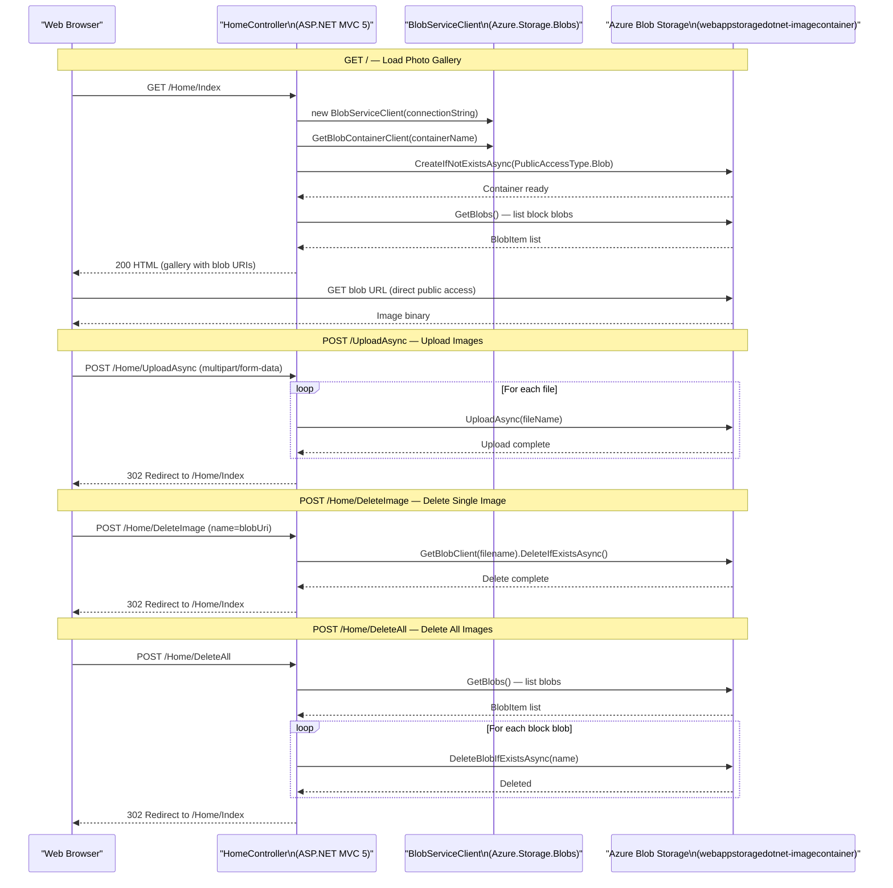

# API & Service Communication Contracts

This application exposes 4 MVC action endpoints through a single `HomeController`, all communicating synchronously with Azure Blob Storage. There are no REST API controllers, no inter-service communication, and no management or observability endpoints.

## Service Catalog

| Service | Port | Category | Purpose |
|---------|------|----------|---------|
| WebApp-Storage-DotNet | 20050 (IIS Express) | API Layer / Business | Single-process ASP.NET MVC 5 web application providing photo gallery UI and blob storage management |

## API Endpoints Inventory

| Service | Method | Path | Request Type | Response Type |
|---------|--------|------|-------------|--------------|
| HomeController | GET | `/Home/Index` (default route `/`) | None | HTML view with list of blob URIs (List of Uri) |
| HomeController | POST | `/Home/UploadAsync` | `multipart/form-data` (HttpFileCollectionBase) | Redirect to Index (302) or Error view |
| HomeController | POST | `/Home/DeleteImage` | Form field: `name` (blob URI string) | Redirect to Index (302) or Error view |
| HomeController | POST | `/Home/DeleteAll` | None | Redirect to Index (302) or Error view |

> Note: These are ASP.NET MVC action methods returning `ActionResult` (HTML views or redirects), not REST/JSON API endpoints.

## Management & Observability Endpoints

| Service | Endpoint | Custom Metrics |
|---------|----------|---------------|
| WebApp-Storage-DotNet | None configured | None |

No health check endpoints, Swagger/OpenAPI documentation, metrics endpoints, or observability integrations (Application Insights, OpenTelemetry, etc.) are configured.

## DTOs & Contracts

The application has no dedicated DTO or contract classes. Data flows directly between the controller and the Azure Blob Storage SDK:

- **`List<Uri>`**: The `Index` action builds a list of blob URI objects (returned by `BlobContainerClient.GetBlobClient(name).Uri`) and passes it directly as the view model to `Index.cshtml`.
- **`HttpFileCollectionBase`**: The `UploadAsync` action reads uploaded files via `Request.Files` (ASP.NET intrinsic), with no typed request model or binding class.
- **`string name`** (blob URI): The `DeleteImage` action receives a raw URI string as a form POST parameter with no validation model.

There are no OpenAPI/Swagger specifications, protobuf schemas, GraphQL schemas, or formal API contracts. Serialization is not relevant as no JSON APIs are exposed; HTML rendering uses Razor views.

## Communication Patterns

**Synchronous only**: The application uses a single synchronous request-response pattern throughout. The browser makes HTTP requests to the ASP.NET MVC controller, which synchronously (using `async/await` for I/O) calls the Azure Blob Storage SDK.

**Azure Blob Storage SDK communication**: The controller communicates with Azure Blob Storage via `Azure.Storage.Blobs` v12.9.1 over HTTPS. The connection string (`StorageConnectionString`) configures the endpoint. No retry policies, circuit breakers, or timeout overrides are configured — the Azure SDK's default retry policy (3 retries with exponential backoff) applies implicitly.

**No inter-service communication**: This is a single-process application with no microservices, message queues, service buses, gRPC, or event-driven patterns.

**No service discovery**: The application connects directly to Azure Blob Storage using a hardcoded connection string; no service discovery mechanism is used.

**Security posture**: No authentication or authorization is configured at the application level. There are no login pages, identity providers, OAuth2/OpenID Connect integrations, JWT validation, or role-based access control. `FilterConfig` registers only `HandleErrorAttribute` (error handling). The blob container is created with `PublicAccessType.Blob`, meaning all stored images are publicly accessible without authentication. All four controller actions are completely unrestricted — any user can upload, delete, or view all images without authentication.

## Service Technology Matrix

| Service | Web Framework | Data Access | Discovery | Gateway | Health Checks | Cache | Metrics |
|---------|--------------|-------------|-----------|---------|---------------|-------|---------|
| WebApp-Storage-DotNet | ASP.NET MVC 5 (System.Web) | Azure.Storage.Blobs 12.9.1 (direct SDK) | None | None | None | None | None |

## Service Communication Sequence

