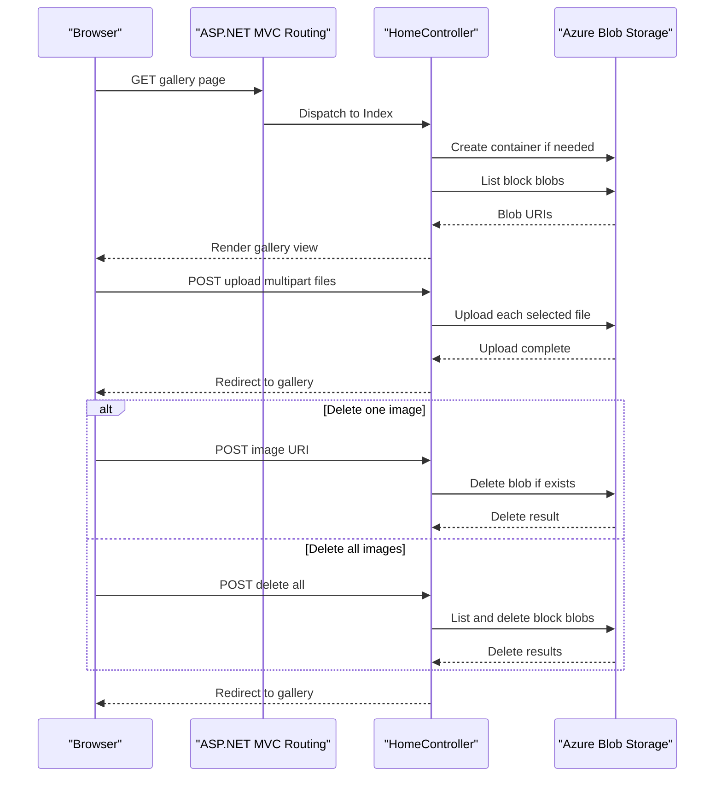

# API & Service Communication Contracts

The application exposes a small server-rendered MVC surface with one controller and four gallery operations. Communication is synchronous HTTP between browser and MVC actions, with SDK calls from the controller to Azure Blob Storage.

## Service Catalog

| Service | Port | Category | Purpose |
|---|---:|---|---|
| WebApp-Storage-DotNet | 20050 development server setting | API Layer | ASP.NET MVC web application for listing, uploading, and deleting gallery images backed by Azure Blob Storage |

## API Endpoints Inventory

| Service | Method | Path | Request Type | Response Type |
|---|---|---|---|---|
| WebApp-Storage-DotNet / HomeController | GET | `/` or `/Home/Index` | None | Razor view with `List<Uri>` model of blob image URIs |
| WebApp-Storage-DotNet / HomeController | POST | `/Home/UploadAsync` | Multipart form files from `Request.Files` | Redirect to `Index` or error view |
| WebApp-Storage-DotNet / HomeController | POST | `/Home/DeleteImage` | Form field `name` containing image URI | Redirect to `Index` or error view |
| WebApp-Storage-DotNet / HomeController | POST | `/Home/DeleteAll` | None | Redirect to `Index` or error view |

No explicit API versioning scheme is present. The default MVC route is `{controller}/{action}/{id}` with `Home/Index` as the default action.

## Management & Observability Endpoints

| Service | Endpoint | Custom Metrics (if any) |
|---|---|---|
| WebApp-Storage-DotNet | None detected | None detected |

## DTOs & Contracts

The application does not define separate DTO, request, response, OpenAPI, protobuf, or GraphQL contract files. The primary contracts are MVC action parameters, multipart form upload data, and a Razor view model containing `List<Uri>` values for image links. Serialization is not central to the public contract; referenced JSON libraries are not used by the controller surface reviewed here.

## Communication Patterns

Browser-to-application communication is synchronous HTTP form submission and page rendering. Application-to-storage communication is synchronous request handling with asynchronous Azure Blob Storage SDK calls for container creation, blob listing, upload, and delete. No inter-service REST clients, message queues, service discovery, API gateway, retry policy, circuit breaker, or configured timeout policy were detected. Startup availability depends on the ASP.NET application starting under IIS or IIS Express and on the `StorageConnectionString` resolving to reachable blob storage. No authentication, authorization attributes, CSRF-specific controller annotations, or TLS enforcement are configured at the API contract level; endpoints are publicly reachable in the application surface unless protected by hosting infrastructure outside the repository.

## Service Technology Matrix

| Service | Web | Data Access | Discovery | Gateway | Actuator | Cache | Metrics |
|---|---|---|---|---|---|---|---|
| WebApp-Storage-DotNet | ASP.NET MVC 5 | Azure Blob Storage SDK | None | None | None | None | None |

## Service Communication Sequence

