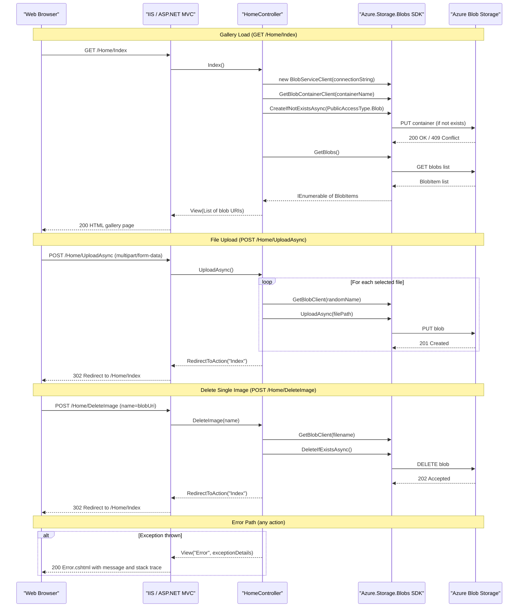

# API & Service Communication Contracts

This is a single-service ASP.NET MVC 5 web application exposing **4 HTTP endpoints** (3 form POST actions and 1 GET page) with no inter-service communication — all external interaction occurs via synchronous calls to the Azure Blob Storage REST API through the Azure SDK.

## Service Catalog

| Service | Port | Category | Purpose |
|---------|------|----------|---------|
| WebApp-Storage-DotNet | 80/443 (IIS-hosted) | Business | ASP.NET MVC 5 web application providing a photo gallery backed by Azure Blob Storage |

## API Endpoints Inventory

| Service | Method | Path | Request Type | Response Type |
|---------|--------|------|-------------|---------------|
| WebApp-Storage-DotNet | GET | `/` or `/Home/Index` | None | HTML view with `List<Uri>` (blob URLs) |
| WebApp-Storage-DotNet | POST | `/Home/UploadAsync` | `multipart/form-data` (file collection via `HttpFileCollectionBase`) | Redirect to `/Home/Index` (HTTP 302) |
| WebApp-Storage-DotNet | POST | `/Home/DeleteImage` | Form field: `name` (string — full blob URI) | Redirect to `/Home/Index` (HTTP 302) or JSON (via jQuery `$.post`) |
| WebApp-Storage-DotNet | POST | `/Home/DeleteAll` | `multipart/form-data` (no body fields) | Redirect to `/Home/Index` (HTTP 302) |

> Note: No API versioning scheme is in use. All routes follow the default ASP.NET MVC convention `{controller}/{action}/{id?}`.

## Management & Observability Endpoints

| Service | Endpoint | Custom Metrics |
|---------|----------|----------------|
| WebApp-Storage-DotNet | None configured | None |

No health check endpoints (`/health`, `/healthz`), Swagger UI, or Application Insights integration are present. Error information is surfaced via the `/Views/Shared/Error.cshtml` view when exceptions are caught.

## DTOs & Contracts

The application uses no dedicated DTO or request/response model classes. Contracts are implicit:

- **`List<Uri>`** — passed as the view model from `HomeController.Index()` to `Index.cshtml`. Contains the publicly accessible blob URLs for each image in the container.
- **`HttpFileCollectionBase`** (ASP.NET MVC built-in) — used in `UploadAsync` to receive multipart file uploads via `Request.Files`.
- **`string name`** — plain action parameter in `DeleteImage`, bound from a form POST field containing the full blob URI.

No OpenAPI/Swagger specification, protobuf schema, or GraphQL schema exists. JSON serialization is not used at the HTTP boundary (all responses are HTML views or redirects). `Newtonsoft.Json` is present as a dependency but is not used by application code directly.

## Communication Patterns

**Synchronous only.** The application follows a simple request/response pattern:

- **Client ↔ Application**: Standard HTTP form submissions (GET for gallery listing, POST for upload/delete). No REST JSON API, gRPC, or message queue involvement.
- **Application ↔ Azure Blob Storage**: Synchronous SDK calls using `Azure.Storage.Blobs` v12.9.1 (`BlobServiceClient`, `BlobContainerClient`, `BlobClient`) over HTTPS to the Azure Storage REST API. Operations used: `CreateIfNotExistsAsync`, `GetBlobs` (synchronous enumeration), `UploadAsync`, `DeleteIfExistsAsync`, `DeleteBlobIfExistsAsync`.

**No resilience patterns are implemented.** There is no retry policy, circuit breaker (Polly or equivalent), timeout configuration, or fallback behavior. If the Azure Storage service is unavailable, the exception propagates to the `catch` block in the controller and is displayed to the user via the Error view.

**Service discovery**: None — the Azure Storage connection string (endpoint + credentials) is read directly from `Web.config` `AppSettings["StorageConnectionString"]` at request time. No Eureka, Consul, or Kubernetes DNS in use.

**Security posture**: No authentication or authorization is configured at the application layer. All four endpoints are publicly accessible with no login requirement, no JWT/OAuth2 validation, and no `[Authorize]` attribute on any controller or action. The application relies on IIS-level configuration for TLS termination. The blob container is created with `PublicAccessType.Blob`, making all stored images publicly readable via their direct Azure CDN/storage URLs without any access token.

## Service Technology Matrix

| Service | Web Framework | Data Access | Discovery | Gateway | Health Checks | Cache | Metrics |
|---------|--------------|-------------|-----------|---------|--------------|-------|---------|
| WebApp-Storage-DotNet | ASP.NET MVC 5 | Azure Blob Storage SDK v12.9.1 (no ORM) | None | None | None | None | None |

## Service Communication Sequence

