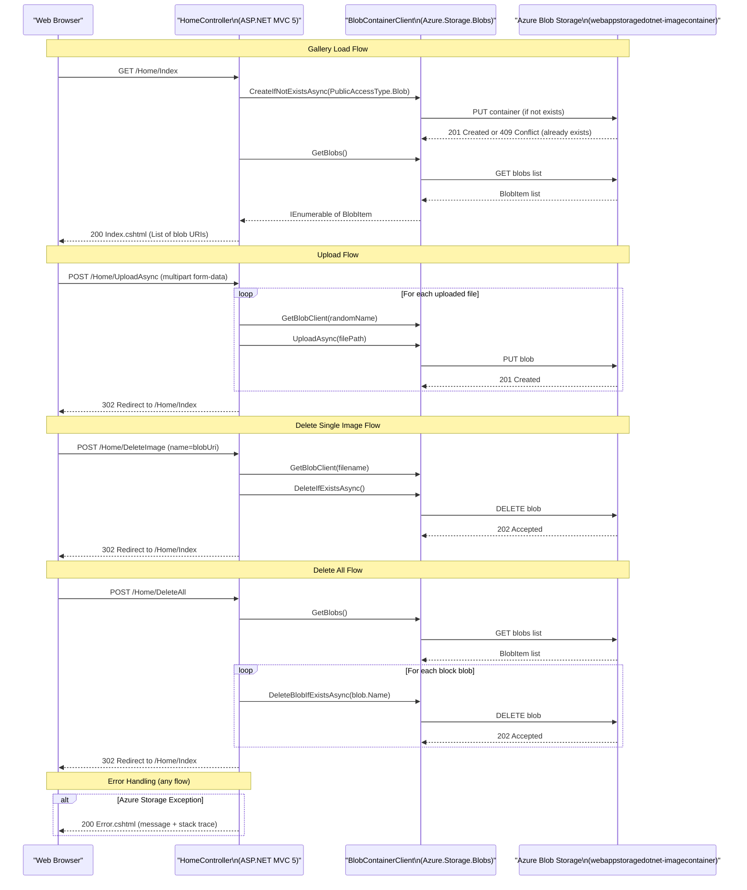

# API & Service Communication Contracts

The PhotoGallery application exposes four MVC controller actions as its HTTP surface (1 GET and 3 POSTs), all served by a single `HomeController`. There are no inter-service calls, message queues, or API gateway; the only external communication is synchronous HTTPS calls to Azure Blob Storage.

## Service Catalog

| Service | Port | Category | Purpose |
|---|---|---|---|
| WebApp-Storage-DotNet | 80 / 443 (IIS/IIS Express) | API Layer + Business | ASP.NET MVC 5 web application that serves a photo gallery UI and manages photo blobs in Azure Blob Storage |

## API Endpoints Inventory

| Service | Method | Path | Request Type | Response Type |
|---|---|---|---|---|
| HomeController | GET | `/` or `/Home/Index` | — | Razor view (`Index.cshtml`) with `List<Uri>` model (list of blob URIs) |
| HomeController | POST | `/Home/UploadAsync` | Multipart form-data (`HttpFileCollectionBase` — one or more image files) | Redirect to `/Home/Index` (302) on success; `Error` view on exception |
| HomeController | POST | `/Home/DeleteImage` | Form field `name` (string — full blob URI) | Redirect to `/Home/Index` (302) on success; `Error` view on exception |
| HomeController | POST | `/Home/DeleteAll` | — (no request body) | Redirect to `/Home/Index` (302) on success; `Error` view on exception |

## Management & Observability Endpoints

| Service | Endpoint | Notes |
|---|---|---|
| WebApp-Storage-DotNet | (none) | No health check, metrics, or Swagger endpoints are configured. The application does not expose any management or observability surface. |

## DTOs & Contracts

The application uses no formal DTO classes. Request and response contracts are:

- **Index (GET `/`)**: No request DTO. The view model is `List<Uri>` — a plain list of Azure Blob Storage public URLs populated by enumerating block blobs in the container.
- **UploadAsync (POST `/Home/UploadAsync`)**: Input is bound from the raw HTTP multipart form (`Request.Files` — `HttpFileCollectionBase`). No typed request class; file metadata is read directly from `HttpPostedFileBase` entries.
- **DeleteImage (POST `/Home/DeleteImage`)**: Input is a single form field `name` (type `string`) bound by the MVC model binder. No request DTO.
- **DeleteAll (POST `/Home/DeleteAll`)**: No request or response body. Unconditional bulk delete followed by redirect.

There are no OpenAPI / Swagger specifications, protobuf schemas, or GraphQL schemas. Serialization is not explicitly configured — the application renders HTML via Razor views rather than JSON APIs, so no JSON serializer settings apply to the endpoint surface.

## Communication Patterns

**Synchronous communication**: The sole external dependency is Azure Blob Storage, accessed synchronously (from the HTTP request thread) via the `Azure.Storage.Blobs` SDK v12.9.1. All SDK calls (`CreateIfNotExistsAsync`, `UploadAsync`, `DeleteIfExistsAsync`, `GetBlobs`) are awaited inline inside the controller actions.

**Asynchronous / messaging**: None. There are no message queues, event buses, Service Bus topics, or background workers.

**Resilience patterns**: None configured. There is no retry policy, circuit breaker (e.g., Polly), timeout override, or bulkhead pattern. If Azure Blob Storage is unavailable or returns an error, the exception propagates directly to the controller's `catch` block and is surfaced as an error view.

**Service discovery**: Not applicable. The application is a single deployment unit. The Azure Storage endpoint is resolved directly from the connection string in `Web.config` (`StorageConnectionString`).

**API gateway**: None. The application is accessed directly through IIS / IIS Express.

**Startup dependency chain**: On first request, `Index()` initializes the static `BlobContainerClient` and calls `CreateIfNotExistsAsync` to ensure the container exists. If Azure Storage is unreachable at first request, the error is shown in the UI.

**Security posture**: No authentication, authorization, or TLS is configured at the application code level. All four endpoints (`/`, `/Home/UploadAsync`, `/Home/DeleteImage`, `/Home/DeleteAll`) are publicly accessible with no authorization checks. There is no use of `[Authorize]`, ASP.NET Identity, OAuth2, JWT validation, or any anti-CSRF (AntiForgeryToken) protection on the POST endpoints. TLS termination, if any, would be handled by the IIS hosting configuration rather than the application. This is a significant security gap — any user can upload, delete individual images, or delete all images without authentication.

## Service Technology Matrix

| Service | Web Framework | Data Access | Discovery | Gateway | Health Checks | Cache | Metrics |
|---|---|---|---|---|---|---|---|
| WebApp-Storage-DotNet | ASP.NET MVC 5 (Razor) | Azure.Storage.Blobs 12.9.1 (direct SDK) | None | None | None | None | None |

## Service Communication Sequence

