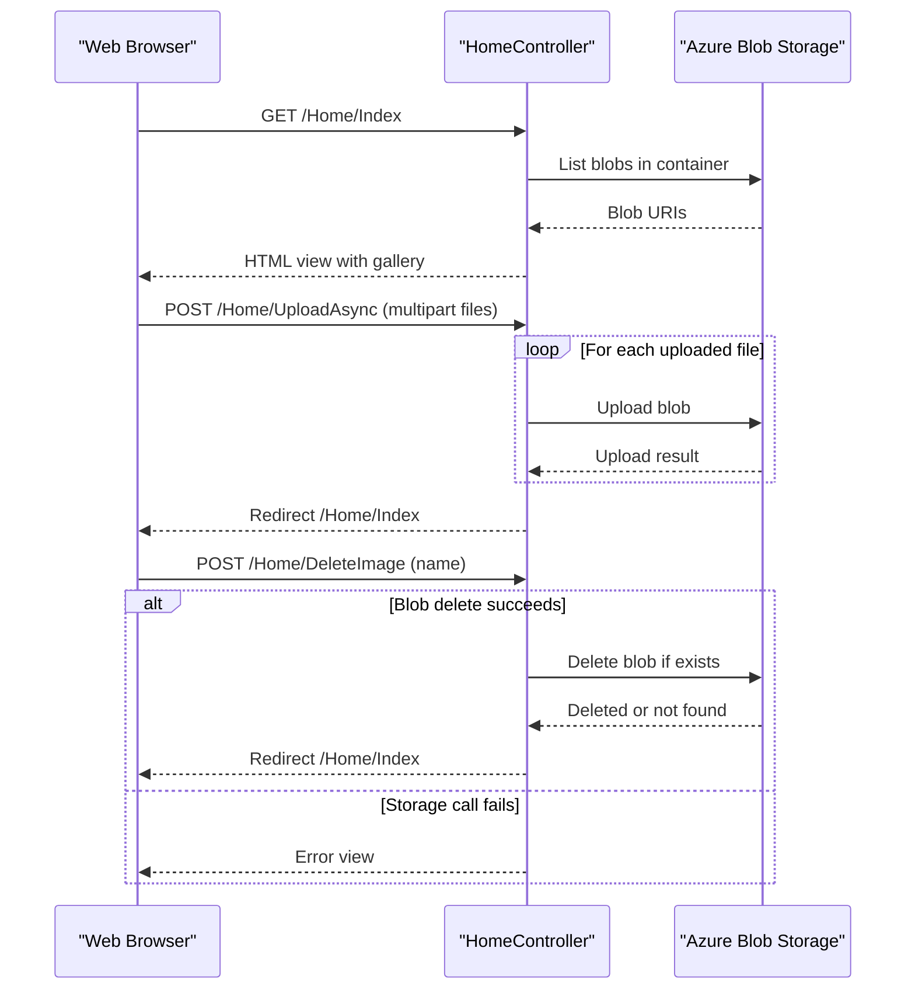

# API & Service Communication Contracts

The application exposes a small MVC-based HTTP surface for photo gallery operations and communicates synchronously with Azure Blob Storage through the Azure SDK. Communication is primarily browser-to-controller requests with controller-to-storage service calls.

## Service Catalog

| Service | Port | Category | Purpose |
|---|---:|---|---|
| WebApp-Storage-DotNet | 20050 (IIS Express dev default) | API Layer | Serves MVC pages and handles upload/delete photo operations |
| Azure Blob Storage | 443 (cloud) / emulator endpoints (local dev) | Infrastructure | Stores and retrieves image blobs |

## API Endpoints Inventory

| Service | Method | Path | Request Type | Response Type |
|---|---|---|---|---|
| WebApp-Storage-DotNet (HomeController) | GET | /Home/Index (default route) | Path/query parameters via MVC route | HTML view with model `List<Uri>` |
| WebApp-Storage-DotNet (HomeController) | POST | /Home/UploadAsync | Multipart form files (`HttpFileCollectionBase`) | Redirect to `/Home/Index` |
| WebApp-Storage-DotNet (HomeController) | POST | /Home/DeleteImage | Form parameter `name` (blob URI string) | Redirect to `/Home/Index` |
| WebApp-Storage-DotNet (HomeController) | POST | /Home/DeleteAll | No body payload | Redirect to `/Home/Index` |

## Management & Observability Endpoints

| Service | Endpoint | Custom Metrics (if any) |
|---|---|---|
| WebApp-Storage-DotNet | None detected | None detected |

## DTOs & Contracts

The API contract is view-oriented rather than JSON API-oriented. The primary response model is `List<Uri>` passed from `HomeController.Index()` to `Views/Home/Index.cshtml` for gallery rendering. Upload and deletion operations use primitive contract types (`HttpFileCollectionBase` and `string name`) rather than dedicated request/response DTO classes. No OpenAPI/Swagger specification, protobuf schema, or GraphQL schema was found.

## Communication Patterns

Client communication is synchronous HTTP form submit and AJAX POST calls from the browser to MVC endpoints. Server-side communication to storage is synchronous request-response over Azure Storage service APIs invoked via asynchronous SDK methods (`CreateIfNotExistsAsync`, `UploadAsync`, `DeleteIfExistsAsync`). No message broker or asynchronous event pipeline is present. No retry, circuit breaker, or explicit timeout policy configuration was identified in API-level code. Service discovery and gateway aggregation are not used in this single-service architecture. Security posture at API contract level is minimal: no authentication/authorization attributes or explicit TLS enforcement were detected, so endpoints are effectively public based on host deployment configuration.

## Service Technology Matrix

| Service | Web | Data Access | Discovery | Gateway | Actuator | Cache | Metrics |
|---|---|---|---|---|---|---|---|
| WebApp-Storage-DotNet | ASP.NET MVC 5 | Azure.Storage.Blobs SDK | None | None | None | None | None |
| Azure Blob Storage | n/a | Blob service storage API | n/a | n/a | n/a | n/a | n/a |

## Service Communication Sequence

