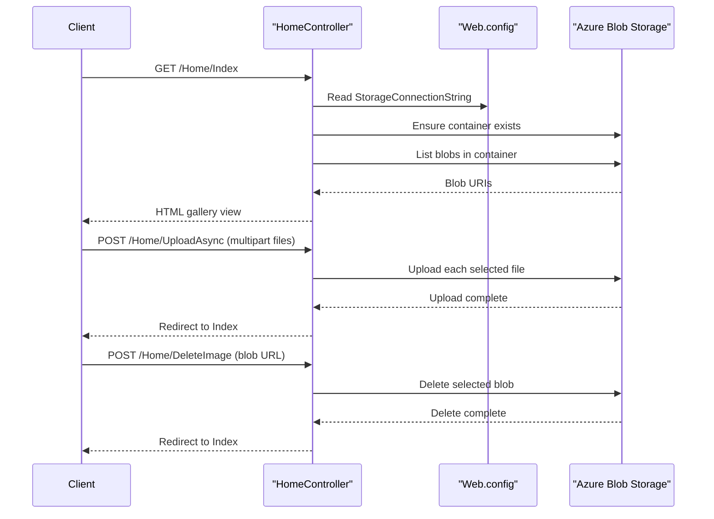

# API & Service Communication Contracts

This application exposes a very small server-rendered HTTP surface made up of one default page and three form or AJAX-driven POST actions. Communication is synchronous throughout: browser requests are handled by one MVC controller, which then calls Azure Blob Storage directly through the SDK.

## Service Catalog

| Service | Port | Category | Purpose |
|---|---:|---|---|
| WebApp-Storage-DotNet | 20050 (IIS Express dev setting) | API Layer | Serves the photo gallery UI and handles image listing, upload, and deletion requests |
| Azure Blob Storage / Storage Emulator | n/a | Infrastructure | Stores image blobs in the configured container |

## API Endpoints Inventory

| Service | Method | Path | Request Type | Response Type |
|---|---|---|---|---|
| WebApp-Storage-DotNet | GET | /Home/Index and / | None | HTML view with `List<Uri>` model |
| WebApp-Storage-DotNet | POST | /Home/UploadAsync | Multipart form upload from `Request.Files` | Redirect to `Index` or error view |
| WebApp-Storage-DotNet | POST | /Home/DeleteImage | Form/AJAX parameter `name` containing the blob URL | Redirect to `Index` or error view |
| WebApp-Storage-DotNet | POST | /Home/DeleteAll | No body beyond form submit | Redirect to `Index` or error view |

## Management & Observability Endpoints

| Service | Endpoint | Custom Metrics (if any) |
|---|---|---|
| WebApp-Storage-DotNet | None detected | None |

## DTOs & Contracts

The project does not define dedicated request or response DTO classes. The primary response contract is the Razor view model `List<Uri>` returned by `Index`, while `UploadAsync` consumes uploaded files directly from `Request.Files` and `DeleteImage` accepts a simple string parameter containing the target blob URI. No OpenAPI/Swagger document, protobuf schema, GraphQL schema, or custom serialization contract was found. Serialization needs are limited to Azure SDK usage and the MVC platform defaults.

## Communication Patterns

All application communication is synchronous. Browser requests post directly to MVC actions, and the controller uses `BlobServiceClient`, `BlobContainerClient`, and `BlobClient` for immediate list, upload, and delete operations against blob storage. No message broker, background queue, service discovery, retry library, circuit breaker, or timeout policy was detected. The API surface is publicly accessible with no authentication, authorization, or HTTPS/TLS enforcement configured in application code or route definitions.

## Service Technology Matrix

| Service | Web | Data Access | Discovery | Gateway | Actuator | Cache | Metrics |
|---|---|---|---|---|---|---|---|
| WebApp-Storage-DotNet | ASP.NET MVC 5 | Azure Storage Blobs SDK | None | No | No | None | None |
| Azure Blob Storage / Storage Emulator | n/a | Blob service | n/a | No | n/a | n/a | n/a |

## Service Communication Sequence

