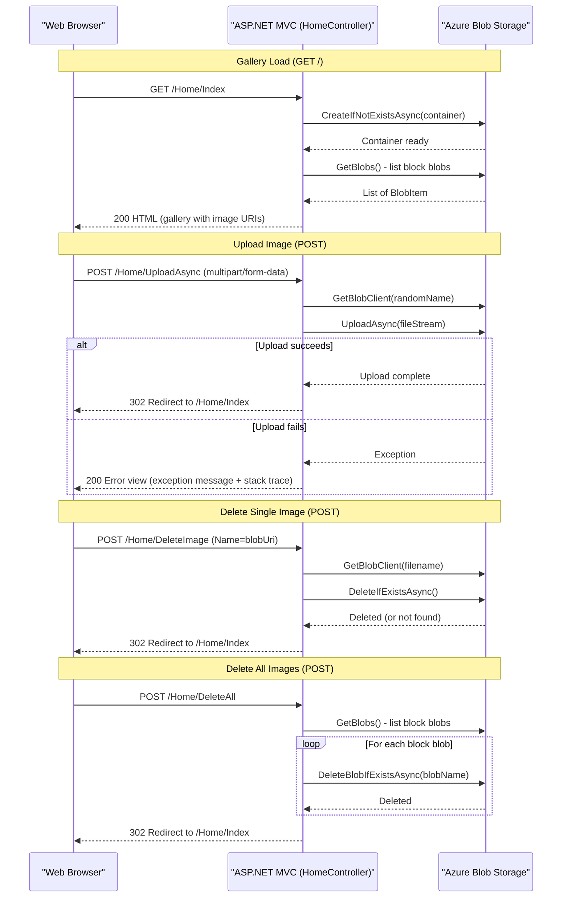

# API & Service Communication Contracts

The application exposes four conventional ASP.NET MVC action endpoints (not a REST API) through a single `HomeController`, all interacting synchronously with Azure Blob Storage. There is no inter-service communication, API gateway, or message broker involved.

## Service Catalog

| Service | Port | Category | Purpose |
|---|---|---|---|
| WebApp-Storage-DotNet | 20050 (IIS Express dev) | Business | ASP.NET MVC 5 web application that provides a photo gallery backed by Azure Blob Storage |
| Azure Blob Storage | 443 (HTTPS external) | Infrastructure | Managed cloud object store holding uploaded image blobs in a single container |

## API Endpoints Inventory

| Service | Method | Path | Request Type | Response Type |
|---|---|---|---|---|
| HomeController | GET | / (or /Home/Index) | None | HTML page with `List<Uri>` model (gallery view) |
| HomeController | POST | /Home/UploadAsync | Multipart form data (`HttpFileCollectionBase`) | Redirect to `/Home/Index` (302) or Error view |
| HomeController | POST | /Home/DeleteImage | Form field `Name` (blob URI string) | Redirect to `/Home/Index` (302) or Error view |
| HomeController | POST | /Home/DeleteAll | None (empty POST body) | Redirect to `/Home/Index` (302) or Error view |

> Note: These are conventional MVC actions returning HTML views or redirects, not JSON REST endpoints. There is no API versioning scheme in place.

## Management & Observability Endpoints

| Service | Endpoint | Custom Metrics |
|---|---|---|
| WebApp-Storage-DotNet | None configured | None |

No health check endpoints, Swagger UI, or metrics export endpoints are present. The application does not include ASP.NET Health Checks middleware or any observability instrumentation.

## DTOs & Contracts

The application does not define formal DTO classes. The MVC controller uses the following data contracts implicitly:

- **`List<Uri>`** — The `Index` action returns a `List<Uri>` as its view model, representing the public URIs of all block blobs in the storage container. This is a framework primitive, not a dedicated DTO class.
- **`HttpFileCollectionBase`** — The `UploadAsync` action reads uploaded files directly from `Request.Files` (the ASP.NET file collection). No request body DTO class is defined.
- **`string name`** — The `DeleteImage` action accepts a single `string` parameter (the blob URI) bound from the form field `Name`. No wrapper DTO is used.

There are no OpenAPI / Swagger specifications, protobuf schemas, or GraphQL schemas. Serialization is handled by the default ASP.NET MVC model binder (backed by `Newtonsoft.Json 6.0.8` for JSON binding and standard form binding for multipart requests).

## Communication Patterns

**Synchronous (HTTP → Azure Blob Storage SDK)**
All external communication is synchronous from the user's perspective (HTTP POST → server → Azure Blob Storage), although the controller actions use `async/await` internally via the `Azure.Storage.Blobs` SDK. There is no inter-service HTTP communication — the application is a single deployable unit.

**No resilience policies configured**: The application does not implement any retry policies, circuit breakers (e.g., Polly), timeout overrides, or bulkhead patterns. Failures from the Azure Blob Storage SDK bubble up directly to a generic `catch (Exception ex)` block and are rendered as an error view with the raw exception message and stack trace exposed to the browser.

**No service discovery**: Azure Blob Storage is addressed directly via a connection string stored in `Web.config` (`StorageConnectionString`). No service registry or DNS-based discovery is used.

**Security posture**: No authentication, authorization, or TLS termination is configured at the application level. All four endpoints are publicly accessible with no authorization checks. The application relies entirely on network-level security (IIS configuration and/or Azure App Service access restrictions) to restrict access. Connection string credentials for Azure Storage are stored in plain text in `Web.config`, which presents a secrets management risk in source-controlled deployments.

## Service Technology Matrix

| Service | Web Framework | Data Access | Discovery | Gateway | Health Checks | Cache | Metrics |
|---|---|---|---|---|---|---|---|
| WebApp-Storage-DotNet | ASP.NET MVC 5 (System.Web) | Azure.Storage.Blobs v12 SDK | None | None | None | None | None |

## Service Communication Sequence

