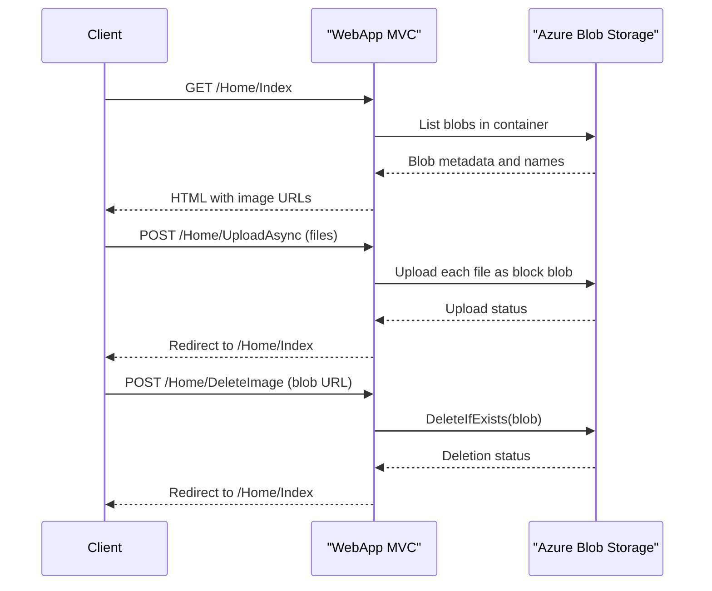

# API & Service Communication Contracts

The application exposes a small HTTP surface through MVC controller actions for listing, uploading, and deleting photos. Communication is synchronous between the web tier and Azure Blob Storage.

## Service Catalog

| Service | Port | Category | Purpose |
|---|---:|---|---|
| WebApp-Storage-DotNet | 20050 (IIS Express dev setting) | API Layer | Hosts MVC UI and request endpoints for photo operations |
| Azure Blob Storage | 443 | Infrastructure | Stores image blobs and serves blob URLs |

## API Endpoints Inventory

| Service | Method | Path | Request Type | Response Type |
|---|---|---|---|---|
| WebApp-Storage-DotNet | GET | /Home/Index | None | HTML view with list of blob URIs |
| WebApp-Storage-DotNet | POST | /Home/UploadAsync | multipart/form-data files | Redirect to /Home/Index |
| WebApp-Storage-DotNet | POST | /Home/DeleteImage | form field `name` (blob URI) | Redirect to /Home/Index |
| WebApp-Storage-DotNet | POST | /Home/DeleteAll | None | Redirect to /Home/Index |

## Management & Observability Endpoints

| Service | Endpoint | Custom Metrics (if any) |
|---|---|---|
| WebApp-Storage-DotNet | None explicitly defined | None detected |

## DTOs & Contracts

No explicit DTO classes are defined for API contracts. Requests are bound directly from multipart form posts or scalar form values, and responses are MVC views/redirects. Blob URI values act as the effective response contract for the gallery list.

## Communication Patterns

All runtime communication is synchronous HTTP request handling in MVC actions with direct SDK calls to Azure Blob Storage. No asynchronous message broker pattern, retry policy, circuit breaker, or service discovery mechanism is configured in code. Startup order has minimal dependencies (web app requires valid storage connection string). API security posture is minimal: no controller-level authentication/authorization attributes and no explicit TLS policy in code.

## Service Technology Matrix

| Service | Web | Data Access | Discovery | Gateway | Actuator | Cache | Metrics |
|---|---|---|---|---|---|---|---|
| WebApp-Storage-DotNet | ASP.NET MVC 5 | Azure.Storage.Blobs SDK | None | None | None | None | None |
| Azure Blob Storage | N/A | Blob REST backend | N/A | N/A | N/A | N/A | N/A |

## Service Communication Sequence

