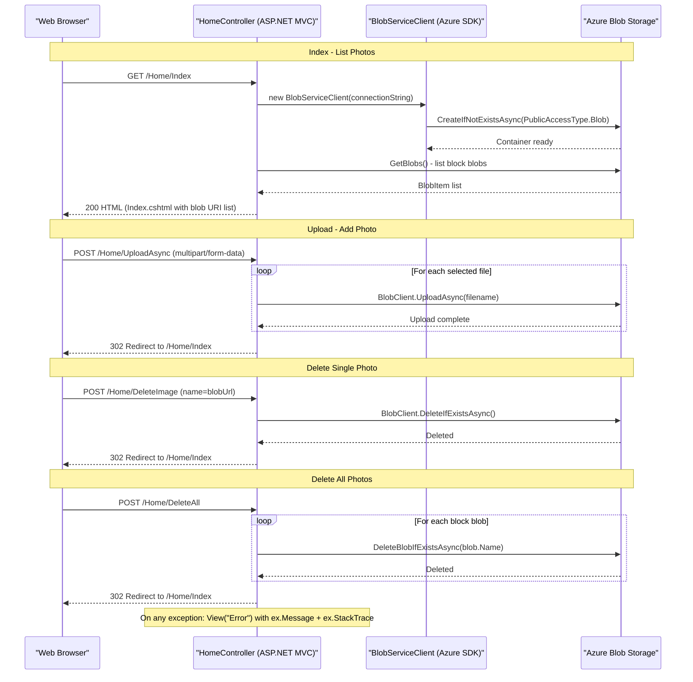

# API & Service Communication Contracts

The application exposes **4 HTTP endpoints** through a single ASP.NET MVC 5 controller; all communication is synchronous browser-to-server HTML form interaction backed by an Azure Blob Storage REST API call.

## Service Catalog

| Service | Port | Category | Purpose |
|---------|------|----------|---------|
| WebApp-Storage-DotNet | 20050 (IIS Express) | Business | ASP.NET MVC 5 web application providing a photo gallery UI backed by Azure Blob Storage |
| Azure Blob Storage | 443 (HTTPS) | Infrastructure | External storage service hosting uploaded image blobs in the `webappstoragedotnet-imagecontainer` container |

## API Endpoints Inventory

| Service | Method | Path | Request Type | Response Type |
|---------|--------|------|-------------|---------------|
| HomeController | GET | `/Home/Index` (default: `/`) | None | HTML view — `List<Uri>` of blob URLs passed to `Index.cshtml` |
| HomeController | POST | `/Home/UploadAsync` | `multipart/form-data` — `HttpFileCollectionBase` (file inputs named `selectFiles`) | HTTP 302 redirect to `/Home/Index` on success; Error view on failure |
| HomeController | POST | `/Home/DeleteImage` | Form body: `name` (string — full blob URL) | HTTP 302 redirect to `/Home/Index` on success; Error view on failure |
| HomeController | POST | `/Home/DeleteAll` | `multipart/form-data` (no parameters) | HTTP 302 redirect to `/Home/Index` on success; Error view on failure |

> Note: Routing follows the default ASP.NET MVC convention `{controller}/{action}/{id}`. No API versioning scheme is implemented.

## Management & Observability Endpoints

| Service | Endpoint | Custom Metrics |
|---------|----------|---------------|
| WebApp-Storage-DotNet | None | None |

No health check, Swagger/OpenAPI, or metrics endpoints are configured. The application has no observability surface beyond ASP.NET's built-in error handling page.

## DTOs & Contracts

No dedicated DTO or request/response model classes are defined. The API surface uses only primitive and framework-provided types:

- **Index response**: `List<Uri>` — a plain list of blob public URLs passed directly as the Razor view model.
- **Upload request**: Raw `HttpFileCollectionBase` from `Request.Files` — no input validation model or binding class.
- **DeleteImage request**: A single `string name` query/form parameter containing the full blob URL — parsed to extract the filename via `Path.GetFileName(new Uri(name).LocalPath)`.
- **DeleteAll request**: No parameters.

There are no OpenAPI/Swagger specifications, protobuf schemas, or GraphQL schemas. Serialization is not applicable since the application returns HTML views, not JSON payloads. No request validation attributes (e.g., `[Required]`, `ModelState`) are used.

## Communication Patterns

**Synchronous only.** The application follows a simple browser → controller → Azure Blob Storage request/response pattern with no asynchronous messaging, event-driven patterns, or inter-service communication.

- **Client-to-server**: Standard HTML form POST and GET over HTTP; no REST or JSON API.
- **Server-to-Azure Storage**: Azure SDK v12 (`BlobServiceClient`, `BlobContainerClient`, `BlobClient`) makes HTTPS REST calls to Azure Blob Storage. All storage calls use `async/await` (`CreateIfNotExistsAsync`, `UploadAsync`, `DeleteIfExistsAsync`).
- **No resilience patterns**: No retry policies, circuit breakers (Polly), or timeouts are configured beyond ASP.NET's `httpRuntime executionTimeout="12000000"` (a very large value).
- **No service discovery**: The storage endpoint is resolved from the `StorageConnectionString` in `Web.config` (defaults to `UseDevelopmentStorage=true`). There is no Eureka, Consul, or service mesh.
- **No API gateway**: The application is a single deployable unit with direct browser access.
- **Security posture**: **No authentication or authorization is configured.** All four endpoints are publicly accessible with no login requirement, session check, or role-based access control. The `StorageConnectionString` (including account key) is stored in plaintext in `Web.config`. HTTPS is not enforced in code — it depends on the hosting configuration (IIS/Azure App Service TLS termination). No CSRF protection is applied to the POST endpoints.

## Service Technology Matrix

| Service | Web Framework | Data Access | Discovery | Gateway | Health Checks | Cache | Metrics |
|---------|--------------|-------------|-----------|---------|---------------|-------|---------|
| WebApp-Storage-DotNet | ASP.NET MVC 5 | Azure.Storage.Blobs SDK | None | None | None | None | None |
| Azure Blob Storage | Azure REST API | — | — | — | — | — | — |

## Service Communication Sequence

