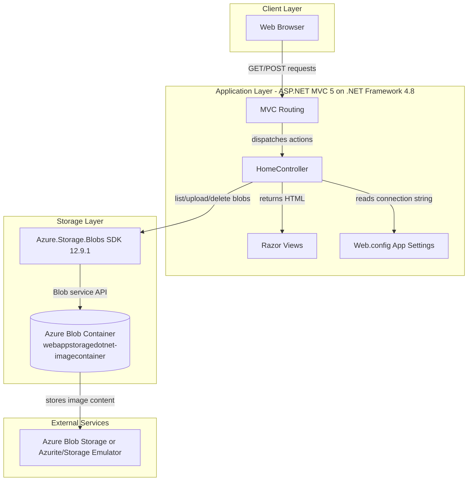
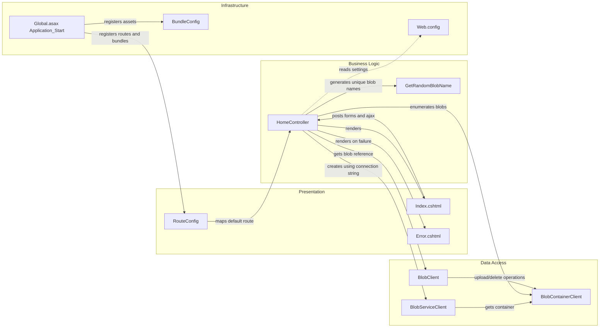

# Architecture Diagram

This repository contains a single ASP.NET MVC photo gallery web application. The application serves Razor views, handles image upload and deletion requests, and persists image content in Azure Blob Storage rather than a relational database.

## Application Architecture

### Technology Stack Summary

| Layer | Technology | Version | Purpose |
|---|---|---:|---|
| Presentation | ASP.NET MVC | 5.2.3 | Handles routing, controllers, forms, and Razor view rendering |
| Presentation | Razor Web Pages | 3.2.3 | Server-side HTML templating for gallery pages |
| Client | jQuery + Bootstrap | 1.10.2 / 3.0.0 | Browser-side upload/delete interactions and page styling |
| Application | .NET Framework | 4.8 target | Hosts the MVC application runtime |
| Storage Access | Azure.Storage.Blobs | 12.9.1 | Connects the app to blob containers and blob objects |
| Configuration | Web.config appSettings | n/a | Provides the storage connection string and MVC runtime settings |

### Data Storage & External Services

The application does not use a relational database, cache, or message broker. Its only persistent store is an Azure Blob Storage container accessed through `BlobServiceClient`; the default local configuration uses `UseDevelopmentStorage=true`, which points the application at a storage emulator-compatible endpoint during development.

### Key Architectural Decisions

- Uses a simple server-rendered MVC pattern with one controller coordinating all gallery operations.
- Stores image binaries externally in blob storage instead of persisting metadata in a separate database.
- Reads the storage connection string from `Web.config`, allowing the same code path to target local emulation or a real Azure Storage account.

## Component Relationships

### Component Inventory

| Component | Layer | Type | Responsibility |
|---|---|---|---|
| Global.asax.cs | Infrastructure | Application startup | Registers MVC areas, filters, routes, and bundles at application start |
| RouteConfig | Presentation | Routing configuration | Defines the default `{controller}/{action}/{id}` route with `Home/Index` as the entry point |
| BundleConfig | Infrastructure | Asset bundling config | Groups jQuery, Bootstrap, validation, and CSS assets for the MVC views |
| HomeController | Business Logic | MVC Controller | Lists blobs, uploads selected files, deletes one image, and deletes all images |
| GetRandomBlobName | Business Logic | Private helper | Generates a unique blob name from current ticks, GUID, and original extension |
| Index.cshtml | Presentation | Razor View | Displays the gallery, file selection UI, upload submit action, and delete controls |
| Error.cshtml | Presentation | Razor View | Displays exception details returned from controller catch blocks |
| BlobServiceClient | Data Access | Azure SDK client | Creates the blob container client from the configured connection string |
| BlobContainerClient | Data Access | Azure SDK client | Creates the container if needed and lists/deletes blobs in the gallery container |
| BlobClient | Data Access | Azure SDK client | Uploads file content and deletes individual blobs |
| Web.config | Infrastructure | Runtime configuration | Stores the storage connection string and ASP.NET runtime settings |
