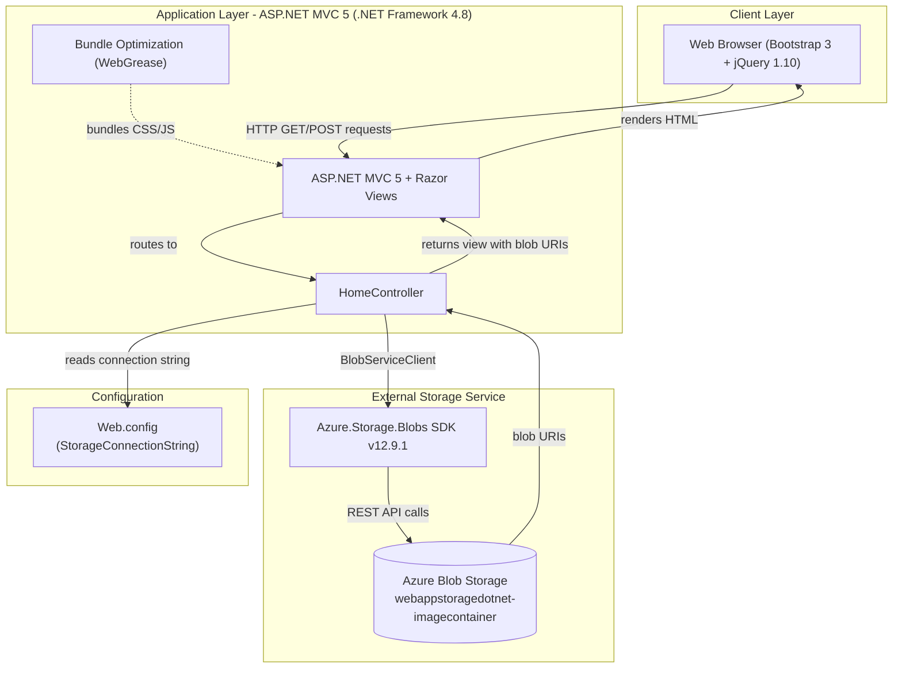
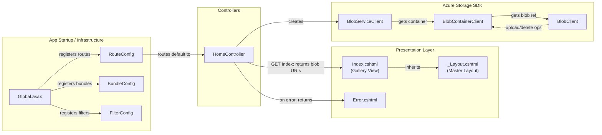

# Architecture Diagram

This document provides a two-layer architectural visualization of the Azure Blob Storage Photo Gallery application: a high-level application architecture diagram and a detailed component relationship diagram.

## Application Architecture

### Technology Stack Summary

| Layer | Technology | Version | Purpose |
|-------|-----------|---------|---------|
| Presentation | ASP.NET MVC | 5.2.3 | Server-side MVC web framework |
| Presentation | Razor Views | 3.2.3 | Server-side HTML templating |
| Presentation | Bootstrap | 3.0.0 | Responsive CSS framework |
| Presentation | jQuery | 1.10.2 | Client-side scripting |
| Application | .NET Framework | 4.8 | Runtime platform |
| Application | C# | 6.0 | Application programming language |
| Application | Microsoft.AspNet.Web.Optimization | 1.1.3 | CSS/JS bundling and minification |
| Storage Client | Azure.Storage.Blobs | 12.9.1 | Azure Blob Storage SDK |
| Storage Client | Azure.Core | 1.18.0 | Azure SDK core primitives |
| External Storage | Azure Blob Storage | - | Unstructured binary/image storage |

### Data Storage & External Services

The application uses **Azure Blob Storage** as its sole data store, accessed via the `Azure.Storage.Blobs` SDK (v12.9.1). A single blob container named `webappstoragedotnet-imagecontainer` stores uploaded photo files as Block Blobs with public read access. The connection string is read from `Web.config` (`StorageConnectionString`), defaulting to local Azure Storage Emulator (`UseDevelopmentStorage=true`) for development. There is no relational database, cache, or message broker involved.

### Key Architectural Decisions

- **Direct SDK integration**: The application communicates with Azure Blob Storage directly using the `Azure.Storage.Blobs` SDK from the MVC controller layer — there is no service abstraction or repository pattern.
- **Asynchronous I/O**: All blob operations (`CreateIfNotExistsAsync`, `UploadAsync`, `DeleteIfExistsAsync`) use the async/await pattern to avoid blocking the ASP.NET thread pool.
- **Public blob access**: The container is created with `PublicAccessType.Blob`, making individual blob URLs publicly accessible via direct HTTP links without SAS tokens.

## Component Relationships

### Component Inventory

| Component | Layer | Type | Responsibility |
|-----------|-------|------|---------------|
| HomeController | Controllers | MVC Controller | Handles Index (list blobs), UploadAsync (upload files), DeleteImage (delete single blob), DeleteAll (delete all blobs) |
| Index.cshtml | Presentation | Razor View | Renders the photo gallery grid with upload form and per-image delete controls |
| Error.cshtml | Presentation | Razor View | Displays exception message and stack trace on error |
| _Layout.cshtml | Presentation | Razor Master Layout | Provides shared HTML structure, Bootstrap CSS, and navigation |
| RouteConfig | App Startup | Route Configuration | Registers default MVC route `{controller}/{action}/{id}` |
| BundleConfig | App Startup | Bundle Configuration | Configures CSS/JS bundle paths for optimization |
| FilterConfig | App Startup | Filter Configuration | Registers global MVC action filters (HandleErrorAttribute) |
| Global.asax | App Startup | Application Entry Point | Bootstraps routes, bundles, and filters on application start |
