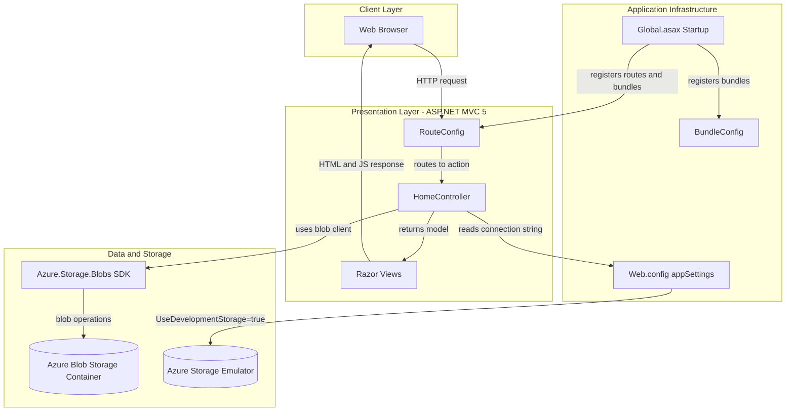
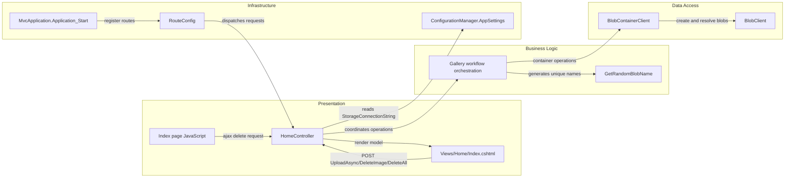

# Architecture Diagram

This document summarizes the application's high-level architecture and key component relationships for the Photo Gallery web application.

## Application Architecture

### Technology Stack Summary

| Layer | Technology | Version | Purpose |
|---|---|---|---|
| Presentation | ASP.NET MVC | 5.2.3 | Controller and Razor view based web UI |
| Runtime | .NET Framework | 4.8 | Application runtime |
| Frontend Assets | jQuery + Bootstrap | jQuery 1.10.2, Bootstrap 3.x | Client-side interactions and styling |
| Storage Access | Azure.Storage.Blobs | 12.9.1 | Blob container and blob CRUD operations |
| Configuration | Web.config appSettings | n/a | Connection string and runtime settings |

### Data Storage & External Services

The application stores photo files in an Azure Blob Storage container and retrieves blob URIs for rendering in the gallery UI. In local development, it uses the Azure Storage Emulator through `UseDevelopmentStorage=true`; in deployed environments it expects an Azure Storage account connection string.

### Key Architectural Decisions

- Uses a single MVC controller (`HomeController`) for gallery listing, upload, and delete workflows.
- Uses asynchronous Azure Blob Storage SDK calls for upload and deletion paths.
- Keeps infrastructure setup centralized in ASP.NET MVC startup (`Global.asax`, route and bundle registration).

## Component Relationships

### Component Inventory

| Component | Layer | Type | Responsibility |
|---|---|---|---|
| MvcApplication.Application_Start | Infrastructure | Startup | Registers routes, filters, and bundles |
| RouteConfig | Infrastructure | Routing config | Defines default MVC route mapping |
| HomeController | Presentation | MVC Controller | Handles gallery listing, upload, and deletion actions |
| Views/Home/Index.cshtml | Presentation | Razor View | Displays image gallery and upload/delete UI |
| Index page JavaScript | Presentation | Client script | Invokes delete endpoint and renders upload preview |
| Gallery workflow orchestration | Business Logic | Application logic | Coordinates blob list/upload/delete sequences |
| GetRandomBlobName | Business Logic | Helper method | Produces unique blob names for uploads |
| BlobContainerClient | Data Access | Azure SDK client | Accesses target blob container |
| BlobClient | Data Access | Azure SDK client | Uploads and deletes individual blobs |
| ConfigurationManager.AppSettings | Infrastructure | Configuration access | Supplies storage connection settings |
