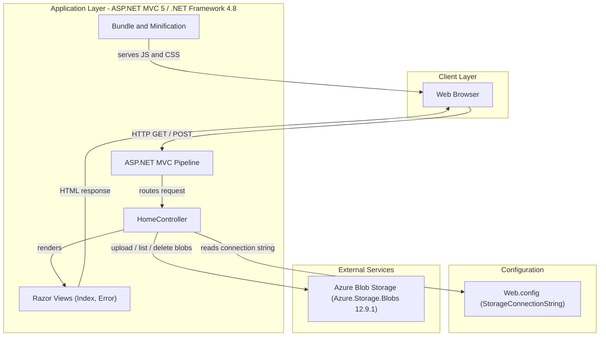
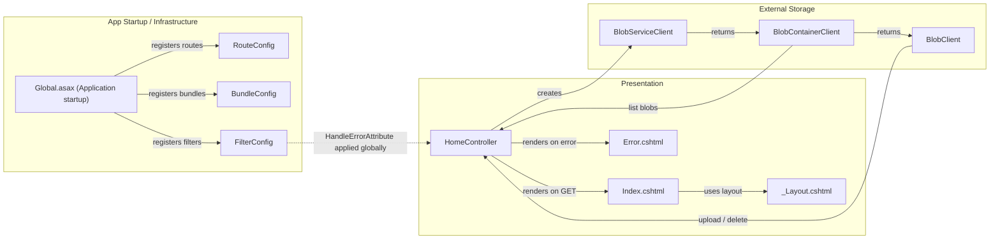

# Architecture Diagram

This document describes the architecture of the PhotoGallery web application — a legacy ASP.NET MVC 5 application (.NET Framework 4.8) that provides photo upload, browsing, and deletion capabilities backed by Azure Blob Storage.

## Application Architecture

### Technology Stack Summary

| Layer | Technology | Version | Purpose |
|---|---|---|---|
| Presentation | ASP.NET MVC | 5.2.3 | Server-side MVC web framework |
| Presentation | Razor Views | 3.2.3 | HTML templating engine |
| Presentation | Bootstrap | 3.x | Responsive UI styling |
| Presentation | jQuery | 1.10.2 | Client-side scripting |
| Application | .NET Framework | 4.8 | Runtime platform |
| Application | System.Web.Optimization | 1.1.3 | JS and CSS bundling / minification |
| Data / Storage | Azure.Storage.Blobs | 12.9.1 | Azure Blob Storage SDK |
| Data / Storage | Azure.Core | 1.18.0 | Azure SDK core primitives |
| Configuration | Web.config | — | Connection strings and app settings |

### Data Storage & External Services

The application has no local database. All photo files are stored in and retrieved from **Azure Blob Storage** using the `Azure.Storage.Blobs` SDK. A single named container (`webappstoragedotnet-imagecontainer`) is created on first use with public blob-level read access. The storage account connection string is read at runtime from `Web.config` (`StorageConnectionString`); in development the value defaults to `UseDevelopmentStorage=true` (Azure Storage Emulator).

### Key Architectural Decisions

- **Thin controller, no service layer**: All blob interaction logic lives directly inside `HomeController`, keeping the codebase compact but mixing business logic with presentation concerns.
- **Static `BlobContainerClient` field**: The container client is stored as a `static` class field and re-initialised on every `Index` request, which avoids per-request client construction overhead but is not thread-safe under concurrent index calls.
- **Public blob access**: The blob container is created with `PublicAccessType.Blob`, making uploaded images publicly readable without authentication tokens.

## Component Relationships

### Component Inventory

| Component | Layer | Type | Responsibility |
|---|---|---|---|
| HomeController | Presentation | MVC Controller | Handles list, upload, and delete actions for gallery images |
| Index.cshtml | Presentation | Razor View | Renders the photo gallery grid and upload / delete forms |
| Error.cshtml | Presentation | Razor View | Displays error messages and stack traces |
| _Layout.cshtml | Presentation | Razor Layout | Shared page shell (Bootstrap navbar, CSS, JS bundles) |
| Global.asax | App Startup | HTTP Application | Bootstraps MVC infrastructure on application start |
| RouteConfig | App Startup | Route Configuration | Defines conventional MVC route (`{controller}/{action}/{id}`) |
| BundleConfig | App Startup | Bundle Configuration | Registers jQuery, Bootstrap, and Modernizr script and style bundles |
| FilterConfig | App Startup | Filter Configuration | Registers `HandleErrorAttribute` as a global exception filter |
