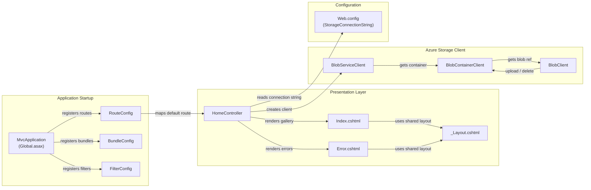

# Architecture Diagram

This document provides a two-layer architecture visualization of the PhotoGallery web application: a high-level application architecture diagram and a detailed component relationship diagram.

## Application Architecture

```mermaid
flowchart TD
    subgraph Client["Client Layer"]
        Browser["Web Browser\n(Bootstrap 3 / jQuery 1.10.2)"]
    end
    subgraph App["Application Layer - ASP.NET MVC 5 / .NET Framework 4.8"]
        MVC["ASP.NET MVC 5 Framework"]
        HomeCtrl["HomeController\n(List / Upload / Delete)"]
        Razor["Razor Views\n(Index, Error, Layout)"]
        Bundle["Bundling and Minification\n(System.Web.Optimization)"]
    end
    subgraph Config["Configuration"]
        WebConfig["Web.config\n(StorageConnectionString)"]
    end
    subgraph External["External Services"]
        AzureBlob["Azure Blob Storage\n(Azure.Storage.Blobs 12.9.1)"]
        Container["Blob Container\nwebappstoragedotnet-imagecontainer"]
    end

    Browser -->|"HTTP requests"| MVC
    MVC -->|"routes to"| HomeCtrl
    HomeCtrl -->|"renders"| Razor
    Razor -->|"serves HTML"| Browser
    Bundle -->|"delivers assets"| Browser
    HomeCtrl -->|"reads connection string"| WebConfig
    HomeCtrl -->|"list / upload / delete blobs"| AzureBlob
    AzureBlob -->|"stores images in"| Container
```

### Technology Stack Summary

| Layer | Technology | Version | Purpose |
|---|---|---|---|
| Presentation | ASP.NET MVC 5 (Razor) | 5.2.3 | Server-side MVC web framework with Razor view engine |
| Presentation | Bootstrap | 3.0.0 | Responsive CSS front-end framework |
| Presentation | jQuery | 1.10.2 | Client-side scripting and AJAX |
| Presentation | Modernizr | 2.6.2 | Feature detection for progressive enhancement |
| Application | .NET Framework | 4.8 | Runtime platform |
| Application | C# | 6.0 | Application programming language |
| Application | System.Web.Optimization | 1.1.3 | Script and CSS bundling/minification |
| Data Access | Azure.Storage.Blobs | 12.9.1 | Azure Blob Storage SDK for image persistence |
| Data Access | Azure.Core | 1.18.0 | Azure SDK core transport and authentication |
| Configuration | Web.config | N/A | App settings and connection string management |

### Data Storage & External Services

The application uses **Azure Blob Storage** as its sole data store, accessed via the `Azure.Storage.Blobs` SDK (v12.9.1). All uploaded photos are stored as Block Blobs inside a dedicated container named `webappstoragedotnet-imagecontainer` with public read access. The connection string (`StorageConnectionString`) is read from `Web.config` at runtime, defaulting to the local Azure Storage Emulator (`UseDevelopmentStorage=true`). There are no relational databases, caches, or message queues involved.

### Key Architectural Decisions

- **Direct SDK calls from the controller**: The `HomeController` calls `Azure.Storage.Blobs` directly without a separate service or repository layer, making this a thin single-tier MVC application.
- **Public blob container access**: Blobs are exposed with `PublicAccessType.Blob`, allowing direct browser rendering of uploaded images via their Azure Storage URLs without SAS tokens.
- **Asynchronous I/O throughout**: All Azure Storage operations (`CreateIfNotExistsAsync`, `UploadAsync`, `DeleteIfExistsAsync`) use async/await to keep the web server thread pool free during I/O.

## Component Relationships

### Component Inventory

| Component | Layer | Type | Responsibility |
|---|---|---|---|
| HomeController | Presentation | MVC Controller | Handles all HTTP actions: listing blobs (Index), uploading photos (UploadAsync), deleting a single photo (DeleteImage), and deleting all photos (DeleteAll) |
| Index.cshtml | Presentation | Razor View | Displays the photo gallery grid with upload form and per-image delete buttons |
| Error.cshtml | Presentation | Razor View | Renders error messages and stack traces on exceptions |
| _Layout.cshtml | Presentation | Razor Layout | Shared master page providing navigation bar and page shell |
| MvcApplication (Global.asax) | Application Startup | HTTP Application | Bootstraps the MVC application on first request (registers routes, bundles, filters) |
| RouteConfig | Application Startup | Route Registration | Defines the default `{controller}/{action}/{id}` URL route |
| BundleConfig | Application Startup | Bundle Registration | Defines script and CSS bundles (jQuery, Bootstrap, Modernizr) |
| FilterConfig | Application Startup | Filter Registration | Registers global MVC action filters (HandleError) |
| BlobServiceClient | Storage | Azure SDK Client | Entry point to Azure Blob Storage, created from the storage connection string |
| BlobContainerClient | Storage | Azure SDK Client | Represents the image blob container; creates it on startup if absent |
| BlobClient | Storage | Azure SDK Client | Represents an individual blob; used for upload and delete operations |
| Web.config | Configuration | Configuration File | Stores the `StorageConnectionString` app setting and ASP.NET runtime settings |
