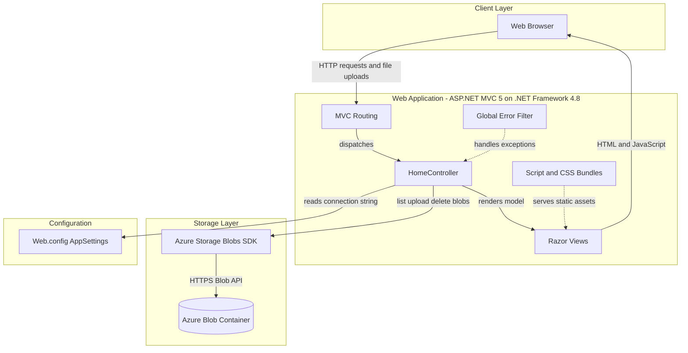
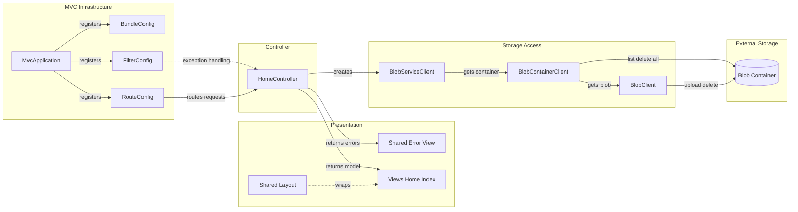

# Architecture Diagram

This ASP.NET MVC photo gallery is a single web application that renders Razor views and stores uploaded images in Azure Blob Storage. The application has a compact controller-centric design with framework-provided routing, filters, and bundling.

## Application Architecture

### Technology Stack Summary

| Layer | Technology | Version | Purpose |
|---|---:|---:|---|
| Presentation | ASP.NET MVC | 5.2.3 | Server-side MVC routing, controllers, and Razor views |
| Runtime | .NET Framework | 4.8 | Application target framework |
| View Engine | Razor WebPages | 3.2.3 | Razor view rendering |
| Client Assets | Bootstrap, jQuery, Modernizr, Respond | 3.0.0, 1.10.2, 2.6.2, 1.2.0 | Layout, DOM scripting, validation, and browser compatibility |
| Storage Integration | Azure.Storage.Blobs | 12.9.1 | Lists, uploads, and deletes image blobs |
| Serialization and Utilities | Newtonsoft.Json, System.Text.Json | 6.0.8, 4.6.0 | JSON and supporting utility libraries |

### Data Storage & External Services

The application uses Azure Blob Storage as its primary persistence mechanism. `HomeController` reads `StorageConnectionString` from `Web.config`, creates or opens the `webappstoragedotnet-imagecontainer` blob container, lists block blobs as image URIs, uploads selected files, and deletes individual or all blobs. No relational database, cache, message broker, or separate API service is present.

### Key Architectural Decisions

- Uses a single ASP.NET MVC controller for gallery listing, upload, and delete operations rather than a separate service layer.
- Uses Azure Blob Storage directly from the controller and stores gallery state externally in a blob container.
- Enables public blob access when creating the container, so rendered image links can be viewed directly by browsers.

## Component Relationships

### Component Inventory

| Component | Layer | Type | Responsibility |
|---|---|---|---|
| MvcApplication | MVC Infrastructure | HttpApplication | Registers areas, filters, routes, and bundles at application startup |
| RouteConfig | MVC Infrastructure | Route registration | Defines the default `{controller}/{action}/{id}` MVC route |
| FilterConfig | MVC Infrastructure | Filter registration | Adds the global `HandleErrorAttribute` filter |
| BundleConfig | MVC Infrastructure | Asset bundling | Bundles jQuery, validation, Modernizr, Bootstrap, Respond, and CSS assets |
| HomeController | Controller | MVC Controller | Lists images, handles uploads, deletes selected images, and deletes all images |
| Views/Home/Index.cshtml | Presentation | Razor view | Displays gallery images and upload/delete UI |
| Views/Shared/Error.cshtml | Presentation | Razor view | Displays exception information provided by the controller |
| Azure Blob SDK clients | Storage Access | External SDK clients | Connect to Azure Blob Storage and perform container/blob operations |
