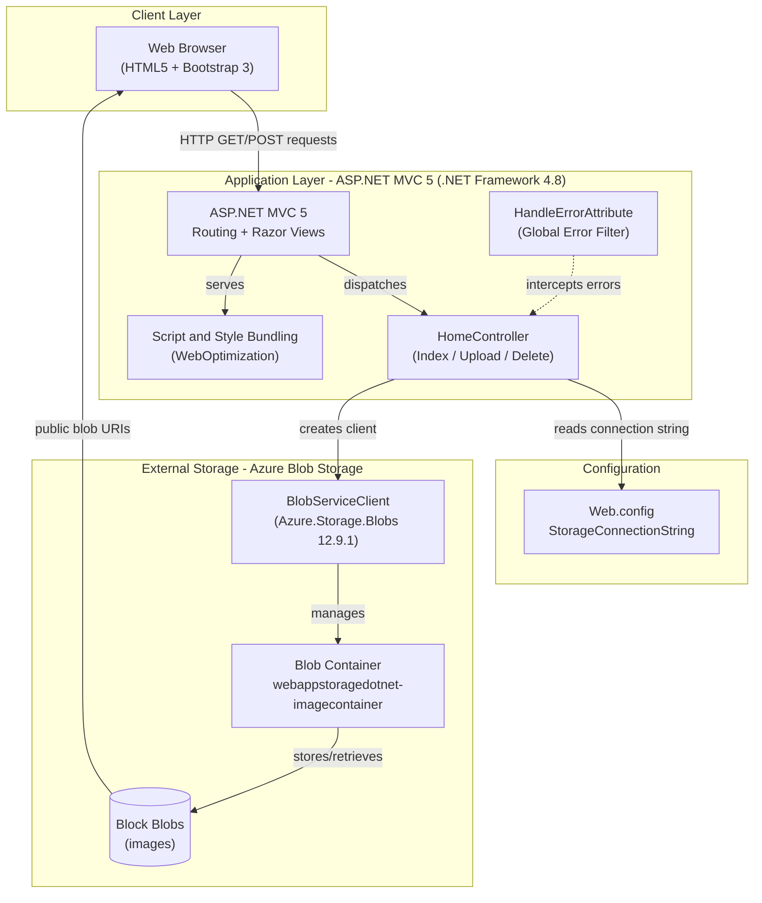
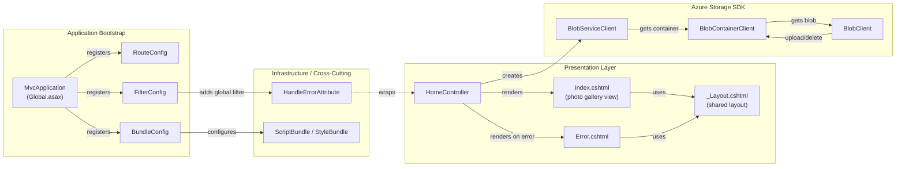

# Architecture Diagram

This document describes the architecture of the WebApp-Storage-DotNet Photo Gallery application, an ASP.NET MVC 5 web application that uses Azure Blob Storage to store and serve images.

## Application Architecture

### Technology Stack Summary

| Layer | Technology | Version | Purpose |
|-------|-----------|---------|---------|
| Presentation | ASP.NET MVC | 5.2.3 | Server-side MVC web framework |
| Presentation | Razor Views | 3.x | Server-side HTML templating |
| Presentation | Bootstrap | 3.x | CSS/UI framework |
| Presentation | jQuery | 1.10.2 | Client-side scripting |
| Application | .NET Framework | 4.8 | Runtime platform |
| Application | System.Web.Optimization | 1.1.3 | Script/CSS bundling and minification |
| Storage SDK | Azure.Storage.Blobs | 12.9.1 | Azure Blob Storage client |
| Storage SDK | Azure.Core | 1.18.0 | Azure SDK core primitives |
| Configuration | Web.config | — | App settings (storage connection string) |

### Data Storage & External Services

The application uses **Azure Blob Storage** as its sole external storage backend. A single blob container (`webappstoragedotnet-imagecontainer`) holds all uploaded images as Block Blobs with public read access. Blob URIs are returned directly to the browser, so images are served from Azure CDN-backed endpoints rather than proxied through the web server. The storage connection string (`StorageConnectionString`) is read at runtime from `Web.config`; by default it points to the Azure Storage Emulator (`UseDevelopmentStorage=true`).

### Key Architectural Decisions

- **Direct Azure SDK integration**: The controller calls `Azure.Storage.Blobs` (v12 SDK) directly — there is no repository or service layer abstraction between the controller and the blob storage client.
- **Public blob access**: The container is created with `PublicAccessType.Blob`, allowing browsers to fetch images directly from the Blob Storage URL without SAS tokens.
- **Convention-over-configuration MVC routing**: The default `{controller}/{action}/{id}` route pattern is used with no custom routes.

## Component Relationships

### Component Inventory

| Component | Layer | Type | Responsibility |
|-----------|-------|------|---------------|
| HomeController | Presentation | MVC Controller | Handles all HTTP actions: list blobs (Index), upload images (UploadAsync), delete single image (DeleteImage), delete all (DeleteAll) |
| Index.cshtml | Presentation | Razor View | Renders the photo gallery grid showing all blob images |
| Error.cshtml | Presentation | Razor View | Displays error messages and stack traces |
| _Layout.cshtml | Presentation | Razor Layout | Shared HTML skeleton (navigation, Bootstrap, scripts) |
| MvcApplication | Application Bootstrap | HttpApplication | ASP.NET application entry point; registers routes, bundles, and filters on startup |
| RouteConfig | Application Bootstrap | Configuration | Defines MVC URL routing rules |
| BundleConfig | Application Bootstrap | Configuration | Configures jQuery, Bootstrap, and CSS script bundles |
| FilterConfig | Application Bootstrap | Configuration | Registers global MVC action filters (HandleErrorAttribute) |
| HandleErrorAttribute | Infrastructure | Global Filter | Catches unhandled exceptions in controllers and redirects to the Error view |
| BlobServiceClient | Azure Storage SDK | External Client | Top-level Azure Blob Storage client; created from the connection string |
| BlobContainerClient | Azure Storage SDK | External Client | Scoped client for the image container; used for listing and deleting blobs |
| BlobClient | Azure Storage SDK | External Client | Scoped client for individual blobs; used for upload and delete operations |
