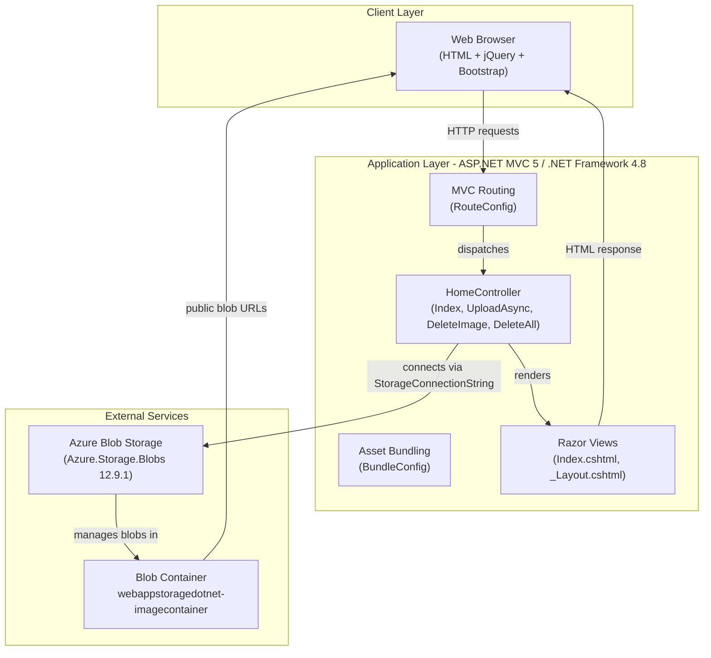
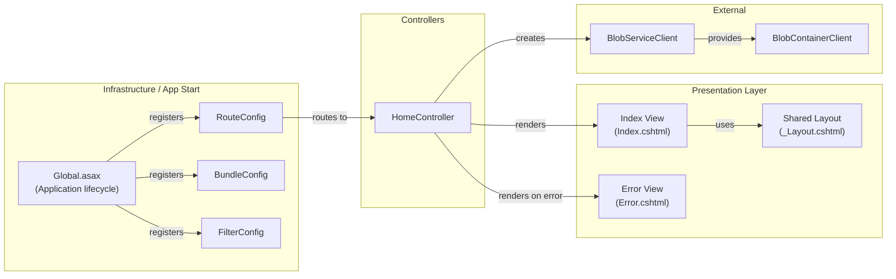

# Architecture Diagram

This document describes the architecture of the Azure Blob Storage Photo Gallery application, an ASP.NET MVC 5 web application targeting .NET Framework 4.8 that allows users to upload, view, and delete photos stored in Azure Blob Storage.

## Application Architecture

### Technology Stack Summary

| Layer | Technology | Version | Purpose |
|-------|-----------|---------|---------|
| Presentation | ASP.NET MVC 5 (Razor Views) | 5.2.3 | Server-side HTML rendering with Razor templates |
| Presentation | Bootstrap | 3.x | Responsive UI styling |
| Presentation | jQuery | 1.10.2 | Client-side scripting for file upload/delete interactions |
| Application | ASP.NET MVC 5 | 5.2.3 | MVC web framework, routing, controller pipeline |
| Application | .NET Framework | 4.8 | Runtime platform |
| Data Access | Azure.Storage.Blobs | 12.9.1 | Azure Blob Storage client SDK |
| Infrastructure | Azure.Core | 1.18.0 | Azure SDK core primitives |
| Infrastructure | Newtonsoft.Json | 6.0.8 | JSON serialization |

### Data Storage & External Services

The application uses **Azure Blob Storage** as its sole data store, accessed via the `Azure.Storage.Blobs` SDK (v12.9.1). Images are stored in a single blob container named `webappstoragedotnet-imagecontainer` with public blob access enabled. The connection string is provided via the `StorageConnectionString` app setting in `Web.config` (defaults to `UseDevelopmentStorage=true` for local development with the Azure Storage Emulator). No relational database, cache, or message broker is used.

### Key Architectural Decisions

- **Direct controller-to-storage pattern**: `HomeController` directly instantiates `BlobServiceClient` and `BlobContainerClient` using the connection string from `ConfigurationManager.AppSettings`, with no service/repository abstraction layer.
- **Async I/O for blob operations**: All Azure Blob Storage calls (`CreateIfNotExistsAsync`, `UploadAsync`, `DeleteIfExistsAsync`) use `async/await` to avoid blocking the ASP.NET thread pool.
- **Public blob access**: The blob container is created with `PublicAccessType.Blob`, allowing direct browser access to image URLs without SAS tokens.

## Component Relationships

### Component Inventory

| Component | Layer | Type | Responsibility |
|-----------|-------|------|---------------|
| HomeController | Controllers | MVC Controller | Handles all HTTP actions: listing blobs (Index), uploading files (UploadAsync), deleting single image (DeleteImage), deleting all images (DeleteAll) |
| Index.cshtml | Presentation | Razor View | Displays photo gallery grid, file upload form, delete controls, and client-side JavaScript |
| _Layout.cshtml | Presentation | Razor Layout | Shared HTML shell with navigation, Bootstrap integration, and bundle references |
| Error.cshtml | Presentation | Razor View | Displays error messages and stack traces on exception |
| RouteConfig | Infrastructure | App_Start Config | Registers default MVC route `{controller}/{action}/{id}` |
| BundleConfig | Infrastructure | App_Start Config | Configures script and CSS bundles (jQuery, Bootstrap, Modernizr) |
| FilterConfig | Infrastructure | App_Start Config | Registers global MVC action filters (HandleErrorAttribute) |
| Global.asax | Infrastructure | Application Entry | Wires up route, bundle, and filter configurations at application start |
