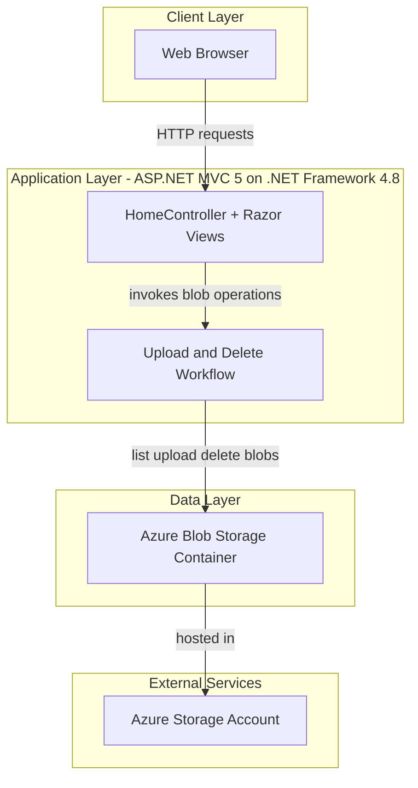
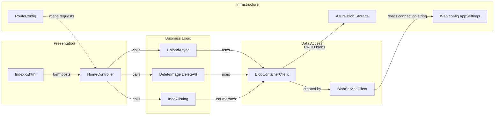

# Architecture Diagram

This repository contains a single ASP.NET MVC web application that serves a photo gallery UI and stores files in Azure Blob Storage. The architecture is a monolith with a clear presentation and service integration flow.

## Application Architecture

### Technology Stack Summary

| Layer | Technology | Version | Purpose |
|---|---|---|---|
| Presentation | ASP.NET MVC + Razor | MVC 5.2.3 | Render gallery page and handle form posts |
| Application | C# async controller actions | .NET Framework 4.8 | Coordinates upload, list, delete operations |
| Storage Integration | Azure.Storage.Blobs SDK | 12.9.1 | Communicates with Azure Blob Storage |
| Client assets | jQuery + Bootstrap | 1.10.2 / 3.0.0 | File selection UI and basic page styling |

### Data Storage & External Services

The application uses Azure Blob Storage as its only persistence layer. It reads `StorageConnectionString` from `Web.config`, creates/opens one container, and performs list, upload, and delete operations directly against blob storage.

### Key Architectural Decisions

- Uses a single MVC controller (`HomeController`) to keep request handling and blob access logic in one place.
- Uses asynchronous blob SDK operations (`CreateIfNotExistsAsync`, `UploadAsync`, `DeleteIfExistsAsync`) for I/O workloads.
- Uses direct cloud storage integration without a local relational database.

## Component Relationships

### Component Inventory

| Component | Layer | Type | Responsibility |
|---|---|---|---|
| Index.cshtml | Presentation | Razor View | Displays gallery items, file upload, delete actions |
| HomeController | Presentation | MVC Controller | Handles gallery request lifecycle |
| UploadAsync | Business Logic | Controller Action | Uploads selected files to blob container |
| DeleteImage/DeleteAll | Business Logic | Controller Actions | Deletes single/all images from storage |
| Index (action) | Business Logic | Controller Action | Creates container if needed and lists blob URIs |
| BlobServiceClient | Data Access | Azure SDK Client | Entry point for blob service operations |
| BlobContainerClient | Data Access | Azure SDK Client | Container-scoped blob listing/upload/delete |
| Web.config | Infrastructure | Configuration file | Stores storage connection string and runtime config |
| RouteConfig | Infrastructure | MVC route setup | Maps default route to Home controller |
