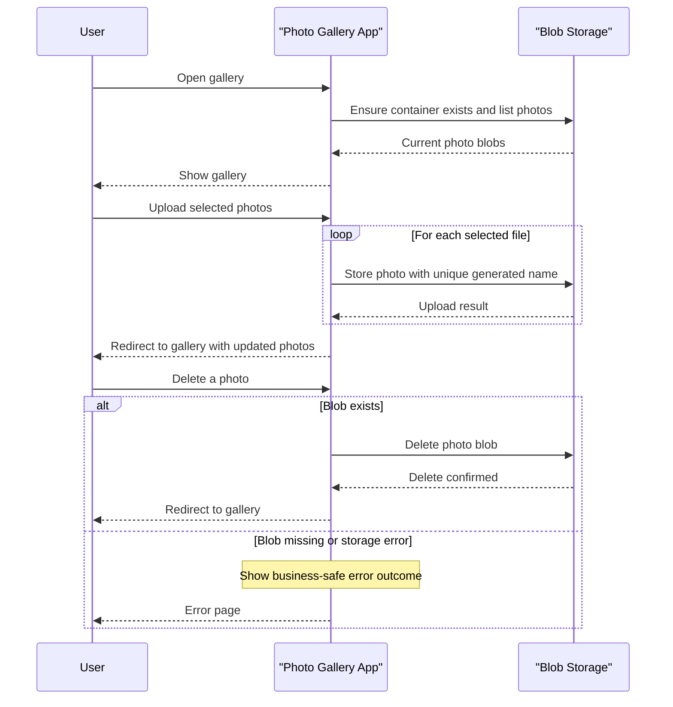

# Core Business Workflows

This application supports a simple photo gallery business flow: users upload, browse, and remove images managed in cloud blob storage. The core value is lightweight image management without additional multi-service orchestration.

## Domain Entities

| Entity | Service / Bounded Context | Description | Key Relationships |
|---|---|---|---|
| Gallery | Photo Management | Logical collection of uploaded photos shown to users | Contains many Photo objects |
| Photo | Photo Management | User-uploaded image asset stored as a blob object | Belongs to one Gallery |
| Storage Container | Storage Integration | External blob container boundary used for persistence | Stores many Photo blobs |

## Service-to-Domain Mapping

| Service | Domain Context | Owned Entities | External Dependencies |
|---|---|---|---|
| WebApp-Storage-DotNet | Photo Management | Gallery, Photo (logical application model) | Azure Blob Storage service |

## Primary Workflows

### Workflow 1: Browse Gallery

1. User opens the gallery page.
2. Application ensures the storage container exists.
3. Application retrieves blob list and filters to image block blobs.
4. Blob URIs are returned to the gallery view.
5. User sees current gallery contents.

Business rules involved:
- Only block blob entries are included in the visible gallery.
- Failures in storage access redirect to an error view.

### Workflow 2: Upload Photos

1. User selects one or more files and submits upload.
2. Application iterates through submitted files.
3. For each file, application creates a unique blob name.
4. File is uploaded to blob storage.
5. User is redirected back to updated gallery.

Business rules involved:
- Each uploaded file gets a generated unique name to avoid collisions.
- If no files are submitted, operation completes with no mutation.

### Workflow 3: Delete Photos

1. User deletes a single image (or all images) from gallery UI.
2. Application resolves target blob name(s).
3. Delete operation is issued for matching blob(s).
4. User is redirected to refreshed gallery.

Business rules involved:
- Delete operations are idempotent via "delete if exists" behavior.
- Errors during deletion show the error page.

## Cross-Service Data Flows

This solution has one application service and one external storage dependency. Data flow is direct and synchronous: the web app reads and mutates blob data in Azure Blob Storage, then renders the resulting state to users. There is no gateway composition or multi-service join logic; if storage calls fail, the user receives an error page rather than partial composite data.

## Business Workflow Sequence

## Business Rules & Decision Logic

- Uploaded photo names are transformed into generated unique storage names to prevent filename collisions.
- Gallery listing includes only blob entries identified as block blobs.
- Delete workflows use idempotent "if exists" semantics to avoid hard failures on already-removed files.
- Errors in storage operations are surfaced through an error view with diagnostic message/trace.
- No explicit role-based authorization rules are implemented in workflow entry points.
- No explicit transactional boundary spans multiple operations; each storage call acts as an independent operation.
