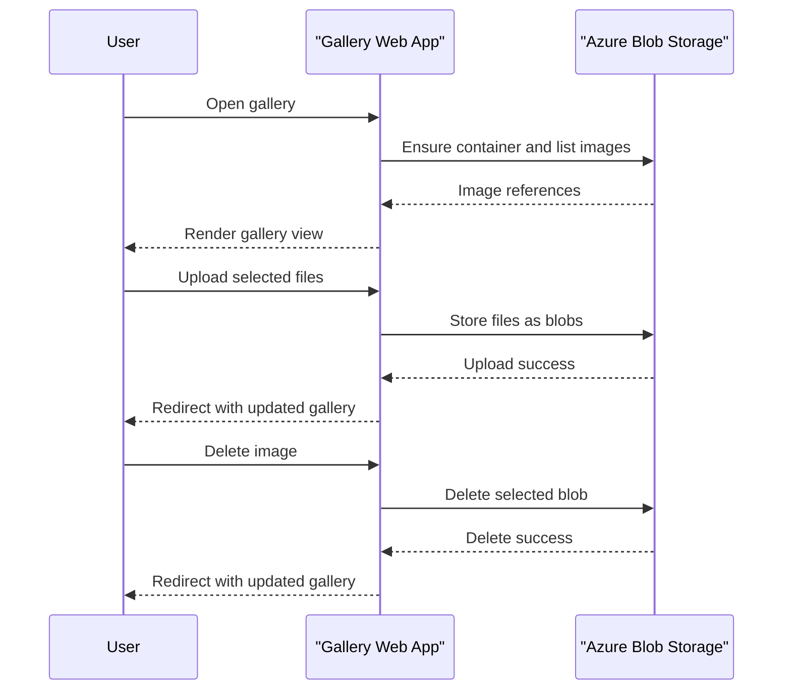

# Core Business Workflows

The application supports a photo-gallery workflow where users upload, view, and remove images stored in cloud blob storage. Business behavior focuses on file lifecycle management through a single web interface.

## Domain Entities

| Entity | Service / Bounded Context | Description | Key Relationships |
|---|---|---|---|
| Gallery Image | Photo Management | Represents one uploaded image available in gallery | Belongs to one Blob Container |
| Blob Container | Photo Management | Logical grouping for all gallery images | Contains many Gallery Images |
| Gallery Session | Web Interaction | User interaction state while browsing and submitting forms | Triggers upload/delete actions on images |

## Service-to-Domain Mapping

| Service | Domain Context | Owned Entities | External Dependencies |
|---|---|---|---|
| WebApp-Storage-DotNet | Photo Management | Gallery Image, Blob Container, Gallery Session | Azure Blob Storage |

## Primary Workflows

### Workflow 1: Browse Gallery

1. User opens the gallery page (`/Home/Index`).
2. Controller ensures container exists.
3. Application lists blobs and converts each to browser-viewable URI.
4. View renders image list and action controls.

### Workflow 2: Upload Photos

1. User selects one or more files and submits upload form (`POST /Home/UploadAsync`).
2. Controller iterates files and assigns random blob names.
3. Each file is uploaded to blob storage.
4. User is redirected to refreshed gallery.

### Workflow 3: Delete Photos

1. User requests single delete (`POST /Home/DeleteImage`) or bulk delete (`POST /Home/DeleteAll`).
2. Controller resolves blob names and issues delete commands.
3. Application redirects to gallery after completion.

## Cross-Service Data Flows

The workflow has one cross-service flow: web application to Azure Blob Storage for read/write/delete operations. There is no inter-service data join or composition and no alternate downstream fallback path.

## Business Workflow Sequence

## Business Rules & Decision Logic

- Uploaded files are assigned unique randomized names to avoid collisions.
- Only block blob items are listed for display in the gallery.
- Delete operations target either a single blob URI or all blobs in the container.
- Error handling returns a shared error page populated with exception message and stack trace.
