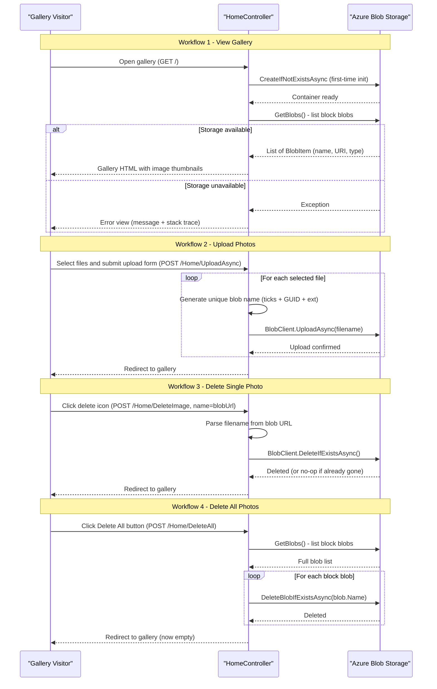

# Core Business Workflows

The application provides a simple photo gallery service that allows users to upload images to Azure Blob Storage, view them in a web gallery, and delete individual images or all images at once.

## Domain Entities

| Entity | Service / Bounded Context | Description | Key Relationships |
|--------|--------------------------|-------------|------------------|
| Blob (Image) | Photo Gallery | A single uploaded image file stored in Azure Blob Storage as a block blob; identified by a randomly generated name | Belongs to the single blob container |
| Blob Container | Photo Gallery | The logical grouping bucket (`webappstoragedotnet-imagecontainer`) that holds all uploaded images | Contains zero or more Blobs |

The application has a minimal domain model — there are no user accounts, albums, tags, comments, or access permissions. Every visitor shares the same gallery view and has equal ability to upload or delete.

## Service-to-Domain Mapping

| Service | Domain Context | Owned Entities | External Dependencies |
|---------|---------------|----------------|----------------------|
| WebApp-Storage-DotNet | Photo Gallery | Blob Container, Blob (Image) | Azure Blob Storage (data persistence and public image serving) |

There is a single service with a single bounded context. All business logic and data access are co-located in `HomeController`.

## Primary Workflows

### Workflow 1: View Photo Gallery

A visitor navigates to the application home page to view all uploaded photos.

**Steps:**
1. User sends `GET /` (or `/Home/Index`).
2. The controller connects to Azure Blob Storage using the configured connection string.
3. The container is created if it does not yet exist (first-run initialization).
4. All block blobs in the container are listed — their public URLs are collected into a `List<Uri>`.
5. The gallery view is rendered with one thumbnail per blob, each linked to its public Azure CDN URL.
6. If no blobs exist, the gallery renders empty (no delete controls shown).

**Business Rule**: Only block blobs are shown (`BlobType.Block` filter applied during listing).

---

### Workflow 2: Upload Photos

A user selects one or more image files and uploads them to the gallery.

**Steps:**
1. User selects files using the "Select Files" button (HTML file input, `multiple` attribute enabled).
2. The browser calls `DisplayFilesToUpload()` JavaScript to show a file list preview before submitting.
3. User clicks "Upload" to submit the form as `multipart/form-data` via `POST /Home/UploadAsync`.
4. The controller iterates over all submitted files.
5. For each file, a new blob name is generated: `{ticks}_{guid}{extension}` — ensuring global uniqueness and no naming collisions.
6. The file is uploaded to the container via `BlobClient.UploadAsync`.
7. After all files are uploaded, the user is redirected to the gallery (`GET /Home/Index`).

**Business Rule**: Each uploaded file receives a unique random name (current ticks + new GUID + original extension). Original filenames are not preserved in blob storage.

---

### Workflow 3: Delete Single Photo

A user removes an individual image from the gallery.

**Steps:**
1. User clicks the delete icon overlay on a photo thumbnail.
2. The browser executes the `deleteImage(item)` JavaScript function, which posts to `POST /Home/DeleteImage` with the full blob URL as the `name` parameter.
3. The controller parses the blob filename from the URL path using `Path.GetFileName(new Uri(name).LocalPath)`.
4. `BlobClient.DeleteIfExistsAsync()` is called — the operation is idempotent (no error if already deleted).
5. User is redirected back to the gallery.

---

### Workflow 4: Delete All Photos

A user removes all images from the gallery in one operation.

**Steps:**
1. User clicks the "Delete All Files" button (only visible when gallery is non-empty).
2. The form submits via `POST /Home/DeleteAll`.
3. The controller lists all block blobs in the container via `GetBlobs()`.
4. For each blob, `DeleteBlobIfExistsAsync(blob.Name)` is called sequentially (no parallelism).
5. User is redirected back to the (now empty) gallery.

**Business Rule**: Only block blobs are targeted for deletion (consistent with the listing filter).

## Cross-Service Data Flows

This is a single-service application with no inter-service communication. The only data flow is between the ASP.NET MVC controller and Azure Blob Storage:

- **Read flow**: Controller → `BlobContainerClient.GetBlobs()` → Azure Blob Storage REST API → list of `BlobItem` records → extract public blob URIs → render HTML gallery.
- **Write flow (upload)**: Browser file input → HTTP multipart POST → controller → `BlobClient.UploadAsync()` → Azure Blob Storage REST API.
- **Delete flow**: Browser JS post (single) or HTML form post (all) → controller → `BlobClient.DeleteIfExistsAsync()` / `BlobContainerClient.DeleteBlobIfExistsAsync()` → Azure Blob Storage REST API.

**Degraded mode behavior**: If Azure Blob Storage is unavailable, all four workflows fail. The controller's `try/catch` block catches the exception and renders the `Error` view with the exception message and stack trace. There is no retry, circuit breaker, or graceful degradation — a storage outage means a complete application failure for all users.

## Business Workflow Sequence



## Business Rules & Decision Logic

### Validation Rules

- **No server-side input validation** is implemented. File type, file size (beyond the 2 GB `maxRequestLength` limit in `Web.config`), and file count are not validated server-side.
- **No authentication or authorization**: any visitor can upload, view, and delete any photo without logging in.
- **Blob type filter**: only `BlobType.Block` blobs are listed and targeted for deletion — page blobs or append blobs in the container are ignored.

### Decision Logic

- **Container creation**: `CreateIfNotExistsAsync()` is called on every `Index` request. If the container already exists, this is a no-op. This acts as a lazy initialization guard rather than a startup routine.
- **Non-empty gallery gate**: The "Delete All" button only renders in the view if `Model != null && Model.Count > 0`, preventing unnecessary empty DELETE requests.
- **Idempotent deletes**: Both delete operations (`DeleteIfExistsAsync`, `DeleteBlobIfExistsAsync`) use safe "if exists" variants — deleting an already-gone blob does not throw an error.

### State Transitions

The blob lifecycle is simple:

```
[Not Exists] → UploadAsync → [Block Blob: Public] → DeleteIfExistsAsync → [Not Exists]
```

There are no intermediate states (processing, quarantine, soft-delete, archived).

### Cross-Cutting Concerns

- **Error handling**: All four controller actions wrap their logic in a `try/catch(Exception ex)` block. On any exception, the action returns `View("Error")` with `ViewData["message"]` and `ViewData["trace"]` populated. No exception is re-thrown and no logging framework records exceptions — errors are only visible to the end user.
- **Transactions**: Not applicable — Azure Blob Storage has no multi-operation transaction support. Upload and delete operations are individually atomic but not grouped.
- **Audit / logging**: No audit trail, application logging, or structured logging is implemented. Operations leave no server-side record beyond what Azure Storage diagnostics may capture.
- **Authorization**: None — all operations are publicly accessible to any HTTP client.
