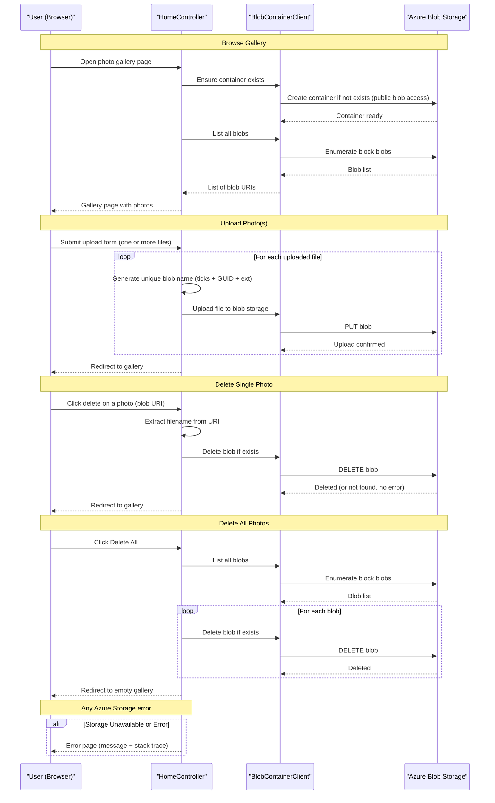

# Core Business Workflows

The PhotoGallery application enables users to manage a personal photo gallery stored in the cloud: browsing existing images, uploading new ones, and deleting individual photos or the entire collection.

## Domain Entities

| Entity | Service / Bounded Context | Description | Key Relationships |
|---|---|---|---|
| Photo (Blob) | Photo Management | A user-uploaded image file stored as a block blob in Azure Blob Storage. Identified by a randomised blob name and exposed via its public URI. | Belongs to one Photo Container |
| Photo Container | Photo Management | The Azure Blob Storage container (`webappstoragedotnet-imagecontainer`) that acts as the logical boundary for all uploaded photos. Created automatically on first use. | Contains zero or more Photos |

The domain model is deliberately minimal — there are no user accounts, albums, tags, comments, or metadata entities. Every photo is a flat, anonymous blob; the only relationship is the container-to-blob containment hierarchy.

## Service-to-Domain Mapping

| Service | Domain Context | Owned Entities | External Dependencies |
|---|---|---|---|
| WebApp-Storage-DotNet (HomeController) | Photo Management | Photo (Blob), Photo Container | Azure Blob Storage (`webappstoragedotnet-imagecontainer`) via `BlobContainerClient` |

This is a single-service application. There are no microservices, bounded contexts beyond Photo Management, or inter-service communication patterns.

## Primary Workflows

### Workflow 1: Browse Photo Gallery

**Entry point**: User navigates to `/` or `/Home/Index` (HTTP GET).

**Steps**:
1. The application connects to Azure Blob Storage using the configured connection string.
2. The blob container is created if it does not already exist (first-time initialisation), with public blob read access so photos are directly accessible in the browser.
3. All block blobs in the container are enumerated, and their public URIs are collected into a list.
4. The view renders a gallery grid showing each photo as an `` element whose `src` points directly to the Azure Blob Storage URL.
5. Upload and delete controls are rendered alongside the gallery.

**Business rules**: None beyond container initialisation. Any Azure Storage exception surfaces as an error page.

---

### Workflow 2: Upload Photo(s)

**Entry point**: User submits the upload form on the gallery page (HTTP POST `/Home/UploadAsync`, multipart form-data).

**Steps**:
1. The controller receives the multipart upload containing one or more files.
2. For each file in the request:
   a. A unique blob name is generated using the current timestamp ticks and a GUID to prevent name collisions (format: `{ticks}_{guid}.{ext}`).
   b. The file is uploaded to the blob container under the generated name.
3. On success, the user is redirected back to the gallery (`/Home/Index`), which re-loads the updated photo list.

**Business rules**:
- No file type or content validation is performed — any file extension is accepted.
- The HTTP runtime `maxRequestLength` is set to ~2 GB, allowing very large uploads.
- There is no per-user quota, file count limit, or duplicate-detection logic.
- If any individual file upload fails, the exception is caught and the Error view is shown; previously uploaded files in the same request are not rolled back.

---

### Workflow 3: Delete Single Photo

**Entry point**: User clicks the delete button on a specific photo (HTTP POST `/Home/DeleteImage`, form field `name` = full blob URI).

**Steps**:
1. The controller receives the full public URI of the blob to delete.
2. The blob filename is extracted from the URI path using `Path.GetFileName`.
3. `DeleteIfExistsAsync` is called on the blob. If the blob does not exist, the call succeeds silently.
4. The user is redirected back to the gallery.

**Business rules**:
- No ownership or authorisation check — any visitor can delete any photo.
- `DeleteIfExistsAsync` makes the operation idempotent (deleting a non-existent blob does not cause an error).

---

### Workflow 4: Delete All Photos

**Entry point**: User clicks the "Delete All" button (HTTP POST `/Home/DeleteAll`, no request body).

**Steps**:
1. The controller enumerates all block blobs in the container.
2. Each blob is deleted individually using `DeleteBlobIfExistsAsync`.
3. The loop processes all blobs sequentially with `await` on each delete call.
4. The user is redirected back to the (now-empty) gallery.

**Business rules**:
- No confirmation step, undo mechanism, or soft-delete — deletions are permanent and irreversible.
- No authorisation check — any visitor can trigger a complete wipe of the gallery.
- Each deletion is awaited individually; there is no parallel bulk-delete or batch operation.

## Cross-Service Data Flows

This is a single-service application with no cross-service data composition. The only external data flow is between the ASP.NET MVC controller and Azure Blob Storage:

- **Read path**: `HomeController.Index()` calls `GetBlobs()` to enumerate all blobs and maps them to a `List<Uri>` passed to the Razor view. No caching layer sits between the controller and storage — every page load results in a live storage enumeration.
- **Write path**: Upload and delete operations call the Azure SDK directly and redirect to the read path on completion. There is no event publishing, message queue, or webhook triggered by photo changes.

No circuit breaker, retry policy, or fallback behaviour is implemented. If Azure Blob Storage is unavailable, all four workflows fail with an unhandled exception that is caught by the global `HandleErrorAttribute` and shown to the user as an error page.

## Business Workflow Sequence

## Business Rules & Decision Logic

### Validation Rules

- **No file type validation**: The upload workflow accepts any file type and extension. There is no allowlist of image MIME types, no server-side content inspection, and no client-side file type restriction.
- **No file size validation beyond HTTP runtime limit**: The only upload size constraint is the ASP.NET `maxRequestLength` (~2 GB). There is no per-file or per-request business limit.
- **No required field validation**: The delete workflows do not validate that the provided blob URI is well-formed beyond what `Path.GetFileName` and the Azure SDK implicitly require.

### Decision Logic

- **Blob name generation**: Every uploaded file receives a name derived from `DateTime.Now.Ticks` concatenated with a `Guid.NewGuid()` and the original file extension. This prevents overwrites but also means the original filename is not preserved.
- **Block blob filter on list**: When enumerating blobs for the gallery and for `DeleteAll`, only blobs with `BlobType.Block` are included. Append or page blobs, if any existed, would be silently skipped.
- **Idempotent delete**: Both single-blob and bulk-delete operations use `DeleteIfExistsAsync` / `DeleteBlobIfExistsAsync`, so deleting a blob that has already been removed does not raise an error.

### State Transitions

There are no multi-state business entities. A photo exists in one of two states:
- **Present**: stored as a block blob in the container, publicly readable.
- **Deleted**: removed from the container, irretrievably gone.

There is no soft-delete, archive, draft, or approval state.

### Business Constraints

- **No authorisation**: All four workflows — including bulk delete — are accessible to any unauthenticated user. There is no login, role check, or ownership enforcement.
- **No undo or recycle bin**: Deletions are permanent and cannot be reversed from within the application.
- **No deduplication**: The same image can be uploaded multiple times, each time producing a separately named blob.

### Transactions & Error Handling

- Each Azure SDK call is individually awaited. There is no transaction scope, compensating action, or rollback if a multi-file upload partially fails. Files uploaded before the failure are retained; the failed file and any subsequent files in the same request are not uploaded.
- All exceptions are caught at the controller action level and forwarded to the `Error` view via `ViewData["message"]` and `ViewData["trace"]`. No structured error logging, alerting, or dead-letter queue is used.

### Audit / Logging

No audit trail or business-event logging is implemented. There is no record of who uploaded or deleted a photo, when it happened, or from which IP address.
