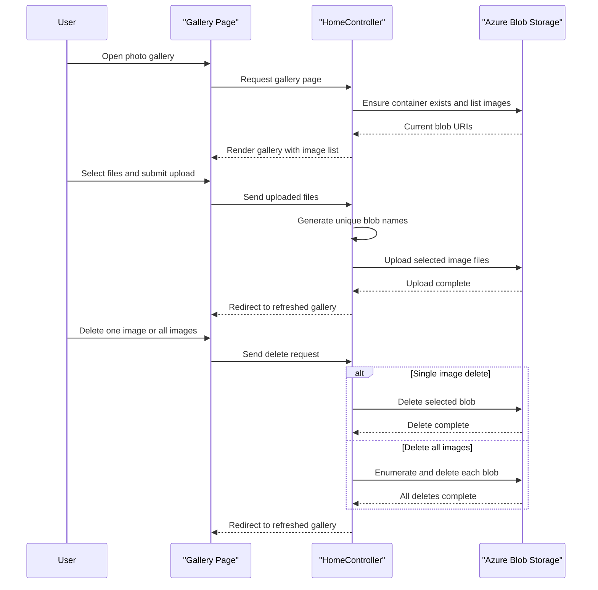

# Core Business Workflows

The application’s business domain is a simple photo gallery for storing and managing images in Azure Blob Storage. Its core workflows revolve around browsing the current gallery, uploading new image files, and deleting one or all stored images.

## Domain Entities

| Entity | Service / Bounded Context | Description | Key Relationships |
|---|---|---|---|
| Photo Gallery | WebApp-Storage-DotNet | The gallery collection presented to the user as the current set of stored image URIs | Composed from all blobs in the configured container |
| Photo Blob | WebApp-Storage-DotNet | An uploaded image object stored in blob storage and displayed in the gallery | Belongs to the gallery container |
| Storage Container | WebApp-Storage-DotNet | Logical bucket that groups all photo blobs for this application | Owns many photo blobs |

## Service-to-Domain Mapping

| Service | Domain Context | Owned Entities | External Dependencies |
|---|---|---|---|
| WebApp-Storage-DotNet | Photo Gallery Management | Photo Gallery, Photo Blob, Storage Container | Azure Blob Storage / emulator |

## Primary Workflows

### Workflow 1: Browse gallery

A user opens the default page, which routes to `HomeController.Index`. The controller reads the configured storage connection string, ensures the target container exists, enumerates block blobs, converts them into blob URIs, and returns the gallery view. If any storage error occurs, the workflow branches to the error view with exception details.

### Workflow 2: Upload images

A user selects one or more files in the browser and submits the upload form. `UploadAsync` iterates through `Request.Files`, generates a unique blob name for each file, uploads each file into blob storage, and redirects back to the gallery page so the user can immediately see the updated image list.

### Workflow 3: Delete images

A user can delete one image through the delete icon or remove all images through the bulk-delete form. The controller either resolves the selected blob name from the supplied URI and deletes it, or loops through all blobs in the container and removes each block blob before redirecting back to the refreshed gallery.

## Cross-Service Data Flows

There is no multi-service composition flow in this repository. All business data is gathered and mutated within the single MVC application, which talks directly to blob storage; when storage is unavailable, the user-facing degradation is immediate because the gallery cannot list, upload, or delete images and instead falls back to the error page.

## Business Workflow Sequence

## Business Rules & Decision Logic

- Only block blobs are treated as gallery items during listing and bulk deletion.
- Each uploaded file is assigned a generated blob name using the current timestamp, a GUID, and the original file extension to avoid name collisions.
- The gallery container is created on demand if it does not already exist, simplifying first-run setup.
- Error handling is coarse-grained: exceptions in any workflow route the user to the shared error view rather than applying compensating actions or partial-success messaging.
- No business-level authorization or role checks are present; any caller with access to the site can perform upload and delete operations.
