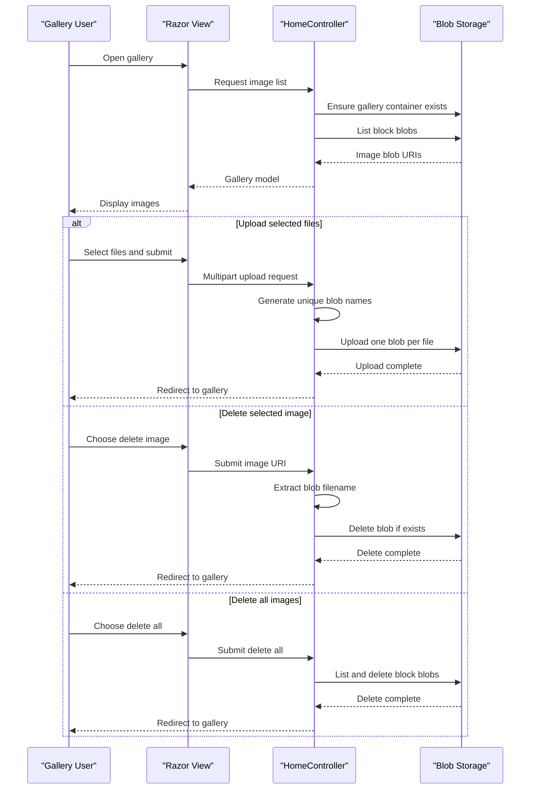

# Core Business Workflows

The application supports a photo gallery workflow where users view stored images, upload new images, delete a selected image, or clear the gallery. Business behavior is limited to file selection, unique blob naming, and blob storage operations.

## Domain Entities

| Entity | Service / Bounded Context | Description | Key Relationships |
|---|---|---|---|
| Gallery | WebApp-Storage-DotNet / Photo Gallery | The user-facing collection of uploaded images | Contains image blobs listed from the configured container |
| Image Blob | WebApp-Storage-DotNet / Photo Gallery | A stored image file represented by an Azure Blob URI | Belongs to the gallery blob container |
| Upload Request | WebApp-Storage-DotNet / Photo Gallery | Multipart browser request containing one or more selected files | Produces one blob per selected file |

## Service-to-Domain Mapping

| Service | Domain Context | Owned Entities | External Dependencies |
|---|---|---|---|
| WebApp-Storage-DotNet | Photo Gallery Management | Gallery, Image Blob, Upload Request | Azure Blob Storage |

## Primary Workflows

### Workflow 1: View Gallery

A user opens the gallery page. The application reads the storage connection string, creates the configured blob container if needed, lists block blobs, converts each blob to a URI, and renders the Razor view with the resulting image list. If storage access fails, the controller returns the error view with exception details.

### Workflow 2: Upload Images

A user selects one or more files in the browser and submits the upload form. The controller checks the request file count, generates a unique blob name for each selected filename by combining ticks, a GUID, and the original extension, uploads each file to the blob container, and redirects back to the gallery. If no files are supplied, the workflow redirects without storage mutation.

### Workflow 3: Delete Images

A user can delete one selected image or all displayed images. For a selected image, the controller extracts the filename from the submitted URI and deletes that blob if it exists. For deleting all images, the controller lists block blobs in the container and deletes each one before redirecting to the gallery.

## Cross-Service Data Flows

No cross-service business data flow or gateway aggregation pattern is present. The only external data flow is between the MVC application and Azure Blob Storage: the web app lists blob metadata for gallery display, uploads user-selected files as new blobs, and deletes blobs by name.

## Business Workflow Sequence

## Business Rules & Decision Logic

- Only requests with one or more uploaded files trigger blob upload; empty upload submissions redirect without creating blobs.
- Uploaded blob names are randomized using current ticks and a GUID while preserving the submitted file extension, reducing name collisions in the gallery container.
- Delete selected image trusts the submitted image URI to identify a blob filename and deletes the blob if present.
- Delete all affects only blobs in the configured container whose blob type is block blob.
- Exceptions during list, upload, or delete operations are caught by the controller and shown through the error view.
- No explicit authorization, ownership checks, image type validation, size validation beyond ASP.NET runtime limits, audit trail, or state machine was detected.
