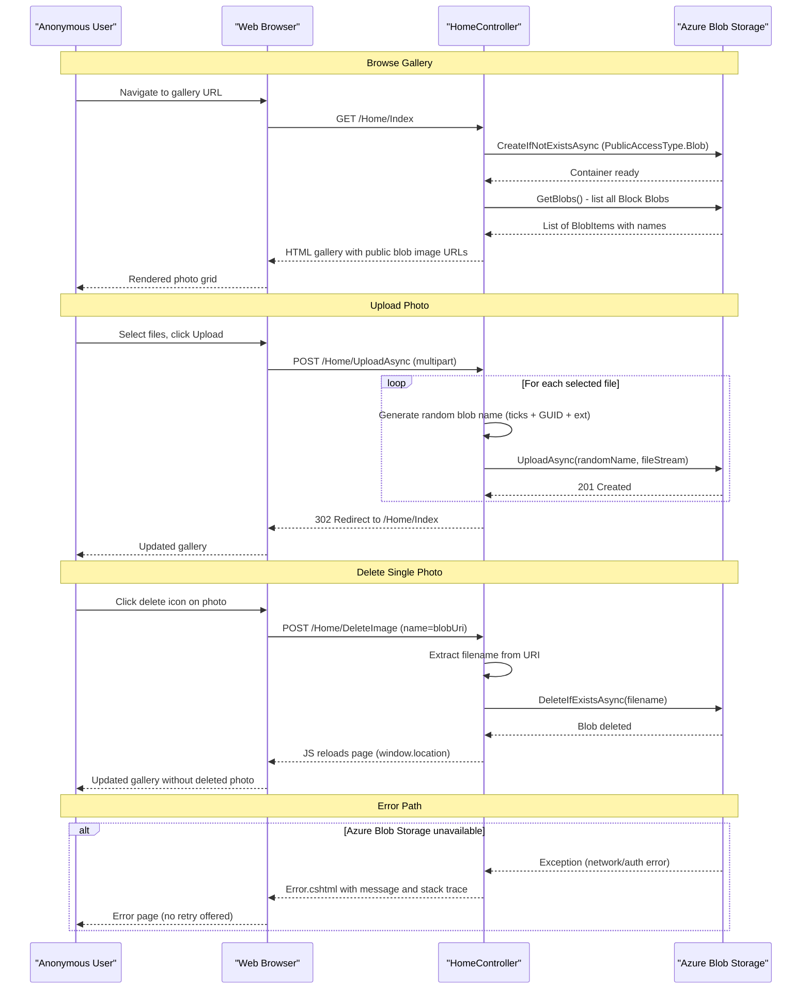

# Core Business Workflows

The application provides a self-service **photo gallery** backed by Azure Blob Storage, allowing users to upload, browse, and delete images through a web interface with no authentication requirement.

## Domain Entities

| Entity | Service / Bounded Context | Description | Key Relationships |
|--------|--------------------------|-------------|------------------|
| Photo (Block Blob) | Photo Gallery | An image file stored in Azure Blob Storage, identified by a randomly generated name. Represents the core asset managed by the application. | Belongs to the single gallery container |
| Gallery Container | Photo Gallery | The Azure Blob Storage container (`webappstoragedotnet-imagecontainer`) that acts as the root collection for all photos. Provisioned automatically on first use. | Contains zero or more Photos |

The domain model is deliberately minimal: there are no users, albums, tags, comments, metadata records, or ownership concepts. All images are publicly accessible and the gallery is a flat, unorganized collection.

## Service-to-Domain Mapping

| Service | Domain Context | Owned Entities | External Dependencies |
|---------|---------------|----------------|-----------------------|
| WebApp-Storage-DotNet | Photo Gallery Management | Gallery Container, Photo (Block Blob) | Azure Blob Storage (REST API via SDK) |

As a single-service application there are no cross-context or cross-service data exchange patterns. All domain state lives exclusively in Azure Blob Storage; the web application is stateless.

## Primary Workflows

### Workflow 1: Browse Gallery

**Actor**: Anonymous user  
**Entry point**: `GET /Home/Index`

1. User navigates to the application root URL
2. Application ensures the blob container exists (`CreateIfNotExistsAsync` with public blob access)
3. Application enumerates all Block Blobs in the container (`GetBlobs()`)
4. For each blob, the public HTTP URL is extracted and added to a list
5. The Index view renders a grid of image thumbnails, each linked to its public blob URL
6. Upload form and "Delete All" button are shown if any images exist

**Business rules involved**: Only `BlobType.Block` items are included in the gallery view (page blobs and append blobs are filtered out).

---

### Workflow 2: Upload Photo(s)

**Actor**: Anonymous user  
**Entry point**: `POST /Home/UploadAsync` (multipart/form-data)

1. User selects one or more image files via the file picker
2. Browser-side JavaScript (`DisplayFilesToUpload()`) shows a preview list and reveals the Upload button
3. User submits the upload form
4. For each selected file:
   a. A random, collision-resistant blob name is generated: `{DateTime.Now.Ticks}_{Guid.NewGuid()}{extension}`
   b. The file is uploaded to Azure Blob Storage via `BlobClient.UploadAsync()`
5. After all files are uploaded, the user is redirected to the gallery (`GET /Home/Index`)
6. On failure, the error message and stack trace are displayed

**Business rules involved**:
- Blob name uniqueness is enforced by combining current ticks and a new GUID — no user-supplied names are persisted
- Maximum upload size is controlled by `maxRequestLength=2100000000` (~2 GB) in `Web.config`
- No file type validation is performed — any file type may be uploaded
- No file size limit below the 2 GB maximum is enforced per file

---

### Workflow 3: Delete Single Photo

**Actor**: Anonymous user  
**Entry point**: `POST /Home/DeleteImage` (via jQuery `$.post`)

1. User clicks the delete icon overlaid on a gallery thumbnail
2. Client-side JavaScript calls `$.post("/Home/DeleteImage", { Name: blobUri })`
3. Controller extracts the blob filename from the full URI (`Path.GetFileName(uri.LocalPath)`)
4. The blob is deleted from Azure Blob Storage via `BlobClient.DeleteIfExistsAsync()`
5. Page is reloaded via `window.location.href = "/Home/Index"`
6. On failure, the error message is displayed (though the jQuery callback does not currently handle error responses)

**Business rules involved**:
- Only the filename segment of the URI is used as the blob identifier — the host and path prefix are stripped
- `DeleteIfExistsAsync` is used, so deleting an already-absent blob does not cause an error

---

### Workflow 4: Delete All Photos

**Actor**: Anonymous user  
**Entry point**: `POST /Home/DeleteAll`

1. User clicks "Delete All Files" submit button
2. Controller iterates over all blobs in the container (`GetBlobs()`)
3. For each Block Blob, `BlobContainerClient.DeleteBlobIfExistsAsync(blob.Name)` is called individually in a loop
4. After all blobs are deleted, the user is redirected to the gallery
5. On failure, the error is displayed

**Business rules involved**:
- Deletion is applied only to Block Blobs (page blobs are skipped by the `BlobType.Block` filter)
- No confirmation dialog is shown before deleting all photos — the form submission is the only gate
- No soft-delete or recycle bin; deletion is permanent

## Cross-Service Data Flows

The application is a single-service system with no microservice boundaries. There are no inter-service data composition flows, aggregation patterns, or circuit breaker fallback paths between services.

The only cross-system data flow is between the web application and Azure Blob Storage:

- **Read**: `GetBlobs()` returns metadata (blob name, type) from which the SDK constructs public blob URIs — no blob content is transferred to the web server
- **Write**: File upload streams the raw bytes from the web server to Azure Blob Storage
- **Delete**: A simple identifier (blob name) is sent to the Azure Storage REST API

**Degradation behavior (no fallback implemented)**: If Azure Blob Storage is unavailable, all four workflows fail with an unhandled `Exception` that is caught at the controller level and rendered via the Error view. There is no retry logic, circuit breaker, or graceful degradation path.

## Business Workflow Sequence

## Business Rules & Decision Logic

### Validation Rules

| Rule | Scope | Behavior |
|------|-------|---------|
| Block Blob type filter | Browse Gallery, Delete All | Only blobs with `BlobType == BlobType.Block` are included; page/append blobs are ignored |
| File count check | Upload | `if (fileCount > 0)` — zero-file submissions are silently ignored (no error, redirects to gallery) |
| Max upload size | Upload | HTTP runtime enforces `maxRequestLength=2100000000` (~2 GB); oversized requests receive HTTP 413 from IIS before reaching the controller |
| No file type validation | Upload | Any file type (not just images) may be uploaded — there is no MIME type check, extension allowlist, or antivirus scan |

### State Transitions

The gallery has no stateful entity lifecycle. The only implicit state is:

- **Container**: Does Not Exist → Exists (one-time transition on first request)
- **Blob**: Absent → Present (upload) → Absent (delete)

### Business Constraints

| Constraint | Enforcement |
|-----------|-------------|
| No authentication | All operations are open to any anonymous user with network access |
| No authorization | There are no roles, ownership checks, or access controls |
| No duplicate detection | Multiple uploads of the same image create separate blobs with different random names |
| No quota or rate limit | No per-user or per-session upload quota is enforced |
| Permanent deletion | `DeleteIfExistsAsync` / `DeleteBlobIfExistsAsync` are irreversible; no soft-delete |

### Error Handling

All four controller actions use a uniform `try/catch (Exception ex)` pattern:
- On success: redirect to gallery or return gallery view
- On any exception: set `ViewData["message"]` and `ViewData["trace"]`, render `Error.cshtml`

There is no domain-specific exception hierarchy, no compensating action for partial failures (e.g., if 3 of 5 uploads succeed before an error, the 3 uploaded blobs remain), and no dead-letter or retry mechanism.

### Transactions & Consistency

No database transactions apply. Each blob operation (upload, delete) is independently committed to Azure Blob Storage. A "Delete All" operation that fails midway leaves the container in a partially-deleted state with no rollback capability.

### Audit & Authorization

No audit logging, change tracking, session state, or authorization checks are implemented. The application has no concept of a logged-in user.
