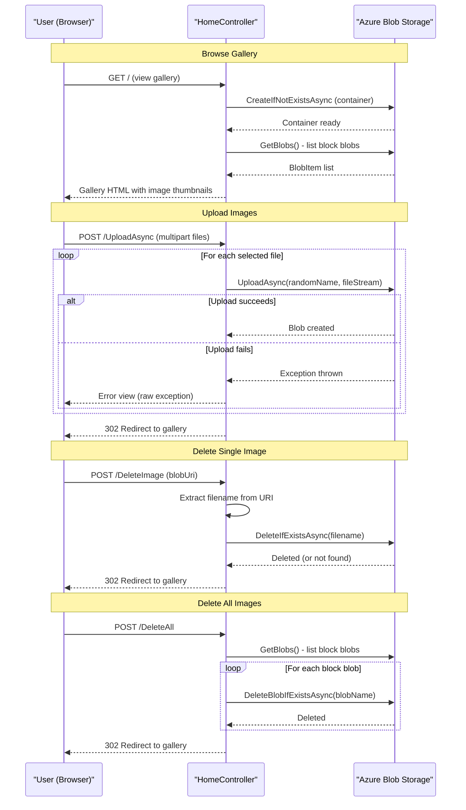

# Core Business Workflows

The application is an Azure Blob Storage photo gallery that allows users to browse, upload, and delete images stored in a cloud object store — with no user authentication, ownership model, or metadata management.

## Domain Entities

| Entity | Service / Bounded Context | Description | Key Relationships |
|---|---|---|---|
| Image Blob | Photo Gallery | A user-uploaded image file stored as a block blob in Azure Blob Storage | Belongs to a single container; identified by a randomly generated filename |
| Blob Container | Photo Gallery | The logical grouping (`webappstoragedotnet-imagecontainer`) that holds all gallery images | Contains zero or more image blobs; created automatically on first use |

The domain is minimal: there are no users, albums, tags, comments, or ownership records. All images exist in a flat, unscoped container accessible to anyone with the public URL.

## Service-to-Domain Mapping

| Service | Domain Context | Owned Entities | External Dependencies |
|---|---|---|---|
| WebApp-Storage-DotNet | Photo Gallery | Image Blob, Blob Container | Azure Blob Storage (Azure.Storage.Blobs SDK v12) |

This is a single-service application. There are no microservices, bounded context boundaries, or inter-service data flows.

## Primary Workflows

### Workflow 1: Browse Photo Gallery

A visitor opens the application homepage. The controller connects to Azure Blob Storage, ensures the container exists, lists all block blobs, and passes their public URIs to the Razor view. The view renders thumbnail images and provides upload and delete controls.

**Steps:**
1. Browser sends `GET /Home/Index`
2. Controller creates `BlobServiceClient` from `StorageConnectionString`
3. Controller calls `CreateIfNotExistsAsync` to ensure container exists (no-op if already present)
4. Controller calls `GetBlobs()` and filters for `BlobType == Block`
5. Blob URIs are collected into `List<Uri>`
6. Razor view renders gallery grid with thumbnails and delete icons

**Business rules involved:**
- Only block blobs are shown (page blobs and append blobs are excluded)
- All images are publicly visible — no per-image access control

---

### Workflow 2: Upload Image(s)

A user selects one or more files using the file picker and submits the form. Each selected file is uploaded to the blob container under a randomly generated filename to avoid collisions.

**Steps:**
1. User selects files in the browser; JavaScript shows a preview list and enables the Upload button
2. Browser sends `POST /Home/UploadAsync` with `multipart/form-data`
3. Controller reads `Request.Files` collection
4. For each file, a random blob name is generated: `{ticks}_{guid}{ext}`
5. `BlobClient.UploadAsync(fileStream)` is called for each file
6. On success, the controller redirects to `GET /Home/Index`
7. On failure, an error view renders the raw exception message and stack trace

**Business rules involved:**
- Any number of files may be selected in a single submission (no per-request file count limit is enforced in code)
- `maxRequestLength` is set to ~2 GB in `Web.config`, permitting very large uploads
- No file type validation, MIME type checking, or virus scanning is performed
- Blob names are randomised to prevent overwrite collisions

---

### Workflow 3: Delete Single Image

A user clicks the delete icon beneath a gallery thumbnail. JavaScript issues a POST to the delete endpoint passing the full blob URI; the controller extracts the filename from the URI and deletes the blob.

**Steps:**
1. User clicks delete icon; JavaScript calls `$.post('/Home/DeleteImage', { Name: blobUri })`
2. Browser sends `POST /Home/DeleteImage` with form field `Name`
3. Controller parses the blob URI to extract the filename with `Path.GetFileName(uri.LocalPath)`
4. `BlobClient.DeleteIfExistsAsync()` is called
5. Controller redirects to `GET /Home/Index`

**Business rules involved:**
- The blob name is derived by parsing the URI; a malformed URI causes an exception with no user-friendly fallback
- `DeleteIfExistsAsync` is used — if the blob was already deleted, the call is a no-op rather than an error
- There is no ownership check or confirmation step before deletion

---

### Workflow 4: Delete All Images

A user clicks the "Delete All Files" button. The controller retrieves the full blob list and deletes each block blob individually in a serial loop.

**Steps:**
1. User clicks "Delete All Files" submit button
2. Browser sends `POST /Home/DeleteAll`
3. Controller calls `GetBlobs()` and iterates over each block blob
4. For each blob, `DeleteBlobIfExistsAsync(blob.Name)` is called sequentially (`await` in loop — serial, not parallel)
5. Controller redirects to `GET /Home/Index`

**Business rules involved:**
- Deletion is irreversible — no confirmation dialog or recycle-bin pattern
- All images are deleted regardless of any attribute; there is no filtering or selection
- Partial failure is not handled: if one deletion throws, subsequent blobs remain and the error view is shown

## Cross-Service Data Flows

There are no cross-service data flows. The application is a monolithic single-service deployment. All data access is from `HomeController` directly to Azure Blob Storage via the SDK. No aggregation, fan-out, or inter-service composition patterns are present.

## Business Workflow Sequence

## Business Rules & Decision Logic

**Validation rules:**
- No server-side input validation is implemented. There are no file type checks, file size limits beyond the global `maxRequestLength` (~2 GB), or content inspection. The application trusts all user-supplied uploads unconditionally.
- The delete-by-name workflow parses the blob URI using `Path.GetFileName(uri.LocalPath)` — no validation that the URI belongs to the expected container or storage account.

**Decision logic:**
- On `GetBlobs()`, only blobs of `BlobType.Block` are included in the gallery display and in the Delete All loop. Page blobs and append blobs are silently skipped.
- The gallery displays zero or more images depending on what is in the container. There is no pagination, search, or filtering logic.

**State transitions:**
- Blob lifecycle: does not exist → uploaded → (optionally) deleted. There are no intermediate states, versioning, or soft-delete semantics enabled at the application level.

**Business constraints:**
- Blob names are generated as `{ticks}_{guid}{extension}`. This makes names globally unique but loses the original filename, making it impossible to identify images by their original name after upload.
- All images in the container are treated as equally owned — there is no per-user ownership, album, or tagging concept.

**Transactions:**
- No transactional semantics. Azure Blob Storage does not support multi-operation transactions. A partial failure during "Delete All" leaves the container in an inconsistent partially-deleted state with no compensating action.

**Error handling:**
- All four controller actions wrap their logic in a single `catch (Exception ex)` block that renders `ViewData["message"]` and `ViewData["trace"]` — exposing the full exception message and stack trace to the end user. This is a security and usability risk in production.

**Authorization:**
- No authentication or authorization is implemented. Any user with network access to the application can upload, view, and delete any image.

**Audit / logging:**
- No application-level logging is implemented. Failed operations surface only through the error view; there is no structured log, event store, or audit trail.
