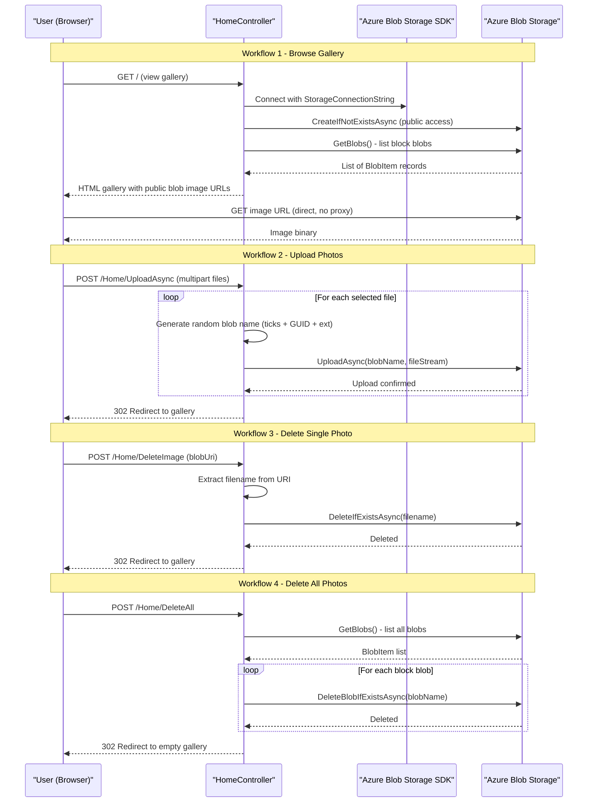

# Core Business Workflows

This application enables users to manage a personal photo gallery by uploading, browsing, and deleting images stored in Azure Blob Storage — with no user authentication or multi-tenancy.

## Domain Entities

| Entity | Service / Bounded Context | Description | Key Relationships |
|--------|--------------------------|-------------|------------------|
| Photo (Blob) | Photo Gallery (single service) | A user-uploaded image file stored as a block blob in Azure Blob Storage | Belongs to the shared blob container |
| Blob Container | Photo Gallery (single service) | The logical grouping of all uploaded photos (`webappstoragedotnet-imagecontainer`) | Contains zero or more Photos |

The domain model is minimal — there are no user accounts, albums, tags, metadata records, comments, or ownership concepts. All blobs share a single public container with no per-user isolation.

## Service-to-Domain Mapping

| Service | Domain Context | Owned Entities | External Dependencies |
|---------|---------------|----------------|--------------------|
| WebApp-Storage-DotNet | Photo Gallery Management | Photo (Blob), Blob Container | Azure Blob Storage (external cloud service) |

This is a single-service application. There are no microservices, bounded contexts, or cross-service data flows beyond the application calling Azure Blob Storage.

## Primary Workflows

### Workflow 1: Browse Photo Gallery

A user navigates to the application home page to view all uploaded photos.

**Steps:**
1. User opens the application (`GET /`)
2. Application connects to Azure Blob Storage using the configured connection string
3. The blob container is created if it does not exist (with public blob access)
4. All block blobs in the container are listed
5. Public HTTPS URLs for each blob are collected and passed to the view
6. The gallery page renders thumbnail images directly from Azure Blob Storage public URLs
7. If any Azure SDK error occurs, an error view is shown with the exception message and stack trace

**Business rules:** No authentication required; all images are publicly visible to any visitor.

---

### Workflow 2: Upload Photos

A user selects one or more image files to upload to the gallery.

**Steps:**
1. User clicks "Select Files" on the gallery page and selects one or more files
2. The browser displays the file names and sizes (`DisplayFilesToUpload()` JS function)
3. User clicks "Upload" — the form posts to `POST /Home/UploadAsync` with `multipart/form-data`
4. For each submitted file, a unique random blob name is generated (format: `{ticks}_{GUID}{ext}`)
5. Each file is uploaded to the blob container via `BlobClient.UploadAsync()`
6. After all uploads complete, the user is redirected back to the gallery (`GET /Home/Index`)
7. If any error occurs during upload, an error view is shown

**Business rules:**
- No file type validation — any file type is accepted
- No file size validation at the application layer (HTTP runtime allows up to ~2 GB per `maxRequestLength` setting)
- Blob names are randomised to prevent collisions and to obscure the original filename
- No duplicate detection — uploading the same file twice creates two separate blobs

---

### Workflow 3: Delete a Single Photo

A user deletes an individual photo from the gallery.

**Steps:**
1. User clicks the delete icon (trash image) under a photo on the gallery page
2. The `deleteImage(item)` JavaScript function posts the blob URI to `POST /Home/DeleteImage`
3. The controller extracts the filename from the URI path
4. The blob is deleted via `BlobClient.DeleteIfExistsAsync()`
5. User is redirected back to the gallery (`GET /Home/Index`)
6. If any error occurs, an error view is shown

**Business rules:**
- No confirmation prompt at the server side (the JS `deleteImage` function posts directly without confirm dialog)
- Uses `DeleteIfExists` — silently succeeds even if the blob was already deleted
- No soft delete or recycle bin — deletion is permanent and immediate

---

### Workflow 4: Delete All Photos

A user clears the entire gallery in one action.

**Steps:**
1. User clicks "Delete All Files" button (visible only when gallery has at least one image)
2. Form posts to `POST /Home/DeleteAll`
3. All block blobs in the container are listed
4. Each block blob is deleted via `BlobContainerClient.DeleteBlobIfExistsAsync()`
5. User is redirected back to the now-empty gallery
6. If any error occurs, an error view is shown

**Business rules:**
- No confirmation required — all photos are deleted immediately on button click
- Only block blobs are deleted (page blobs, if any, are ignored)
- Deletion is permanent with no undo capability

## Cross-Service Data Flows

This application has no cross-service data flows. It is a single-process application that communicates with one external service: **Azure Blob Storage**. All data originates from or is sent to Azure Blob Storage directly via the SDK. There is no API gateway, no service composition, no event bus, and no fallback/circuit-breaker logic.

The only "composition" pattern is within the `Index` action, which assembles a list of public blob URIs from the Azure SDK response and passes it to the Razor view — the browser then fetches each image directly from Azure Blob Storage's public endpoint, bypassing the application server entirely for image delivery.

## Business Workflow Sequence

## Business Rules & Decision Logic

### Validation Rules

| Rule | Location | Behavior |
|------|----------|---------|
| No file type restriction | `HomeController.UploadAsync` | Any file type accepted; no MIME-type or extension check |
| No file size limit (application level) | `Web.config httpRuntime` | `maxRequestLength=2100000000` (~2 GB); no per-file size check in code |
| No empty upload check | `HomeController.UploadAsync` | `fileCount > 0` guard; no further validation on each file |
| Blob name uniqueness | `GetRandomBlobName()` | Uses `DateTime.Now.Ticks + Guid.NewGuid()` to generate unique names; original filename not preserved |
| URI format for delete | `HomeController.DeleteImage` | Parses the blob URI with `new Uri(name)` and uses `Path.GetFileName()` to extract the blob name; no format validation |

### Decision Logic

| Decision | Condition | Outcome |
|----------|-----------|---------|
| Show "Delete All" button | `Model != null && Model.Count > 0` | Button only rendered when gallery has at least one image |
| Filter blobs to display | `blob.Properties.BlobType == BlobType.Block` | Only block blobs are shown (excludes page blobs and append blobs) |
| Filter blobs to delete (DeleteAll) | `blob.Properties.BlobType == BlobType.Block` | Only block blobs are deleted; other blob types are preserved |

### State Transitions

The only state in this application is the presence or absence of blobs in Azure Blob Storage:

- **No blobs** → Upload → **Has blobs** (gallery shows images)
- **Has blobs** → Delete single → **Fewer blobs** (or no blobs if last one deleted)
- **Has blobs** → Delete all → **No blobs**
- **Container absent** → First request → **Container created** (automatic via `CreateIfNotExistsAsync`)

### Cross-Cutting Concerns

| Concern | Implementation |
|---------|---------------|
| **Error handling** | All four controller actions wrap logic in `try/catch (Exception ex)` — catches any exception, sets `ViewData["message"]` and `ViewData["trace"]`, and returns the generic Error view. No typed business exceptions, no retry logic. |
| **Transactions** | None — Azure Blob Storage operations are individually atomic but there is no transactional grouping. If a multi-file upload fails mid-way, already-uploaded blobs are not rolled back. |
| **Authentication/Authorization** | None — all actions are open to any user. No `[Authorize]` attributes, no identity framework, no session management. |
| **Audit/Logging** | None — no application-level logging, audit trail, or structured event logging is implemented. Errors are only surfaced to the user via the Error view. |
| **Concurrency** | The static `blobContainer` field on `HomeController` is assigned on each `Index` request without locking, which could cause a race condition under concurrent requests. No concurrency controls are implemented. |
