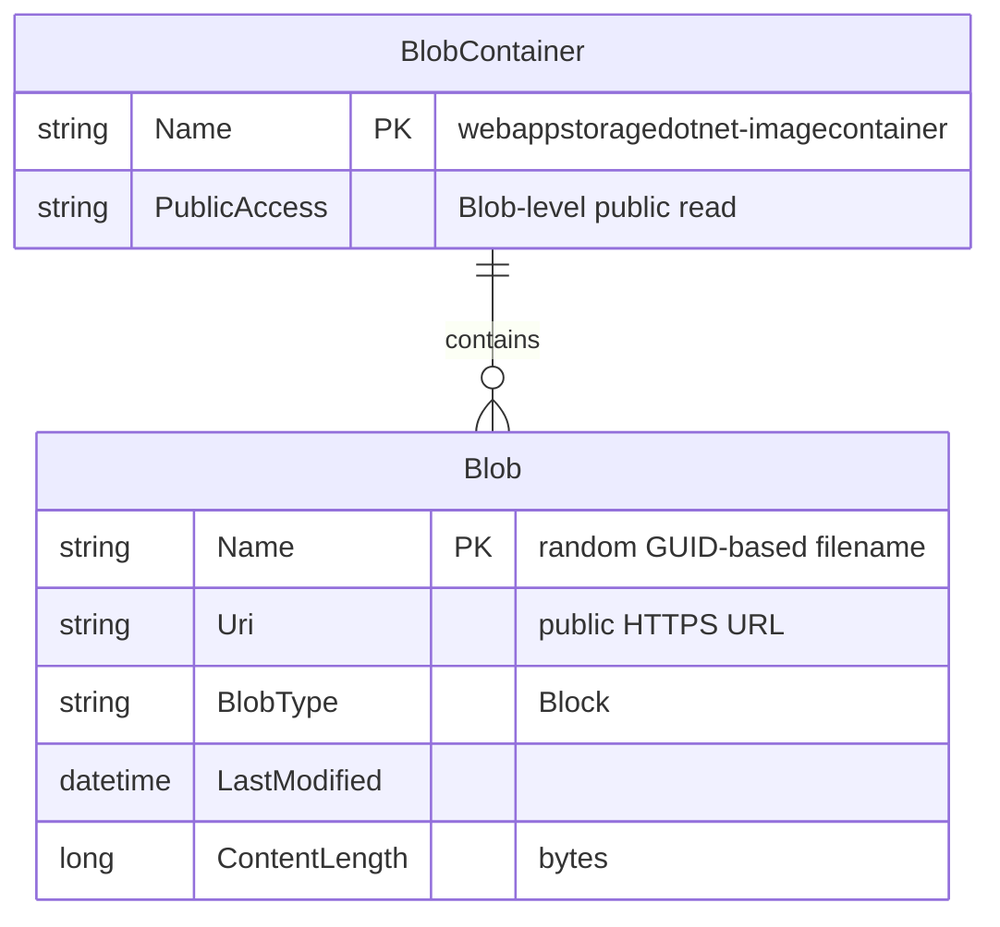

# Data Architecture & Persistence Layer

The application has no relational database or ORM layer. All persistent data is stored as unstructured binary blobs in a single Azure Blob Storage container, accessed directly through the `Azure.Storage.Blobs` v12 SDK without any intermediate data access abstraction.

## Database Configuration

| Service/Module | DB Type | Profile/Environment | Driver / SDK | Connection | Migration Tool |
|---|---|---|---|---|---|
| WebApp-Storage-DotNet | Azure Blob Storage | All (dev uses Storage Emulator) | Azure.Storage.Blobs 12.9.1 | `StorageConnectionString` in `Web.config` (default: `UseDevelopmentStorage=true`) | None — container created programmatically via `CreateIfNotExistsAsync` |

No relational database, migration framework (Flyway, Liquibase, EF Migrations), or schema versioning tooling is used. The only persistent store is the Azure Blob Storage container `webappstoragedotnet-imagecontainer`, which is created at runtime on first request if it does not already exist.

## Data Ownership per Service

| Service | Entities / Data Owned | ORM Framework | Caching | Notes |
|---|---|---|---|---|
| WebApp-Storage-DotNet | Image blobs in Azure Blob Storage container `webappstoragedotnet-imagecontainer` | None (direct SDK calls) | None | Container created with `PublicAccessType.Blob`; no transactional semantics |

## Entity Model

The application stores image files as opaque binary blobs. There are no application-defined entity classes or ORM mappings. The only conceptual entity is the **blob object** as represented by the Azure SDK types:

> Note: `BlobContainer` and `Blob` are Azure SDK domain objects, not application-defined entity classes. All metadata listed above is managed by Azure Blob Storage; the application stores no additional metadata.

## Key Repository Methods

The application does not define repository interfaces or use an ORM. All data access is performed inline within `HomeController` using the Azure Blob Storage SDK client objects:

| Service | Access Object | Operations Used | Purpose |
|---|---|---|---|
| HomeController | `BlobServiceClient` | Constructor with connection string | Initialise service client from config |
| HomeController | `BlobContainerClient` | `CreateIfNotExistsAsync(PublicAccessType.Blob)` | Ensure container exists on startup |
| HomeController | `BlobContainerClient` | `GetBlobs()` → filter `BlobType == Block` | List all image blobs for gallery view |
| HomeController | `BlobContainerClient` | `GetBlobClient(randomName)` | Obtain a client for a specific blob by name |
| HomeController | `BlobClient` | `UploadAsync(fileStream)` | Upload a new image file |
| HomeController | `BlobClient` | `DeleteIfExistsAsync()` | Delete a specific image by name |
| HomeController | `BlobContainerClient` | `DeleteBlobIfExistsAsync(blobName)` | Delete a blob during bulk delete |

No custom query methods, bulk-fetch helpers, or stored procedures exist. All access is synchronous from the persistence perspective (wrapped in `async/await` at the controller level).

## Caching Strategy

No caching layer is implemented. Every page load issues a live `GetBlobs()` call to Azure Blob Storage to enumerate the current container contents. There is no in-process cache, distributed cache (Redis, MemoryCache), or HTTP-level response caching configured.

The static `BlobContainerClient blobContainer` field on `HomeController` is re-assigned on every `Index` request and does not serve as a cache — it simply holds the most recently created client reference.

## Data Ownership Boundaries

The application is a single deployable unit with no inter-service data access. There is one data store (Azure Blob Storage) owned exclusively by this service. No shared database, cross-service queries, or CQRS patterns are present.

All read and write operations are performed through a direct SDK client with no abstraction boundary between the controller and the storage layer.

### Data Classification & Sensitivity

| Data Element | Sensitive Fields | Classification | Controls in Place |
|---|---|---|---|
| Uploaded image files | Binary content (photos) | Potentially sensitive — depends on content uploaded by users | None — blobs are publicly readable (`PublicAccessType.Blob`); no access control, encryption key management, or content scanning configured |
| Azure Storage connection string | `StorageConnectionString` (account key or SAS token) | Confidential (credential) | Stored in plain text in `Web.config`; no Azure Key Vault, environment variable injection, or secrets management in place |

No PII, PHI, or PCI fields are stored in application-managed entity classes (none exist). However, uploaded images may contain personally identifiable visual content. The connection string stored in `Web.config` is a sensitive credential and should be managed via a secrets store (Azure Key Vault, environment variables, or Azure App Configuration) in any production or cloud deployment.
