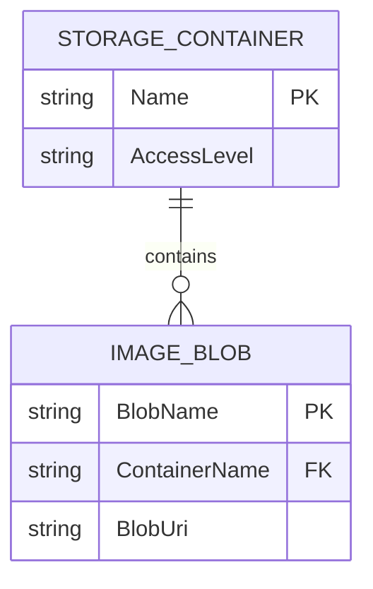

# Data Architecture & Persistence Layer

The application data layer is centered on Azure Blob Storage rather than relational persistence. There are no ORM entities or database tables in this repository.

## Database Configuration

| Service/Module | DB Type | Profile | Driver | Connection | Migration Tool |
|---|---|---|---|---|---|
| WebApp-Storage-DotNet | Azure Blob Storage | Default | Azure.Storage.Blobs SDK | `StorageConnectionString` app setting | None |

## Data Ownership per Service

| Service | Tables Owned | ORM Framework | Caching | Notes |
|---|---|---|---|---|
| WebApp-Storage-DotNet | None (blob objects only) | None | None | Owns container `webappstoragedotnet-imagecontainer` |

## Entity Model

## Key Repository Methods

| Service | Repository | Notable Methods | Purpose |
|---|---|---|---|
| WebApp-Storage-DotNet | BlobContainerClient usage in `HomeController` | `GetBlobs`, `GetBlobClient`, `DeleteBlobIfExistsAsync` | Read and delete image objects |
| WebApp-Storage-DotNet | BlobClient usage in `HomeController` | `UploadAsync`, `DeleteIfExistsAsync` | Upload and delete individual image blobs |

## Caching Strategy

No explicit caching layer is configured. Blob operations are executed directly against Azure Storage on each request.

## Data Ownership Boundaries

Data ownership is single-service and single-store: the MVC app writes and reads blob objects in one container. There are no cross-service database joins or CQRS patterns.

### Data Classification & Sensitivity

| Entity | Sensitive Fields | Classification (PII/PHI/PCI/None) | Controls in Place |
|---|---|---|---|
| IMAGE_BLOB | File names may contain user-provided text | PII (potential) | No explicit masking or field-level controls in code |
| STORAGE_CONTAINER | None | None | Managed by Azure Storage account controls outside app code |
