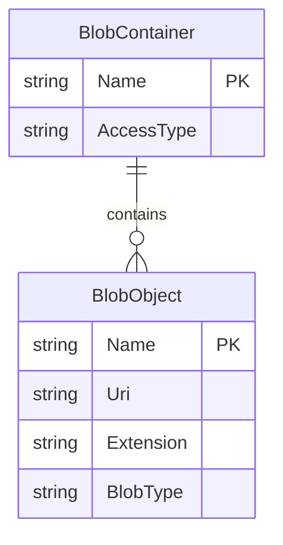

# Data Architecture & Persistence Layer

The application has no relational database or ORM entity model; it persists gallery images as blobs in a single Azure Blob Storage container. The data layer is implemented directly through Azure Storage SDK clients in the MVC controller.

## Database Configuration

| Service/Module | DB Type | Profile | Driver | Connection | Migration Tool |
|---|---|---|---|---|---|
| WebApp-Storage-DotNet | Azure Blob Storage | Default | Azure.Storage.Blobs 12.9.1 | `StorageConnectionString` app setting, defaulting to development storage | None |

## Data Ownership per Service

| Service | Tables Owned | ORM Framework | Caching | Notes |
|---|---|---|---|---|
| WebApp-Storage-DotNet | Blob container `webappstoragedotnet-imagecontainer` and uploaded image blobs | None | None detected | Single web app owns listing, upload, and deletion of blobs through Azure SDK calls |

## Entity Model

No JPA, Entity Framework, Dapper, database migrations, or relational entity classes were detected. The storage model is a blob container containing block blobs, each represented to the UI by a URI.

## Key Repository Methods

| Service | Repository | Notable Methods | Purpose |
|---|---|---|---|
| WebApp-Storage-DotNet | None | `BlobContainerClient.GetBlobs()` | Enumerates block blobs for gallery display |
| WebApp-Storage-DotNet | None | `BlobClient.UploadAsync(...)` | Uploads selected image files to blob storage |
| WebApp-Storage-DotNet | None | `BlobClient.DeleteIfExistsAsync()` | Deletes one selected blob by name |
| WebApp-Storage-DotNet | None | `BlobContainerClient.DeleteBlobIfExistsAsync(...)` | Deletes all listed block blobs during bulk delete |

## Caching Strategy

No application cache provider, object cache, distributed cache, query cache, or blob metadata cache was detected. Each gallery load lists blobs from Azure Blob Storage, and delete operations enumerate or address blobs directly.

## Data Ownership Boundaries

The application uses a shared external blob storage account rather than a database-per-service topology. There is only one application service, so no cross-service data ownership or CQRS pattern is present. Browser-visible image references are blob URIs returned from the MVC controller after listing storage contents.

### Data Classification & Sensitivity

| Entity | Sensitive Fields | Classification (PII/PHI/PCI/None) | Controls in Place |
|---|---|---|---|
| BlobObject | Uploaded file contents and filenames may contain user-provided information | Potential PII depending on uploaded images and filenames | No repository-level encryption, masking, content validation, or field-level access controls detected; Azure Storage platform encryption may apply outside application code |
| BlobContainer | Container name and blob URIs | None by itself | Container is created with public blob access in application code |
