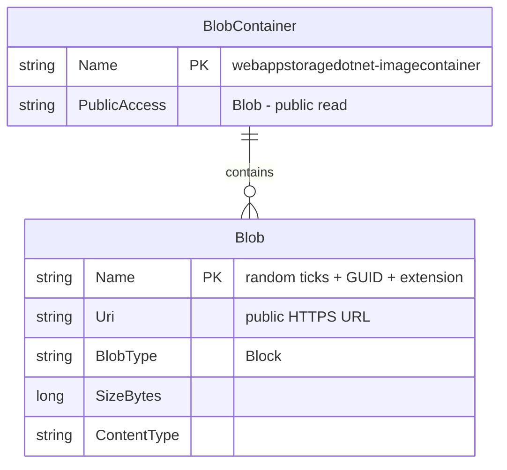

# Data Architecture & Persistence Layer

The application uses **Azure Blob Storage** as its sole persistence layer — there is no relational database, ORM, or entity model. All data consists of unstructured image blobs stored in a single public container.

## Database Configuration

| Service/Module | DB Type | Profile | Driver | Connection | Migration Tool |
|----------------|---------|---------|--------|-----------|----------------|
| WebApp-Storage-DotNet | Azure Blob Storage | All (single config) | Azure.Storage.Blobs SDK 12.9.1 | `StorageConnectionString` from `Web.config`; defaults to `UseDevelopmentStorage=true` (Azurite emulator) | None — container is created programmatically on first request via `CreateIfNotExistsAsync` |

No SQL database, connection pool, or schema migration tool is used. The `StorageConnectionString` key in `Web.config` controls which storage account the application connects to. No per-environment profiles exist; environment switching requires manually editing `Web.config`.

## Data Ownership per Service

| Service | Data Owned | Storage Framework | Caching | Notes |
|---------|-----------|------------------|---------|-------|
| WebApp-Storage-DotNet | Block blobs (images) in container `webappstoragedotnet-imagecontainer` | Azure.Storage.Blobs SDK v12 | None | Container is created with `PublicAccessType.Blob` on startup; no TTL or lifecycle policy configured |

## Entity Model

The application has no ORM entities or relational schema. The only persistent data unit is a **Blob** within a named container. The conceptual model is represented below:

> Note: This ER diagram represents the Azure Blob Storage data model as used by this application, not a relational database schema.

## Key Repository Methods

No repository interface or ORM data access layer is implemented. The `HomeController` directly calls the Azure SDK client methods. The table below documents these storage operations in lieu of repository methods.

| Service | Storage Client | Operation | Purpose |
|---------|---------------|-----------|---------|
| HomeController | `BlobContainerClient` | `CreateIfNotExistsAsync(PublicAccessType.Blob)` | Ensures the container exists with public blob access on every Index request |
| HomeController | `BlobContainerClient` | `GetBlobs()` | Lists all blobs in the container to display in the gallery |
| HomeController | `BlobContainerClient` | `GetBlobClient(name)` | Resolves a `BlobClient` for a specific blob by name |
| HomeController | `BlobClient` | `UploadAsync(filename)` | Uploads a file from the HTTP request to the blob container |
| HomeController | `BlobClient` | `DeleteIfExistsAsync()` | Deletes a single blob by name |
| HomeController | `BlobContainerClient` | `DeleteBlobIfExistsAsync(name)` | Deletes a blob inside the Delete All loop |

No transactions, batch operations, custom queries, or retry policies are implemented.

## Caching Strategy

No caching layer is configured. Each request to `/Home/Index` calls `GetBlobs()` directly against Azure Blob Storage, which incurs a live network round-trip every time. There is no in-memory cache, distributed cache (Redis), or HTTP response cache (`OutputCache`) applied to any endpoint.

This is a notable gap: listing blobs on every page load is a latency-sensitive operation that would benefit from short-lived in-memory caching (`IMemoryCache`) or an Azure CDN for serving the images directly.

## Data Ownership Boundaries

The application is a single-service deployment with no inter-service data sharing. All data lives in one Azure Storage account under one container. There is no database-per-service topology, CQRS separation, or event sourcing.

**Cross-service data access**: Not applicable — there are no other services. The blob container is publicly readable, meaning any external party with the blob URL can read images without authentication.

**Read/write patterns**: The application performs unbounded full-container scans on every `Index` request (`GetBlobs()` without pagination). This will degrade as the number of blobs grows, since there is no pagination, filtering, or continuation token pattern implemented.

### Data Classification & Sensitivity

| Entity | Sensitive Fields | Classification | Controls in Place |
|--------|-----------------|----------------|------------------|
| Blob (uploaded images) | Image content (may contain faces, personal photos) | Potential PII — depends on content | None — blobs are publicly accessible without authentication; no encryption-at-rest key management beyond Azure default (Microsoft-managed keys); no content scanning or access control |
| BlobContainer | Container name, public access level | Internal | None — access level is `PublicAccessType.Blob` meaning all blobs are world-readable |
| StorageConnectionString | Account name + account key (full control credential) | Confidential | Stored in plaintext in `Web.config`; no Key Vault or environment variable injection; anyone with access to the deployed `Web.config` file has full storage account access |

**Notable risk**: The `StorageConnectionString` stored in `Web.config` grants full data-plane access (read, write, delete) to the storage account. If this file is exposed (e.g., via a path traversal vulnerability or accidental deployment artifact), the entire storage account is compromised. Migration to a managed identity with a scoped role (e.g., `Storage Blob Data Contributor`) is strongly recommended.
