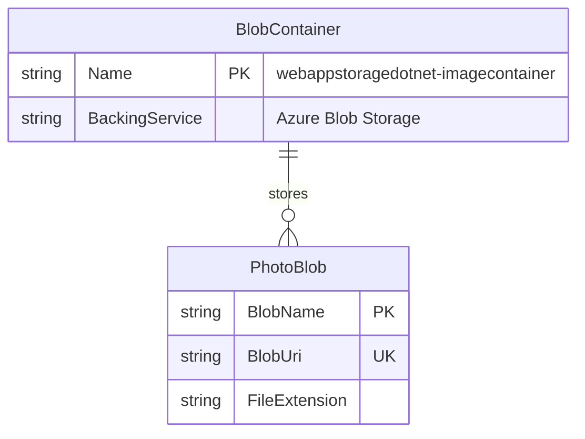

# Data Architecture & Persistence Layer

This application has a very small persistence layer centered on Azure Blob Storage rather than a relational database. It manages one logical data set—uploaded image blobs—through direct Azure SDK calls in the MVC controller, with no ORM, entity framework, or repository abstraction.

## Database Configuration

| Service/Module | DB Type | Profile | Driver | Connection | Migration Tool |
|---|---|---|---|---|---|
| WebApp-Storage-DotNet | Azure Blob Storage | Default | Azure.Storage.Blobs SDK | `StorageConnectionString` from `Web.config` (`UseDevelopmentStorage=true` by default) | None |

## Data Ownership per Service

| Service | Tables Owned | ORM Framework | Caching | Notes |
|---|---|---|---|---|
| WebApp-Storage-DotNet | No tables; owns one blob container for image objects | None | None | Images are stored as blobs in `webappstoragedotnet-imagecontainer` |

## Entity Model

## Key Repository Methods

| Service | Repository | Notable Methods | Purpose |
|---|---|---|---|
| WebApp-Storage-DotNet | Direct `BlobContainerClient` usage in `HomeController` | `CreateIfNotExistsAsync`, `GetBlobs`, `DeleteBlobIfExistsAsync` | Ensures the container exists, enumerates stored images, and removes blobs |
| WebApp-Storage-DotNet | Direct `BlobClient` usage in `HomeController` | `UploadAsync`, `DeleteIfExistsAsync` | Uploads selected files and deletes a single blob |

## Caching Strategy

No application-level caching layer was detected. Every gallery page load enumerates the current blob list from storage, and upload/delete operations act directly on blob storage without local cache-aside, read-through, or session-backed object caching.

## Data Ownership Boundaries

The application is a single service with a single persistence boundary. All image data is owned by the web application and stored in one blob container accessed directly through the Azure Storage SDK; there are no cross-service data access patterns, shared relational schemas, or CQRS-style read/write splits.

### Data Classification & Sensitivity

| Entity | Sensitive Fields | Classification (PII/PHI/PCI/None) | Controls in Place |
|---|---|---|---|
| PhotoBlob | None inferred from code; filenames may incidentally contain user-chosen text | None | No explicit masking, encryption-at-rest configuration, or field-level controls are defined in the application |
| Configuration | `StorageConnectionString` | Confidential | Stored in `Web.config`; no external secret store integration is configured in this repository |
