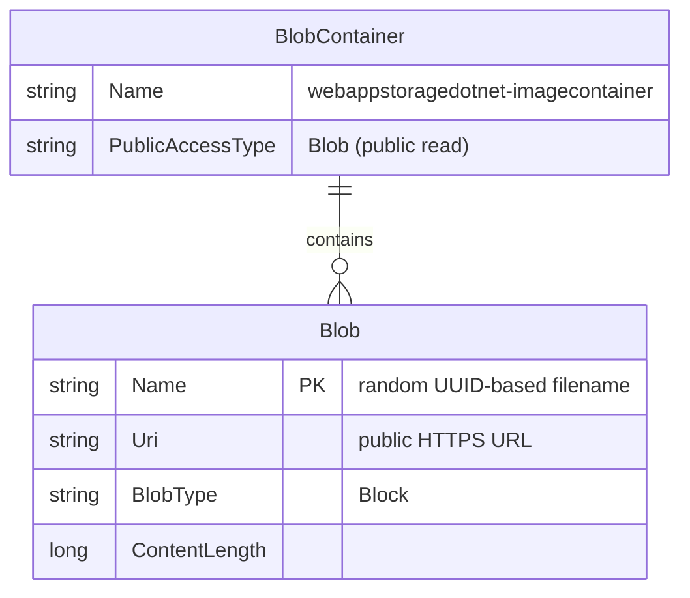

# Data Architecture & Persistence Layer

This application has no relational database or ORM layer; its sole data store is **Azure Blob Storage**, accessed directly via the Azure SDK without any abstraction repositories or entity models.

## Database Configuration

| Service/Module | DB Type | Profile | Driver | Connection | Migration Tool |
|---------------|---------|---------|--------|-----------|---------------|
| WebApp-Storage-DotNet | Azure Blob Storage | All (no profiles) | Azure.Storage.Blobs 12.9.1 | `StorageConnectionString` in Web.config (defaults to `UseDevelopmentStorage=true`) | None — Azure manages storage infrastructure |

No relational database, in-memory database, connection pooling, schema migration tool (Flyway, Liquibase, EF Migrations), or seed data mechanism is configured. Schema management is entirely handled by the Azure Blob Storage service — the application creates the blob container on first use via `CreateIfNotExistsAsync`.

## Data Ownership per Service

| Service | Data Owned | Access Framework | Caching | Notes |
|---------|-----------|-----------------|---------|-------|
| WebApp-Storage-DotNet | Blob container `webappstoragedotnet-imagecontainer` (block blobs / image files) | Azure.Storage.Blobs 12.9.1 (direct SDK calls) | None | Container is created with `PublicAccessType.Blob`; all blobs are publicly readable without authentication |

## Entity Model

The application has no ORM entity classes, no `DbContext`, no domain model, and no data transfer objects with formal definitions. The sole "data unit" is a **Blob** object in Azure Blob Storage, represented in code as `BlobItem` (a metadata descriptor) and accessed via `Uri` (the public URL passed to the view).

> Note: `BlobContainer` and `Blob` are Azure Blob Storage SDK constructs (`BlobContainerClient`, `BlobItem`), not application-defined entity classes. There is no ORM mapping, no persistence layer code, and no domain entity classes in the source.

## Key Repository Methods

The application has no repository classes or interfaces. All data access is performed directly in `HomeController` using the Azure Blob Storage SDK client objects. The following table documents these direct access patterns:

| Service | Access Pattern | Operation | Notes |
|---------|---------------|-----------|-------|
| HomeController | `BlobServiceClient(connectionString)` | Initialize client | Connection string from `ConfigurationManager.AppSettings` |
| HomeController | `blobServiceClient.GetBlobContainerClient(name)` | Get/create container reference | Container is a static class-level field |
| HomeController | `blobContainer.CreateIfNotExistsAsync(PublicAccessType.Blob)` | Ensure container exists | Called on every GET /Index request |
| HomeController | `blobContainer.GetBlobs()` | List all blobs | Filters for `BlobType.Block`; no pagination |
| HomeController | `blobContainer.GetBlobClient(name).Uri` | Get public URL | Used to build the view model |
| HomeController | `blobContainer.GetBlobClient(name).UploadAsync(fileName)` | Upload blob | Random UUID-based name generated by `GetRandomBlobName()` |
| HomeController | `blobContainer.GetBlobClient(filename).DeleteIfExistsAsync()` | Delete single blob | Filename extracted from URI path |
| HomeController | `blobContainer.DeleteBlobIfExistsAsync(blob.Name)` | Delete blob in loop | Called for each blob during DeleteAll |

## Caching Strategy

No caching layer is implemented. There is no in-memory cache, distributed cache (Redis, Azure Cache), HTTP response caching, CDN, or SDK-level caching configured. The `BlobContainerClient` instance is stored as a static class-level field on `HomeController`, which provides instance reuse within a single application lifetime but is not a caching strategy and is not thread-safe.

The absence of caching means that every `GET /Home/Index` request triggers a fresh `GetBlobs()` enumeration against Azure Blob Storage, which may incur latency and storage transaction costs as the number of blobs grows.

## Data Ownership Boundaries

This is a single-process application with a single data store. There are no service boundaries, no shared-vs-isolated data store topology decisions, and no cross-service data access patterns to document.

**Data store topology**: One Azure Blob Storage account, one container (`webappstoragedotnet-imagecontainer`). All read/write operations originate from the single `HomeController`.

**Access pattern**: Read-heavy listing (every page load) with occasional writes (upload) and deletes. No CQRS, event sourcing, or read replica separation. No pagination — all blobs are listed on every index request, which becomes a scalability concern at high blob counts.

### Data Classification & Sensitivity

| Entity | Sensitive Fields | Classification | Controls in Place |
|--------|-----------------|----------------|------------------|
| Blob (uploaded images) | Image content (potentially contains faces, personal photos) | Potentially PII (content-dependent) | None — blobs are publicly accessible without authentication via `PublicAccessType.Blob` |
| BlobContainer | Container name, storage account details | Internal | Connection string stored in plaintext in `Web.config` (`UseDevelopmentStorage=true` as default; production value must be supplied at deploy time) |

No encryption-at-rest controls are implemented at the application level (Azure Blob Storage encrypts data at rest by default via Azure Storage Service Encryption, but this is platform-managed, not application-configured). No data masking, field-level access controls, or data retention/deletion policies are implemented. The storage connection string in `Web.config` defaults to the local emulator; production credentials must be injected securely via environment configuration or Azure Key Vault — no secret management integration is currently present.
