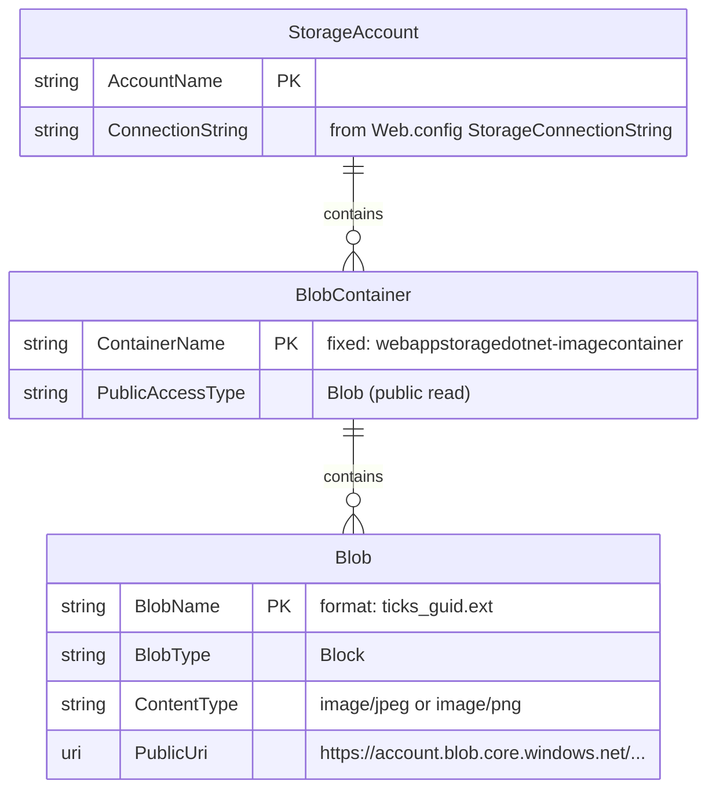

# Data Architecture & Persistence Layer

The application uses a single, schema-less data store — Azure Blob Storage — with no relational database, ORM framework, or entity model. All persisted data consists of image files stored as block blobs inside one dedicated container.

## Database Configuration

| Service/Module | DB Type | Profile | Driver | Connection | Migration Tool |
|---|---|---|---|---|---|
| WebApp-Storage-DotNet | Azure Blob Storage | All (single config) | Azure.Storage.Blobs 12.9.1 | `StorageConnectionString` in `Web.config` (defaults to `UseDevelopmentStorage=true` for local Azurite emulator) | None — Azure Blob Storage is schema-less; no migration tooling is needed or configured |

No SQL database, JDBC driver, connection pool, Flyway/Liquibase, or EF Migrations are present. The container (`webappstoragedotnet-imagecontainer`) is created programmatically on first request via `CreateIfNotExistsAsync` with `PublicAccessType.Blob`. Refer to `configuration-inventory.md` for the full property inventory.

## Data Ownership per Service

| Service | Data Owned | Storage Technology | Caching | Notes |
|---|---|---|---|---|
| WebApp-Storage-DotNet | Block blobs in `webappstoragedotnet-imagecontainer` | Azure Blob Storage | None | Container is created at runtime on first request; blob names are randomised (`{ticks}_{guid}.{ext}`) to avoid collisions. Public access is set at the container level — blobs are readable by anyone without a SAS token. |

## Entity Model

The application has no ORM entity classes or relational schema. The only data artifact is a flat set of block blobs within a single container. The structural model below represents the Azure Blob Storage resource hierarchy:

> Note: This is a logical representation of the Azure Blob Storage resource hierarchy, not an ORM entity model. There are no C# entity classes, database tables, or foreign key constraints.

## Key Repository Methods

The application does not use a repository pattern or any data-access abstraction layer. Storage operations are performed directly on `BlobContainerClient` and `BlobClient` in `HomeController`:

| Service | Client / "Repository" | Method | Purpose |
|---|---|---|---|
| HomeController | `BlobServiceClient` | `GetBlobContainerClient(containerName)` | Resolves the container client from the service client |
| HomeController | `BlobContainerClient` | `CreateIfNotExistsAsync(PublicAccessType.Blob)` | Ensures the container exists on first request; sets public blob access |
| HomeController | `BlobContainerClient` | `GetBlobs()` | Enumerates all blobs in the container to build the gallery index |
| HomeController | `BlobContainerClient` | `GetBlobClient(blobName)` | Resolves a `BlobClient` for a specific blob |
| HomeController | `BlobContainerClient` | `DeleteBlobIfExistsAsync(blobName)` | Deletes a single blob by name (used in DeleteAll loop) |
| HomeController | `BlobClient` | `UploadAsync(filePath)` | Uploads an image file; blob name is generated with `GetRandomBlobName` |
| HomeController | `BlobClient` | `DeleteIfExistsAsync()` | Deletes a single blob by URI-derived filename |

No custom query methods, batch queries, pagination, named queries, or stored procedures exist.

## Caching Strategy

No caching is implemented. There is no Redis, MemoryCache, distributed cache, or any `@Cacheable` / `[ResponseCache]` configuration. Every call to the `Index` action performs a live `GetBlobs()` enumeration from Azure Blob Storage. At scale, this approach would result in latency proportional to the number of blobs in the container with no cache hit path.

## Data Ownership Boundaries

The application is a single-service deployment with no inter-service data access. There are no shared databases, cross-service queries, or data replication concerns.

All data resides in one Azure Blob Storage account and one container. The application is the sole writer and reader of blobs. There is no CQRS, event sourcing, outbox pattern, or read/write split. Direct blob enumeration (`GetBlobs()`) is used for all read operations; direct SDK calls are used for all writes and deletes.

### Data Classification & Sensitivity

| Resource | Sensitive Fields | Classification | Controls in Place |
|---|---|---|---|
| Blob container `webappstoragedotnet-imagecontainer` | Image content (photos uploaded by users) | Potentially sensitive (user-generated images) | None — container is configured with `PublicAccessType.Blob`, making all blobs world-readable without authentication |
| Blob name (key) | Filename extension leaked via randomised name | Low sensitivity | Blob names are randomised (`{ticks}_{guid}.{ext}`) but no access control is applied |

No PII, PHI, or PCI data fields are stored in structured form (no names, addresses, emails, or payment data in the data model). However, uploaded images could contain personal information embedded in photo content (faces, location metadata in EXIF data). There is no EXIF stripping, image sanitisation, content inspection, or access control on uploaded blobs — all uploaded content is immediately publicly accessible via its Azure Storage URL.
