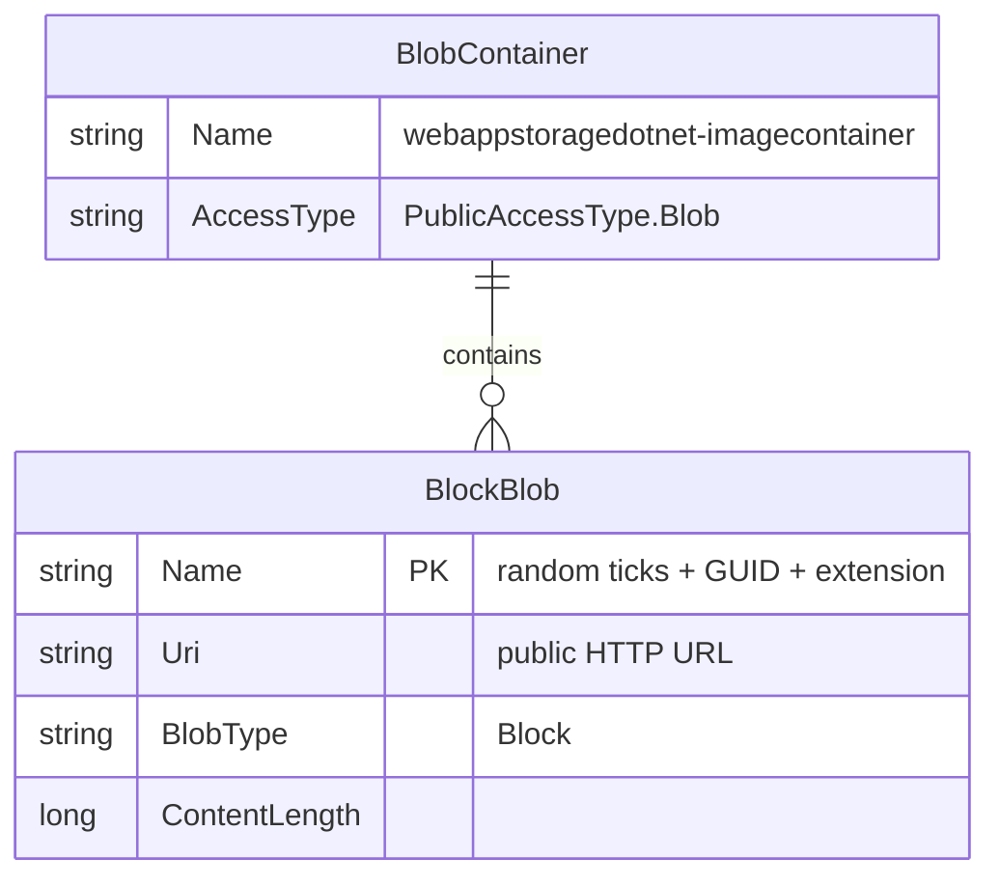

# Data Architecture & Persistence Layer

The application uses **Azure Blob Storage** as its sole data store — there is no relational database, ORM framework, or in-process cache. All persistent data consists of binary image files stored as Block Blobs in a single container.

## Database Configuration

| Service/Module | DB Type | Profile | Driver/SDK | Connection | Migration Tool |
|---------------|---------|---------|------------|------------|----------------|
| WebApp-Storage-DotNet | Azure Blob Storage | All (single profile) | Azure.Storage.Blobs v12.9.1 | `StorageConnectionString` from `Web.config` (defaults to `UseDevelopmentStorage=true`) | None — container is created on first request via `CreateIfNotExistsAsync` |

No relational database, schema migration tool (Flyway, EF Migrations, Liquibase), or seed data mechanism is configured. The blob container (`webappstoragedotnet-imagecontainer`) is provisioned lazily at application startup when the first HTTP request arrives.

## Data Ownership per Service

| Service | Storage Owned | Framework | Caching | Notes |
|---------|--------------|-----------|---------|-------|
| WebApp-Storage-DotNet | `webappstoragedotnet-imagecontainer` (Block Blobs) | Azure.Storage.Blobs SDK v12.9.1 (no ORM) | None | Container access type is `PublicAccessType.Blob`; no private/shared-access boundary |

## Entity Model

The application has no ORM entity classes. The only data object surfaced at the application level is the `BlobItem` returned by the Azure SDK during listing, from which the blob URI is derived. The conceptual storage model is:

> Note: `BlobContainer` and `BlockBlob` are Azure Storage concepts, not application-defined entity classes. The application never defines a model/POCO for these — it works directly with `BlobContainerClient` and `BlobClient` from the Azure SDK.

## Key Repository Methods

There is no repository interface or repository pattern in the application. Data access is performed inline within `HomeController` using the Azure SDK clients directly:

| Service | Access Object | Method / Operation | Purpose |
|---------|--------------|-------------------|---------|
| WebApp-Storage-DotNet | `BlobContainerClient` | `CreateIfNotExistsAsync(PublicAccessType.Blob)` | Ensure container exists on first request |
| WebApp-Storage-DotNet | `BlobContainerClient` | `GetBlobs()` (synchronous paged enumeration) | List all Block Blobs to populate gallery view |
| WebApp-Storage-DotNet | `BlobClient` | `UploadAsync(filePath)` | Upload a single image file to blob storage |
| WebApp-Storage-DotNet | `BlobClient` | `DeleteIfExistsAsync()` | Delete a specific blob by name |
| WebApp-Storage-DotNet | `BlobContainerClient` | `DeleteBlobIfExistsAsync(blobName)` | Delete individual blobs during delete-all operation |

> Note: `GetBlobs()` is called synchronously within an `async` controller action — this is a potential threading concern as it blocks an ASP.NET thread pool thread during enumeration. See `api-service-contracts.md` for the full endpoint context.

## Caching Strategy

No caching layer is implemented. Each request to the gallery page (`GET /Home/Index`) performs a fresh enumeration of all blobs in the container via a live SDK call to Azure Blob Storage. There is no in-memory cache, distributed cache (Redis, Azure Cache), or HTTP response cache (`OutputCache`) configured.

For a production deployment this means gallery load time scales linearly with the number of stored blobs, and every page load counts as a billable Blob Storage list transaction.

## Data Ownership Boundaries

The application is a single-service monolith. There is no cross-service data access, shared database, or database-per-service topology to describe. All persistent state is owned exclusively by one Azure Blob Storage container (`webappstoragedotnet-imagecontainer`).

**Read/write pattern**: Simple CRUD — list all blobs (read), upload blob (write), delete one blob (delete), delete all blobs (bulk delete). No CQRS, event sourcing, or outbox pattern is in use.

### Data Classification & Sensitivity

| Storage Object | Sensitive Fields | Classification | Controls in Place |
|---------------|-----------------|----------------|-------------------|
| BlockBlob (image files) | None — binary image data only | None (Public) | Container created with `PublicAccessType.Blob`; all blobs are publicly accessible by URL with no authentication |
| Blob name | None — auto-generated random name (`{ticks}_{guid}{ext}`) | None | No PII encoded in blob names |
| `StorageConnectionString` (Web.config) | Storage account key (credential) | Confidential | Stored in plaintext in `Web.config`; no Azure Key Vault, environment variable injection, or secret management in use |

No PII, PHI, or PCI data is stored in blob content by design (the application stores only user-uploaded photos). However, the **storage account key** embedded in `Web.config` is a high-sensitivity credential that grants full control over the storage account and should be migrated to Azure Managed Identity or Azure Key Vault before any cloud deployment.
