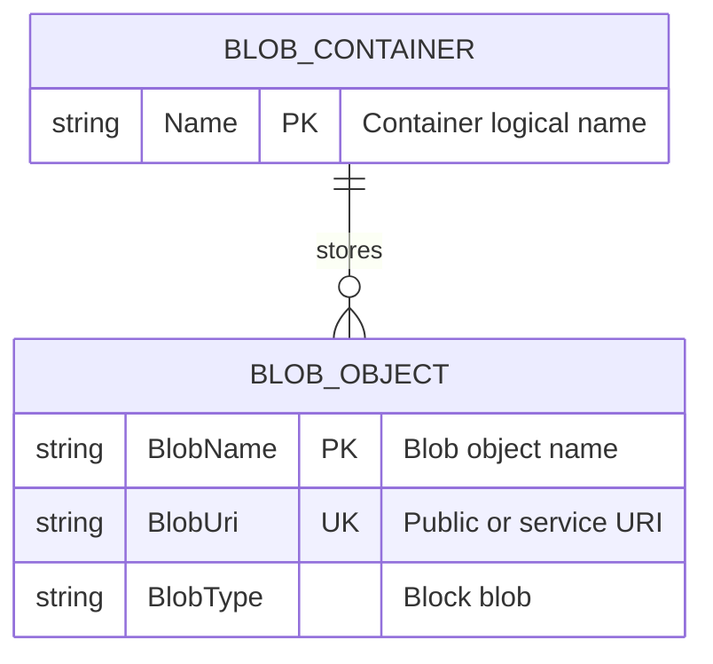

# Data Architecture & Persistence Layer

The data layer is centered on Azure Blob Storage for unstructured image persistence with no relational ORM model in the application code. Persistence access is implemented through Azure Storage SDK clients directly from controller logic.

## Database Configuration

| Service/Module | DB Type | Profile | Driver | Connection | Migration Tool |
|---|---|---|---|---|---|
| WebApp-Storage-DotNet | Azure Blob Storage (object storage) | Local development | Azure.Storage.Blobs 12.9.1 | Development storage emulator or Azure Storage connection string from configuration | None detected |
| WebApp-Storage-DotNet | Azure Blob Storage (object storage) | Cloud deployment | Azure.Storage.Blobs 12.9.1 | Azure Storage account connection string from configuration | None detected |

## Data Ownership per Service

| Service | Tables Owned | ORM Framework | Caching | Notes |
|---|---|---|---|---|
| WebApp-Storage-DotNet | None (blob container objects only) | None | None | Owns image objects in container `webappstoragedotnet-imagecontainer` |

## Entity Model

## Key Repository Methods

| Service | Repository | Notable Methods | Purpose |
|---|---|---|---|
| WebApp-Storage-DotNet | HomeController direct SDK usage (no repository interface) | `GetBlobs()`, `GetBlobClient(name)`, `CreateIfNotExistsAsync(...)`, `UploadAsync(...)`, `DeleteIfExistsAsync(...)`, `DeleteBlobIfExistsAsync(...)` | Lists, creates, uploads, and deletes blob-backed photo content |

## Caching Strategy

No application-level cache provider or explicit cache-aside strategy was detected. The application reads and writes directly to blob storage for each operation and relies on storage service behavior rather than in-process or distributed caching.

## Data Ownership Boundaries

The solution is a single-service application with a single external data store boundary at Azure Blob Storage. There is no database-per-service or shared relational schema concern because no relational database is used. Cross-service data access and CQRS patterns are not present; all read/write operations are performed by the same web module against its blob container.

### Data Classification & Sensitivity

| Entity | Sensitive Fields | Classification (PII/PHI/PCI/None) | Controls in Place |
|---|---|---|---|
| BLOB_OBJECT | File names may contain user-provided strings | PII (potential, indirect) | No explicit masking or field-level controls in application code |
| BLOB_OBJECT | Image binary content may include personal photos | PII (potential, content-dependent) | No explicit application-level encryption controls detected (storage account controls managed externally) |
