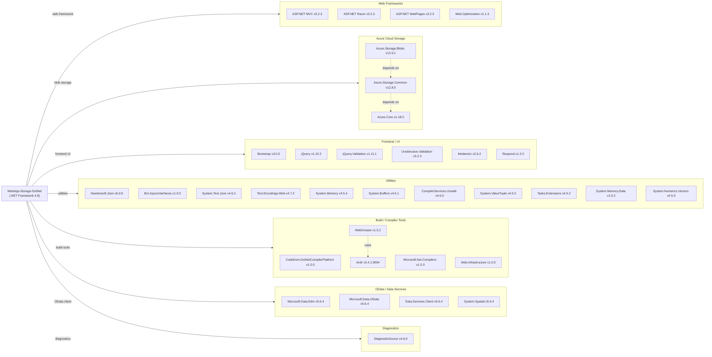

# Dependency Map

This document maps all external dependencies of the **Azure Blob Storage Photo Gallery** (.NET Framework 4.8 / ASP.NET MVC 5) application. A total of **34 declared packages** are referenced via `packages.config`.

## Dependencies

### Dependency Summary

| Category | Count | Key Libraries | Notes |
|----------|-------|---------------|-------|
| Web Frameworks | 4 | ASP.NET MVC 5.2.3, Razor 3.2.3, Web.Optimization 1.1.3 | Legacy MVC stack on .NET Framework 4.8 |
| Azure Cloud Storage | 3 | Azure.Storage.Blobs 12.9.1, Azure.Core 1.18.0 | Azure SDK v12 — current but tied to .NET Framework |
| Frontend / UI | 6 | Bootstrap 3.0.0, jQuery 1.10.2, Modernizr 2.6.2 | All significantly outdated client-side libraries |
| Utilities | 11 | Newtonsoft.Json 6.0.8, System.Text.Json 4.6.0 | Many are polyfill/backport packages for .NET Framework compatibility |
| Build / Compiler Tools | 5 | Microsoft.Net.Compilers 1.0.0, WebGrease 1.5.2 | Development-time tools; Antlr is a transitive dependency of WebGrease |
| OData / Data Services | 4 | Microsoft.Data.OData 5.6.4, Data.Edm 5.6.4 | Unused at the application layer — likely pulled in transitively |
| Diagnostics | 1 | System.Diagnostics.DiagnosticSource 4.6.0 | Azure SDK telemetry dependency |

### Version & Compatibility Risks

The application runs on **.NET Framework 4.8**, which is in long-term maintenance mode with no future feature development. **ASP.NET MVC 5.2.3** is a legacy framework superseded by ASP.NET Core MVC; migrating to .NET 8/10 requires a full rewrite of the web layer. **Newtonsoft.Json 6.0.8** is significantly outdated (current is 13.x) and contains known serialization edge-case bugs. **Bootstrap 3.0.0** reached end-of-life in July 2019 and has known accessibility and security gaps. **jQuery 1.10.2** is critically outdated (current is 3.7+) with multiple CVEs. **Modernizr 2.6.2** and **Respond 1.2.0** are only needed for IE8/IE9 polyfills and can be removed entirely for modern targets. The `Azure.Storage.Blobs` v12.9.1 package is reasonably current but an older minor — v12.22+ is available.

### Notable Observations

- **Polyfill bloat for legacy browsers**: `Modernizr 2.6.2`, `Respond 1.2.0`, and several `System.*` backport packages (e.g., `System.ValueTuple`, `System.Memory`, `System.Buffers`) exist solely to support .NET Framework 4.x or IE8/IE9 — they would be eliminated on a migration to .NET 8+.
- **Duplicate JSON libraries**: Both `Newtonsoft.Json 6.0.8` and `System.Text.Json 4.6.0` are present. The application likely only uses `Newtonsoft.Json`; `System.Text.Json` is pulled in by the Azure SDK as a transitive dependency.
- **Unused OData stack**: The `Microsoft.Data.Edm`, `Microsoft.Data.OData`, `Microsoft.Data.Services.Client`, and `System.Spatial` packages (all v5.6.4) are not referenced by any application code and appear to be leftover transitive dependencies from an earlier version of the Azure Storage SDK.
- **Build-time compilers pinned to old versions**: `Microsoft.Net.Compilers 1.0.0` (C# 6.0 / VB 14) and `Microsoft.CodeDom.Providers.DotNetCompilerPlatform 1.0.0` are both pinned to very old Roslyn versions; the `compilerOptions="/langversion:6"` setting in Web.config restricts the project to C# 6 language features.

## Test Dependencies

No test-scoped dependencies were detected in `packages.config` or the project file.

Total test-scope dependencies: **0**

The repository contains no automated test project or test package references. Adding a unit test project (e.g., xUnit or MSTest) with a mocking library (e.g., Moq) is recommended before undertaking any modernization work.
