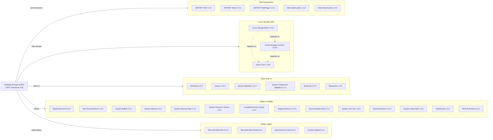

# Dependency Map

This document maps all declared external dependencies of the **WebApp-Storage-DotNet** Photo Gallery application, a single-project ASP.NET MVC 5 web application targeting .NET Framework 4.8. A total of **34 declared packages** are listed in `packages.config`.

## Dependencies

### Dependency Summary

| Category | Count | Key Libraries | Notes |
|----------|-------|---------------|-------|
| Web Frameworks | 5 | ASP.NET MVC 5.2.3, Razor 3.2.3, Web.Optimization 1.1.3 | Legacy ASP.NET MVC on .NET Framework 4.8 |
| Azure Storage SDK | 3 | Azure.Storage.Blobs 12.9.1, Azure.Core 1.18.0 | Modern Azure SDK v12; requires upgrade for managed identity |
| Client-Side UI | 6 | Bootstrap 3.0.0, jQuery 1.10.2 | All client-side libs are old; Bootstrap 3 and jQuery 1.x are end-of-life |
| Utilities / Polyfills | 14 | Newtonsoft.Json 6.0.8, System.Memory 4.5.4 | Mostly .NET backport polyfills; many are built-in to modern .NET |
| OData Legacy | 4 | Microsoft.Data.Edm 5.6.4, Microsoft.Data.OData 5.6.4 | WCF Data Services era packages; not used in app logic (transitive) |

### Version & Compatibility Risks

The application targets **.NET Framework 4.8**, which is in long-term maintenance mode — Microsoft will not ship new features and the path to modern cloud-native deployment requires migrating to **.NET 8+**. **ASP.NET MVC 5.2.3** is a Windows-IIS-only framework with no cross-platform support; its modern replacement is ASP.NET Core MVC. **Bootstrap 3.0.0** and **jQuery 1.10.2** are well past end-of-life (Bootstrap 3 EOL: 2019, jQuery 1.x EOL: 2016) and carry known security advisories. **Newtonsoft.Json 6.0.8** is extremely old (current is 13.x); `System.Text.Json` is now the recommended library. The **Azure.Storage.Blobs 12.9.1** package is reasonably current but a newer minor version (12.22+) is available with support for managed identity and token credentials without connection strings. The four **Microsoft.Data.OData / WCF Data Services** packages (5.6.4) are legacy WCF-era libraries that are no longer maintained.

### Notable Observations

- **14 utility/polyfill packages** (`System.Buffers`, `System.Memory`, `System.ValueTuple`, etc.) exist solely to backport BCL features to .NET Framework; they are all built-in to .NET 6+ and can be removed after migration.
- **No logging framework** is declared — the application relies entirely on ASP.NET's built-in `HandleErrorAttribute` for error handling, with no structured logging (Serilog, NLog, or Microsoft.Extensions.Logging).
- **No dependency injection container** is used — the controller directly instantiates `BlobServiceClient`, making it harder to test and configure for managed identity.
- The **OData 5.6.4 packages** (`Microsoft.Data.Edm`, `Microsoft.Data.OData`, `Microsoft.Data.Services.Client`, `System.Spatial`) appear to be transitive residues from an older Azure Storage SDK version and are not referenced in any application code.

## Test Dependencies

No test-scoped packages are declared in `packages.config`. The solution contains no test project.

**Total test-scope dependencies: 0**

No automated test infrastructure is present in this repository. Adding a test project with xUnit (or MSTest), Moq for mocking `BlobContainerClient`, and integration tests using Azurite (the Azure Storage emulator) is recommended before migration.
