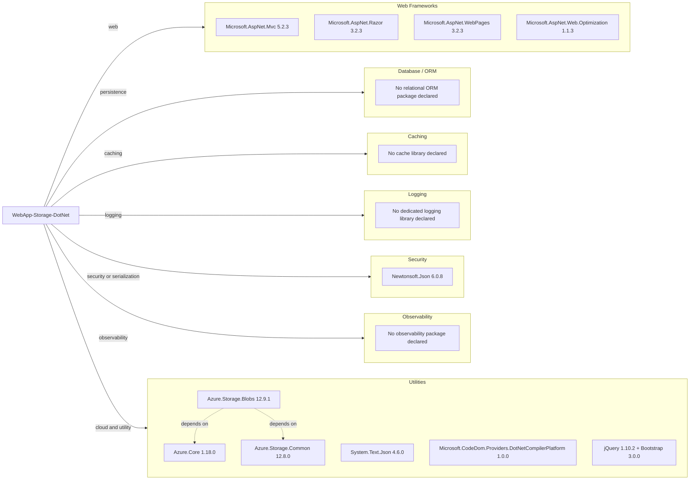

# Dependency Map

The PhotoGallery web application declares 30+ NuGet/front-end package dependencies centered on ASP.NET MVC and Azure Storage integration.

## Dependencies

### Dependency Summary

| Category | Count | Key Libraries | Notes |
|---|---:|---|---|
| Web Frameworks | 4 | Microsoft.AspNet.Mvc, Razor, WebPages, Web.Optimization | Classic ASP.NET MVC 5 stack on .NET Framework |
| Database / ORM | 0 | N/A | No SQL/ORM dependencies declared |
| Messaging | 0 | N/A | No queue/event dependencies declared |
| Caching | 0 | N/A | No cache provider package declared |
| Logging | 0 | N/A | Uses default framework behavior only |
| Security | 1 | Newtonsoft.Json | Serialization dependency with older version |
| Observability | 0 | N/A | No telemetry/metrics package declared |
| Utilities | 6 | Azure.Storage.Blobs, Azure.Core, jQuery, Bootstrap | Blob-storage and client UI support |

### Version & Compatibility Risks

The project targets .NET Framework 4.8 and relies on legacy ASP.NET MVC package versions. Several dependencies are old (for example Newtonsoft.Json 6.0.8 and jQuery 1.10.2), which can increase compatibility and security risk during modernization.

### Notable Observations

- Azure Blob SDK packages are modern relative to the rest of the stack, creating mixed-era dependency posture.
- No EF or SQL driver packages are present, consistent with storage-only architecture.
- No explicit observability library is declared, reducing operational insight during migration.
- Front-end packages are legacy and tightly coupled to MVC asset bundling.

## Test Dependencies

| Framework | Version | Notes |
|---|---|---|
| None detected | N/A | No test-scoped package entries in `packages.config` |

Total test-scope dependencies: 0
No test dependencies detected.
