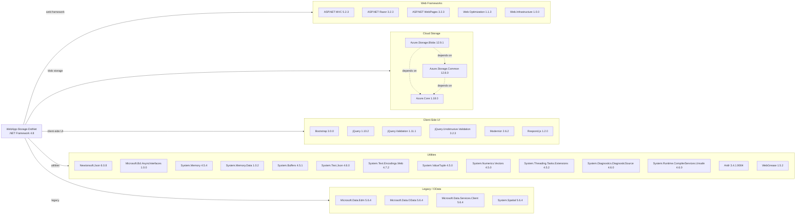

# Dependency Map

This document maps all external dependencies declared by the **WebApp-Storage-DotNet** photo gallery application. A total of 36 NuGet packages are declared across web framework, cloud storage, client-side, and infrastructure categories.

## Dependencies

### Dependency Summary

| Category | Count | Key Libraries | Notes |
|----------|-------|--------------|-------|
| Web Frameworks | 5 | ASP.NET MVC 5.2.3, Razor 3.2.3, WebPages 3.2.3 | Legacy .NET Framework MVC stack; not portable to .NET Core without migration |
| Cloud Storage | 3 | Azure.Storage.Blobs 12.9.1, Azure.Core 1.18.0 | Modern Azure SDK v12; compatible with .NET Standard 2.0 |
| Client-Side UI | 6 | Bootstrap 3.0.0, jQuery 1.10.2, Modernizr 2.6.2 | All significantly outdated; Bootstrap 3 and jQuery 1.x are EOL |
| Utilities | 12 | Newtonsoft.Json 6.0.8, System.Memory 4.5.4 | Mix of polyfill packages required for .NET Framework 4.8 Azure SDK compatibility |
| Legacy / OData | 4 | Microsoft.Data.Edm 5.6.4, Microsoft.Data.OData 5.6.4 | OData/WCF Data Services packages; unused in current code — likely leftover from an older version |

### Version & Compatibility Risks

The application targets **.NET Framework 4.8**, which is in maintenance-only mode with no new features. **ASP.NET MVC 5.2.3** and **ASP.NET Razor 3.2.3** are the legacy System.Web-based MVC stack and cannot run on .NET Core/.NET 5+ without a full rewrite to ASP.NET Core. **Bootstrap 3.0.0** reached end-of-life in 2019 and **jQuery 1.10.2** has known security vulnerabilities. **Newtonsoft.Json 6.0.8** is five major versions behind (current is 13.x) and has known deserialization vulnerabilities in older versions. The four **Microsoft.Data.OData / Microsoft.Data.Edm 5.6.4** packages appear unused in the current codebase and represent unnecessary bloat. The Azure Storage SDK packages (Azure.Storage.Blobs 12.9.1) are relatively modern but newer releases are available (v12.22+).

### Notable Observations

- **Unused OData packages**: `Microsoft.Data.Edm`, `Microsoft.Data.OData`, `Microsoft.Data.Services.Client`, and `System.Spatial` (all v5.6.4) appear to be leftover from an earlier version of the application and are not referenced in any source code. They add unnecessary attack surface and should be removed.
- **Outdated client-side libraries with security implications**: jQuery 1.10.2 and Bootstrap 3.0.0 have documented security vulnerabilities (CVE-2019-11358 for jQuery, multiple XSS CVEs for Bootstrap 3). Both should be upgraded before production deployment.
- **Polyfill packages for Azure SDK compatibility**: A large number of utility packages (`System.Memory`, `System.Buffers`, `System.ValueTuple`, `System.Text.Json`, etc.) are present solely to backport .NET Standard 2.0 features to .NET Framework 4.8 for the Azure Storage SDK — these would disappear automatically upon migration to modern .NET.
- **No test dependencies detected**: The project contains no test projects or test framework references, indicating a lack of automated test coverage.

## Test Dependencies

No test-scoped dependencies detected.

Total test-scope dependencies: 0

The project does not include any test projects or unit/integration test framework references (e.g., xUnit, NUnit, MSTest). Adding automated tests would be beneficial before undertaking a modernization effort.
