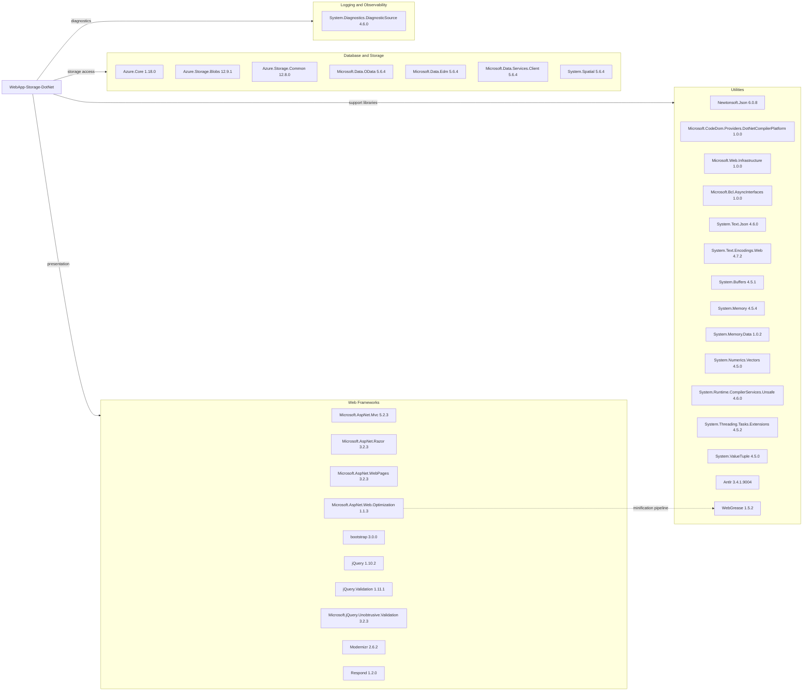

# Dependency Map

This project is a single .NET web application with 34 declared NuGet dependencies in `packages.config`. The dependency set is centered on the ASP.NET MVC 5 presentation stack and Azure Blob Storage access, with several older support libraries carried by the legacy .NET Framework application model.

## Dependencies

### Dependency Summary

| Category | Count | Key Libraries | Notes |
|---|---:|---|---|
| Web Frameworks | 10 | Microsoft.AspNet.Mvc, Razor, WebPages, jQuery, Bootstrap | Legacy ASP.NET MVC 5 stack running on .NET Framework |
| Database / Storage | 7 | Azure.Storage.Blobs, Azure.Core, Azure.Storage.Common | Blob storage is the only persistence integration; older OData libraries remain referenced |
| Logging / Observability | 1 | System.Diagnostics.DiagnosticSource | Minimal diagnostics support only; no full telemetry stack detected |
| Utilities | 16 | Newtonsoft.Json, System.Text.Json, CodeDom provider, WebGrease | Mix of compiler/runtime shims and legacy utility packages required by the web app model |

### Version & Compatibility Risks

The dependency set is skewed toward older ASP.NET MVC 5 and .NET Framework-era packages, several of which are already flagged in the .NET upgrade assessment for incompatibility, deprecation, or replacement. In particular, MVC 5/WebPages bundling, the CodeDom compiler provider, and old front-end packages such as jQuery 1.10.2 and Bootstrap 3.0.0 will require modernization when moving to a current .NET target.

### Notable Observations

- Both `Newtonsoft.Json` and `System.Text.Json` are referenced, which suggests overlapping JSON functionality during migration planning.
- `Microsoft.AspNet.Web.Optimization` depends on `WebGrease`, and the upgrade assessment explicitly calls out bundling/minification as unsupported in modern .NET.
- Storage integration is already on the newer Azure SDK (`Azure.Storage.Blobs` v12), which reduces one migration concern compared with older `Microsoft.WindowsAzure.Storage` packages.
- No dedicated security, authentication, or resilience libraries are declared; the application relies on platform defaults and direct SDK calls.

## Test Dependencies

| Framework | Version | Notes |
|---|---:|---|

Total test-scope dependencies: 0

No test dependencies detected. The repository does not include a separate automated test project or test-only package declarations.
