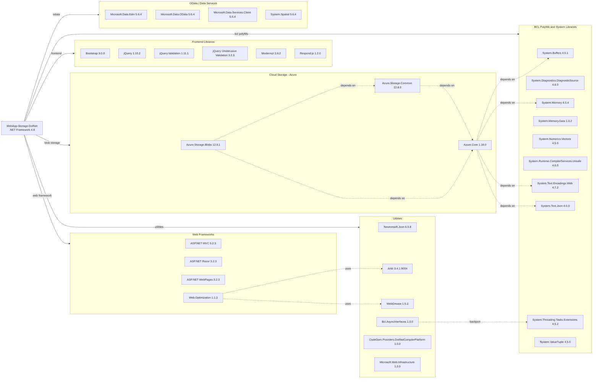

# Dependency Map

This document maps all external dependencies declared by the PhotoGallery (WebApp-Storage-DotNet) ASP.NET MVC application, sourced from `packages.config` and `WebApp-Storage-DotNet.csproj`. The project declares **34 external packages** in total.

## Dependencies

### Dependency Summary

| Category | Count | Key Libraries | Notes |
|---|---|---|---|
| Web Frameworks | 4 | ASP.NET MVC 5.2.3, Razor 3.2.3, WebPages 3.2.3, Web.Optimization 1.1.3 | Legacy ASP.NET MVC stack on .NET Framework 4.8; not compatible with .NET Core/5+ without migration |
| Frontend Libraries | 6 | Bootstrap 3.0.0, jQuery 1.10.2, Modernizr 2.6.2 | All server-side-rendered frontend assets; Bootstrap and jQuery are several major versions behind current |
| Cloud Storage - Azure | 3 | Azure.Storage.Blobs 12.9.1, Azure.Core 1.18.0 | Azure SDK v12 is current-generation but newer patch versions are available |
| Utilities | 6 | Newtonsoft.Json 6.0.8, Antlr 3.4.1, WebGrease 1.5.2 | Newtonsoft.Json 6.x is very old (current is 13.x); Antlr and WebGrease are compile-time bundling dependencies |
| BCL Polyfills and System Libraries | 10 | System.Memory 4.5.4, System.Text.Json 4.6.0, System.Buffers 4.5.1 | Polyfill packages for .NET Standard 2.0 compatibility required by the Azure SDK; not needed on modern .NET |
| OData / Data Services | 4 | Microsoft.Data.Edm 5.6.4, Microsoft.Data.OData 5.6.4, Microsoft.Data.Services.Client 5.6.4 | OData stack pulled in transitively by legacy Azure Storage SDK; not directly used by application code |

### Version & Compatibility Risks

The most significant risk is the **ASP.NET MVC 5 / .NET Framework 4.8** stack, which is in long-term maintenance mode with no new feature development. Migrating to ASP.NET Core requires a full rewrite of the startup pipeline, routing, and dependency injection. **Newtonsoft.Json 6.0.8** is severely outdated (current is 13.x) and predates many security and performance fixes. **Bootstrap 3.0.0** and **jQuery 1.10.2** are end-of-life and have known cross-site scripting vulnerabilities. The **OData / Data Services** packages (v5.6.4) are legacy and have been superseded by OData.Core 7.x, though these appear to be transitive artifacts rather than directly consumed APIs. The 10 BCL polyfill packages (`System.Memory`, `System.Buffers`, etc.) are only needed because the Azure SDK targets .NET Standard 2.0 when used from .NET Framework; these polyfills are automatically eliminated when targeting modern .NET.

### Notable Observations

- **No logging framework**: The application uses no structured logging library (no Serilog, NLog, or even `System.Diagnostics.Trace`). All error handling surfaces raw exceptions through `ViewData["message"]` and `ViewData["trace"]`, which is a security and observability concern.
- **No dependency injection container**: There is no DI framework registered (no Autofac, Unity, or the built-in ASP.NET Core DI). The `BlobContainerClient` is held as a static field on the controller, creating a global singleton with potential concurrency and testability issues.
- **Transitive OData packages with no direct use**: `Microsoft.Data.Edm`, `Microsoft.Data.OData`, `Microsoft.Data.Services.Client`, and `System.Spatial` appear to be legacy transitive dependencies pulled through older Azure Storage SDK versions; they are not directly used by any application code and can likely be removed after upgrading the Azure SDK.
- **Newtonsoft.Json version gap**: The declared version 6.0.8 (released 2014) is 7 major versions behind the current 13.x release. Upgrading to 13.x resolves multiple serialization edge-cases and performance issues, and is required for compatibility with many modern libraries.

## Test Dependencies

| Framework | Version | Notes |
|---|---|---|
| (none detected) | — | No test packages found in packages.config or the .csproj |

Total test-scope dependencies: **0**

No test project or test framework references were found in the solution. The repository contains a single web application project with no unit or integration test infrastructure. Adding a test project with xUnit or MSTest and mocking the Azure SDK via its test doubles or fakes is recommended before any migration work.
