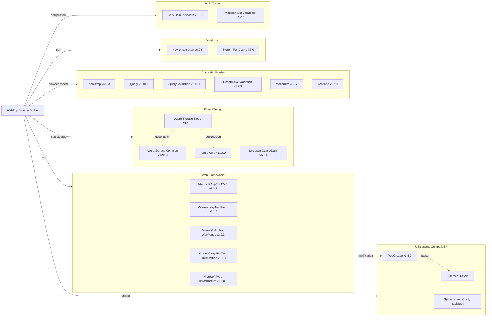

# Dependency Map

WebApp-Storage-DotNet declares 34 NuGet packages in `packages.config`, plus framework assemblies referenced by the legacy project file. The dependency set is centered on ASP.NET MVC 5, Razor, client-side web assets, Azure Blob Storage, and compatibility libraries for .NET Framework 4.8.

## Dependencies

### Dependency Summary

| Category | Count | Key Libraries | Notes |
|---|---:|---|---|
| Web Frameworks | 5 | Microsoft.AspNet.Mvc 5.2.3, Razor 3.2.3, WebPages 3.2.3 | Legacy ASP.NET MVC stack on .NET Framework |
| Cloud Storage | 7 | Azure.Storage.Blobs 12.9.1, Azure.Core 1.18.0, Microsoft.Data.OData 5.6.4 | Azure Blob SDK plus older OData support libraries |
| Client UI Libraries | 6 | bootstrap 3.0.0, jQuery 1.10.2, jQuery.Validation 1.11.1 | Older browser-side dependencies bundled in the project |
| Serialization | 2 | Newtonsoft.Json 6.0.8, System.Text.Json 4.6.0 | Both Newtonsoft.Json and System.Text.Json are referenced |
| Build Tooling | 2 | Microsoft.CodeDom.Providers.DotNetCompilerPlatform 1.0.0, Microsoft.Net.Compilers 1.0.0 | Legacy compiler tooling for ASP.NET MVC projects |
| Utilities and Compatibility | 12 | WebGrease, Antlr, System.Memory, System.Buffers, System.ValueTuple | Support packages for minification and .NET Standard compatibility |

### Version & Compatibility Risks

The application targets .NET Framework 4.8 and uses ASP.NET MVC 5, which does not directly run on modern .NET without migration to ASP.NET Core. Several client libraries are old, notably jQuery 1.10.2 and Bootstrap 3.0.0. Azure.Storage.Blobs 12.9.1 is newer than the original classic storage client but still should be reviewed during migration for current SDK compatibility and authentication practices.

### Notable Observations

- No test-scoped dependencies are declared in `packages.config`.
- The project references both Newtonsoft.Json and System.Text.Json, which may be redundant for this simple MVC application.
- `Microsoft.Net.Compilers` is marked as a development dependency and supports build-time compilation rather than runtime behavior.
- Azure Blob Storage is the only external service dependency declared for business functionality.

## Test Dependencies

| Framework | Version | Notes |
|---|---:|---|
| None detected | N/A | No test framework packages are declared in `packages.config`. |

Total test-scope dependencies: 0
No test dependencies detected.
