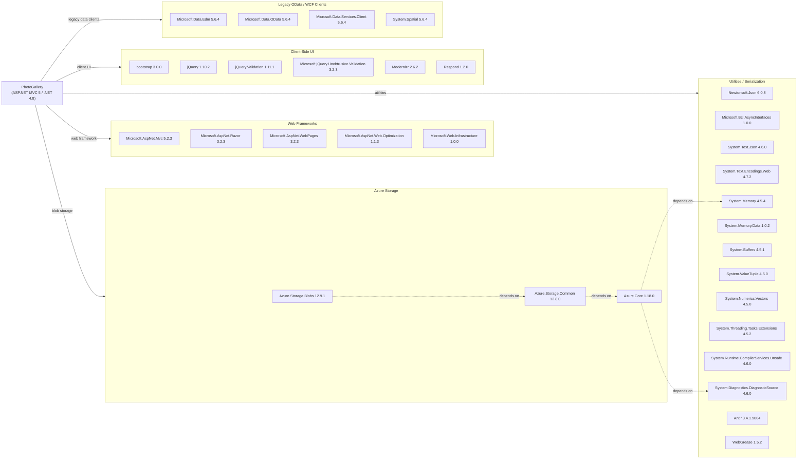

# Dependency Map

This document maps all declared external dependencies for the PhotoGallery ASP.NET MVC 5 application. A total of **36 packages** are declared in `packages.config` (targeting .NET Framework 4.8 / 4.5.2), the majority being Azure SDK components and legacy ASP.NET ecosystem libraries.

## Dependencies

### Dependency Summary

| Category | Count | Key Libraries | Notes |
|---|---|---|---|
| Web Frameworks | 5 | Microsoft.AspNet.Mvc 5.2.3, Razor 3.2.3, Web.Optimization 1.1.3 | Legacy ASP.NET MVC stack targeting .NET Framework |
| Azure Storage | 3 | Azure.Storage.Blobs 12.9.1, Azure.Core 1.18.0 | Modern Azure SDK v12; supported on .NET Standard 2.0+ |
| Client-Side UI | 6 | Bootstrap 3.0.0, jQuery 1.10.2, Modernizr 2.6.2 | Older client libraries bundled via NuGet |
| Utilities / Serialization | 14 | Newtonsoft.Json 6.0.8, System.Text.Json 4.6.0, System.Memory 4.5.4 | Mostly polyfills and primitives required by Azure SDK on .NET 4.8 |
| Legacy OData / WCF | 4 | Microsoft.Data.Edm 5.6.4, Microsoft.Data.OData 5.6.4 | Transitive pull from older Azure Storage packages; not directly used |

### Version & Compatibility Risks

Several dependencies carry meaningful migration risk. **Microsoft.AspNet.Mvc 5.2.3** and the associated Razor/WebPages packages are tied to the legacy `System.Web` pipeline, which does not run on .NET Core / .NET 5+; migrating to modern .NET requires adopting **ASP.NET Core MVC**. **Newtonsoft.Json 6.0.8** is extremely old (released 2014) — current is 13.x — and exposes the application to known deserialization vulnerabilities if untrusted input is parsed. **Bootstrap 3.0.0** and **jQuery 1.10.2** are end-of-life client libraries. The four **Microsoft.Data.Edm / OData / DataServices.Client 5.6.4** packages appear as legacy leftovers from earlier Azure SDK versions and are no longer needed with the modern `Azure.Storage.Blobs` v12 SDK. The **Microsoft.Bcl.AsyncInterfaces 1.0.0** and **System.*` polyfill packages** are .NET 4.8 backports; they can be dropped entirely once the application targets .NET 6+.

### Notable Observations

- **Dual JSON serialization stacks**: Both `Newtonsoft.Json 6.0.8` and `System.Text.Json 4.6.0` are declared. `Newtonsoft.Json` is used directly by legacy ASP.NET MVC for model binding; `System.Text.Json` is pulled in as a transitive dependency by the Azure SDK. Having both libraries at significantly different versions increases binary footprint and risks subtle serialization divergence.
- **Azure SDK is modern but runtime target is not**: `Azure.Storage.Blobs 12.9.1` is a current, well-maintained SDK, yet it is running on .NET Framework 4.8. Upgrading the runtime to .NET 8+ would allow using newer SDK versions and removing all the `System.*` polyfill backports.
- **Legacy OData packages are orphaned**: `Microsoft.Data.Edm`, `Microsoft.Data.OData`, `Microsoft.Data.Services.Client`, and `System.Spatial` (all v5.6.4) are transitive remnants of the old `WindowsAzure.Storage` SDK. The current `Azure.Storage.Blobs` v12 SDK does not depend on them; they can be safely removed.
- **Client-side libraries managed via NuGet**: Bootstrap, jQuery, and Modernizr are delivered as NuGet packages rather than via a dedicated front-end toolchain (npm / yarn). This anti-pattern is common in older MVC projects but makes front-end updates harder and includes unnecessary server-side package metadata.

## Test Dependencies

No test-scoped dependencies were detected in `packages.config` or any project files.

Total test-scope dependencies: **0**

No unit or integration test project was found in the solution. Adding a test project with a modern framework such as xUnit 2.x and Moq would significantly improve maintainability and support safe migration to .NET 8+.
