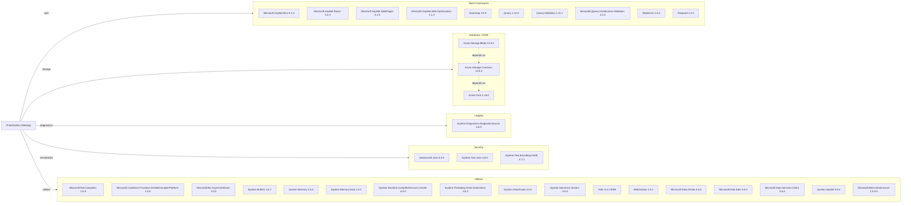

# Dependency Map

This map summarizes declared external dependencies for the Photo Gallery ASP.NET MVC application. A total of 34 NuGet/package dependencies are declared.

## Dependencies

### Dependency Summary

| Category | Count | Key Libraries | Notes |
|---|---:|---|---|
| Web Frameworks | 10 | Microsoft.AspNet.Mvc 5.2.3, Razor 3.2.3, jQuery 1.10.2 | Legacy ASP.NET MVC 5 stack on .NET Framework |
| Database / ORM | 3 | Azure.Storage.Blobs 12.9.1, Azure.Core 1.18.0 | Uses Azure Blob Storage SDK instead of relational ORM |
| Logging | 1 | System.Diagnostics.DiagnosticSource 4.6.0 | Basic diagnostics dependency only |
| Security | 3 | Newtonsoft.Json 6.0.8, System.Text.Json 4.6.0 | Contains older JSON stack versions |
| Utilities | 17 | Microsoft.Net.Compilers 1.0.0, OData 5.6.4, System.* helpers | Includes compiler/runtime and OData-era support libraries |

### Version & Compatibility Risks

Several dependencies are significantly old for a modern runtime target, including ASP.NET MVC 5.x ecosystem packages, Newtonsoft.Json 6.0.8, and legacy OData libraries (5.6.4). The project is on .NET Framework and uses packages.config, which generally increases migration effort versus SDK-style projects with PackageReference.

### Notable Observations

- The dependency set mixes legacy web stack packages and newer Azure Storage v12 SDK packages.
- `Microsoft.Net.Compilers 1.0.0` and `Microsoft.CodeDom.Providers.DotNetCompilerPlatform 1.0.0` indicate old build-time tooling.
- No dedicated observability stack (for example Application Insights or OpenTelemetry) is declared.
- Storage is blob-focused; there is no relational database driver or ORM package declared.

## Test Dependencies

| Framework | Version | Notes |
|---|---|---|
| None detected | n/a | No test-scoped dependencies found in packages.config or project file |

Total test-scope dependencies: 0

No test dependencies were detected, and there is no dedicated automated test framework declared in this repository.
