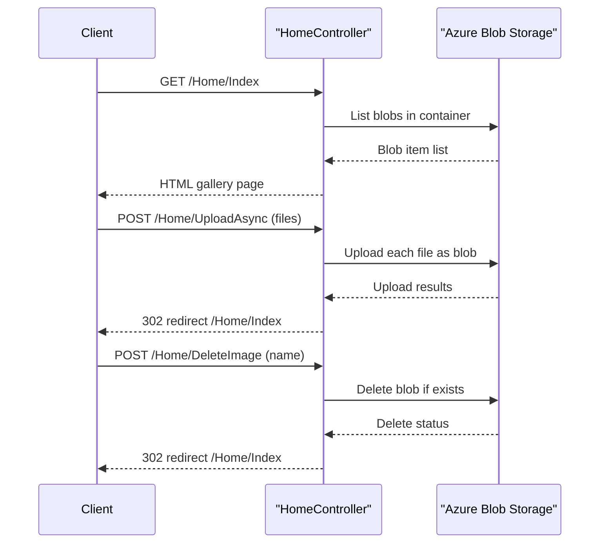

# API & Service Communication Contracts

The application exposes a small MVC HTTP surface for image gallery operations and communicates synchronously with Azure Blob Storage through SDK calls.

## Service Catalog

| Service | Port | Category | Purpose |
|---|---|---|---|
| WebApp-Storage-DotNet | 20050 (IIS Express dev setting) | API Layer | Hosts MVC endpoints and gallery UI |
| Azure Blob Storage | 443/HTTPS (service endpoint) | Infrastructure | Stores and serves image objects |

## API Endpoints Inventory

| Service | Method | Path | Request Type | Response Type |
|---|---|---|---|---|
| HomeController | GET | /Home/Index | None | HTML view with list of blob URIs |
| HomeController | POST | /Home/UploadAsync | multipart form files (`Request.Files`) | Redirect to `/Home/Index` |
| HomeController | POST | /Home/DeleteImage | form field `name` (blob URL) | Redirect to `/Home/Index` |
| HomeController | POST | /Home/DeleteAll | None | Redirect to `/Home/Index` |

## Management & Observability Endpoints

| Service | Endpoint | Custom Metrics (if any) |
|---|---|---|
| WebApp-Storage-DotNet | None explicitly configured | None detected |

## DTOs & Contracts

The API surface is form-based MVC rather than JSON API contracts. Inputs are handled using framework request abstractions (`HttpFileCollectionBase` for uploads and `string name` for delete). The `Index` view model is effectively `List<Uri>` rendered by Razor. No OpenAPI, protobuf, or GraphQL contract definitions were found.

## Communication Patterns

Communication is synchronous and request/response driven:
- Browser requests hit MVC controller actions directly.
- Controller actions use Azure Storage SDK clients (`BlobServiceClient`, `BlobContainerClient`, `BlobClient`) for blob operations.
- No asynchronous messaging or service discovery is configured.
- No explicit retry, timeout, or circuit-breaker policy wrappers were found around blob operations.
- Security posture: HTTPS support depends on deployment; no API authentication/authorization attributes are configured on controller actions, so endpoints are publicly callable in the current app configuration.

## Service Technology Matrix

| Service | Web | Data Access | Discovery | Gateway | Actuator | Cache | Metrics |
|---|---|---|---|---|---|---|---|
| WebApp-Storage-DotNet | ASP.NET MVC 5 | Azure Storage Blob SDK | None | None | None | None | None |
| Azure Blob Storage | N/A | Blob service endpoint | N/A | N/A | N/A | N/A | Service-native |

## Service Communication Sequence

