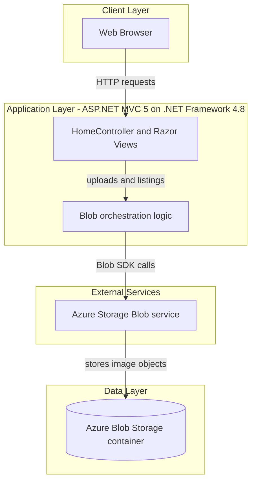
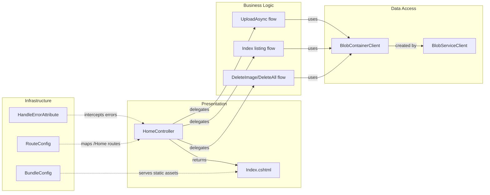

# Architecture Diagram

This document summarizes the current architecture of the Photo Gallery application and key runtime component interactions.

## Application Architecture

### Technology Stack Summary

| Layer | Technology | Version | Purpose |
|---|---|---|---|
| Presentation | ASP.NET MVC + Razor | MVC 5.2.3 | Serves web UI and form posts |
| Application | .NET Framework | v4.8 target | Controller-based request handling |
| Storage Access | Azure.Storage.Blobs SDK | 12.9.1 | Read/write/delete image blobs |
| Data | Azure Blob Storage | Configured via connection string | Durable object storage for uploaded photos |

### Data Storage & External Services

The application persists photo content in a single Azure Blob Storage container (`webappstoragedotnet-imagecontainer`) using the configured `StorageConnectionString`. There is no relational database, message broker, or cache layer in the current implementation.

### Key Architectural Decisions

- Uses a single MVC controller to orchestrate upload, list, and delete operations.
- Stores all user content in Azure Blob Storage to avoid local file persistence.
- Uses asynchronous storage SDK APIs in controller actions for I/O operations.

## Component Relationships

### Component Inventory

| Component | Layer | Type | Responsibility |
|---|---|---|---|
| HomeController | Presentation | MVC Controller | Handles image list, upload, and delete requests |
| Index.cshtml | Presentation | Razor View | Renders gallery UI and upload/delete controls |
| BlobServiceClient | Data Access | SDK Client | Connects to Azure Storage account |
| BlobContainerClient | Data Access | SDK Client | Enumerates, uploads, and deletes blobs |
| RouteConfig | Infrastructure | MVC Routing Config | Defines default route mapping |
| FilterConfig / HandleErrorAttribute | Infrastructure | Global Filter | Handles unhandled MVC exceptions |
| BundleConfig | Infrastructure | Asset Bundling Config | Registers JS/CSS bundles for UI |
