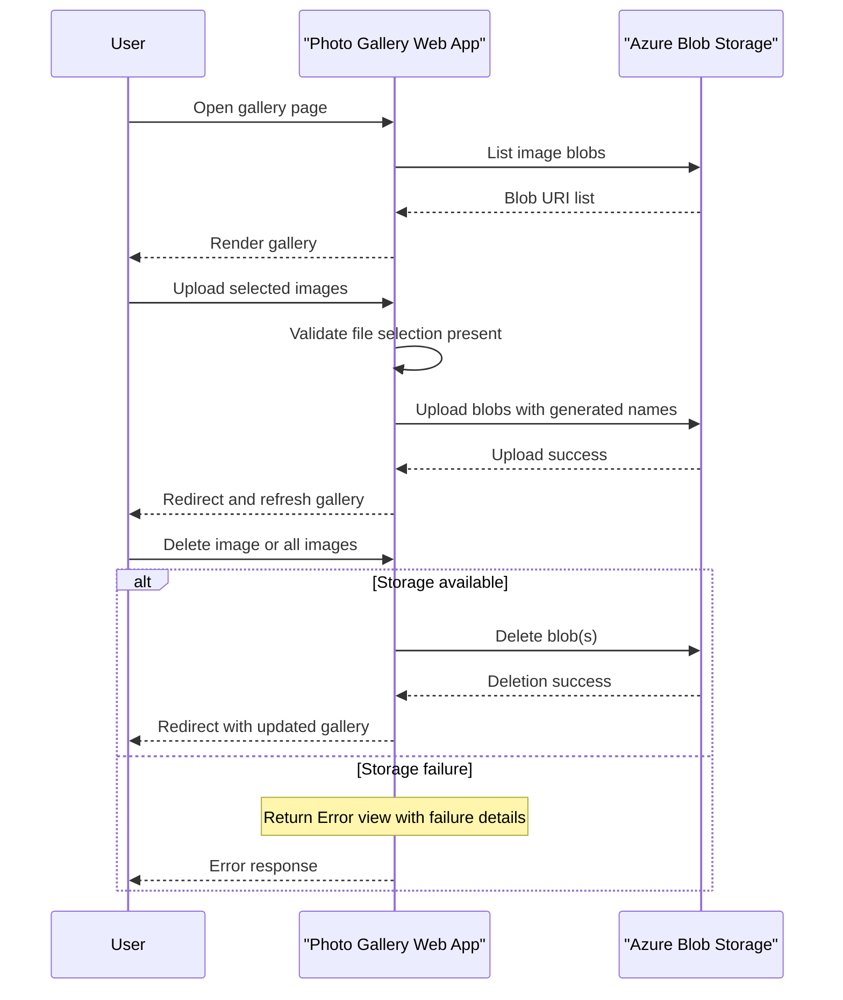

# Core Business Workflows

The application supports a simple photo-gallery business flow where users upload, browse, and remove images stored in Azure Blob Storage.

## Domain Entities

| Entity | Service / Bounded Context | Description | Key Relationships |
|---|---|---|---|
| Gallery Image | Photo Gallery | User-managed uploaded photo asset | Belongs to Blob Container |
| Blob Container | Photo Gallery | Logical storage group for all images | Contains many Gallery Images |
| Upload Request | Photo Gallery | User action containing one or more files | Creates one or more Gallery Images |

## Service-to-Domain Mapping

| Service | Domain Context | Owned Entities | External Dependencies |
|---|---|---|---|
| WebApp-Storage-DotNet | Photo Gallery Management | Gallery Image, Blob Container | Azure Blob Storage service |

## Primary Workflows

### Workflow 1: Upload images to gallery

1. User selects one or more files in the web page and submits upload.
2. `HomeController.UploadAsync` iterates each file and uploads to blob storage with generated unique name.
3. Application redirects to `Index`, where uploaded blobs are listed back to the user.

### Workflow 2: Browse and delete images

1. User opens `Index` to view current gallery images.
2. `HomeController.Index` lists blob URIs from container and renders thumbnails.
3. User can delete a single item (`DeleteImage`) or all items (`DeleteAll`) and gets redirected to refreshed gallery.

## Cross-Service Data Flows

The workflow is single-service and does not involve cross-service aggregation. All business data is retrieved from and persisted to Azure Blob Storage directly by the web application. If blob access fails, the workflow degrades to an error view.

## Business Workflow Sequence

## Business Rules & Decision Logic

- Files are only uploaded when at least one request file is present.
- Uploaded blob names are randomized using timestamp + GUID to avoid collisions.
- Delete operations only target block blobs and use safe "delete-if-exists" semantics.
- Exceptions in list/upload/delete flows are captured and routed to an error view for user feedback.
