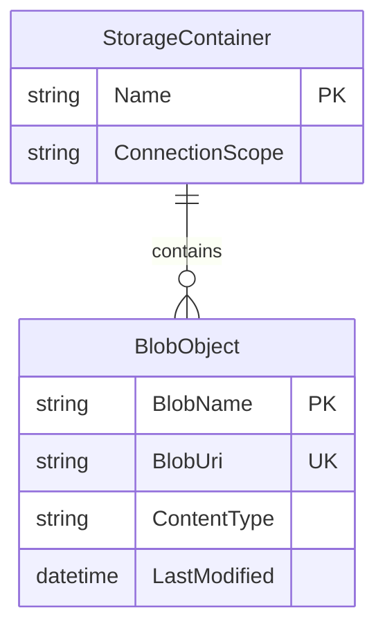

# Data Architecture & Persistence Layer

The application uses Azure Blob Storage as its primary persistence layer and does not define relational entities or ORM repositories.

## Database Configuration

| Service/Module | DB Type | Profile | Driver | Connection | Migration Tool |
|---|---|---|---|---|---|
| WebApp-Storage-DotNet | Azure Blob/Object Storage | Default | Azure.Storage.Blobs SDK | `StorageConnectionString` appSetting (defaults to `UseDevelopmentStorage=true`) | None |

## Data Ownership per Service

| Service | Tables Owned | ORM Framework | Caching | Notes |
|---|---|---|---|---|
| WebApp-Storage-DotNet | Blob objects in `webappstoragedotnet-imagecontainer` | None | None | Service owns blob lifecycle (create/list/delete) |

## Entity Model

## Key Repository Methods

| Service | Repository | Notable Methods | Purpose |
|---|---|---|---|
| WebApp-Storage-DotNet | BlobContainerClient (SDK abstraction) | `GetBlobs()`, `CreateIfNotExistsAsync()`, `DeleteBlobIfExistsAsync()` | Enumerate and manage blob objects |
| WebApp-Storage-DotNet | BlobClient (SDK abstraction) | `UploadAsync()`, `DeleteIfExistsAsync()` | Upload and delete individual blob content |

## Caching Strategy

No dedicated application-level cache provider or cache-aside logic is configured. Each request interacts directly with Azure Blob Storage through SDK calls.

## Data Ownership Boundaries

Data ownership is centralized in a single service and a single blob container. There are no multi-service boundaries, shared relational schemas, or cross-service data joins in this repository.

### Data Classification & Sensitivity

| Entity | Sensitive Fields | Classification (PII/PHI/PCI/None) | Controls in Place |
|---|---|---|---|
| BlobObject (image files and names) | File names and image content may contain user-identifying information | PII (potential) | No explicit masking/encryption controls configured in application code |
