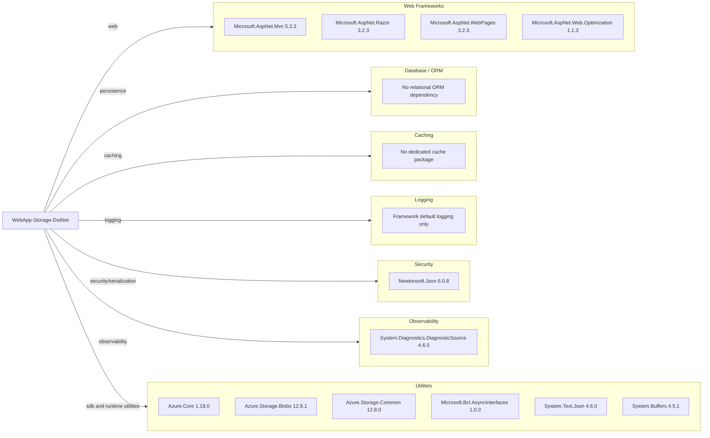

# Dependency Map

This dependency map covers declared external libraries for WebApp-Storage-DotNet and their functional roles (36 declared NuGet/package assets).

## Dependencies

### Dependency Summary

| Category | Count | Key Libraries | Notes |
|---|---:|---|---|
| Web Frameworks | 4 | Microsoft.AspNet.Mvc 5.2.3, Razor 3.2.3 | Legacy ASP.NET MVC stack on .NET Framework |
| Database / ORM | 0 | None | No relational DB access package detected |
| Caching | 0 | None | No explicit cache library declared |
| Logging | 0 | None | No dedicated logging framework package |
| Security | 1 | Newtonsoft.Json 6.0.8 | Serialization dependency with older major version |
| Observability | 1 | DiagnosticSource 4.6.0 | Minimal diagnostics instrumentation |
| Utilities | 30 | Azure Storage SDK, System.* compatibility packages | Includes Azure SDK and framework support packages |

### Version & Compatibility Risks

The project depends on an older ASP.NET MVC 5/.NET Framework stack and several legacy package versions (for example Newtonsoft.Json 6.0.8 and early compiler provider packages). These dependencies can increase migration effort and security/compatibility risk when targeting newer .NET runtimes.

### Notable Observations

- Azure Blob Storage SDK packages are the core external integration dependencies.
- No test-scoped package references were declared in `packages.config`.
- Multiple compatibility packages (`System.*`) suggest backported runtime features for .NET Framework.
- Build-time packages like `Microsoft.Net.Compilers` are pinned to old versions.

## Test Dependencies

| Framework | Version | Notes |
|---|---|---|
| None detected | N/A | No test package references found in build/package files |

Total test-scope dependencies: 0
No dedicated test framework or integration-test package is declared in the repository build manifests.
